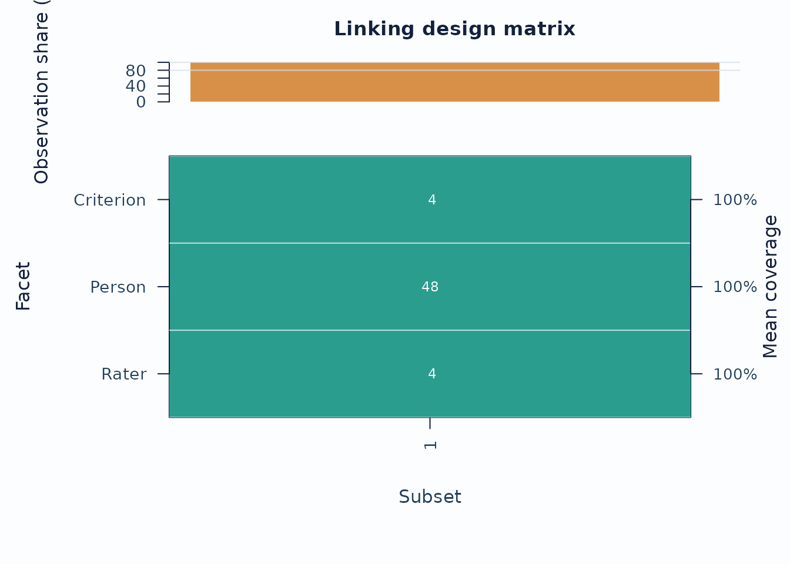
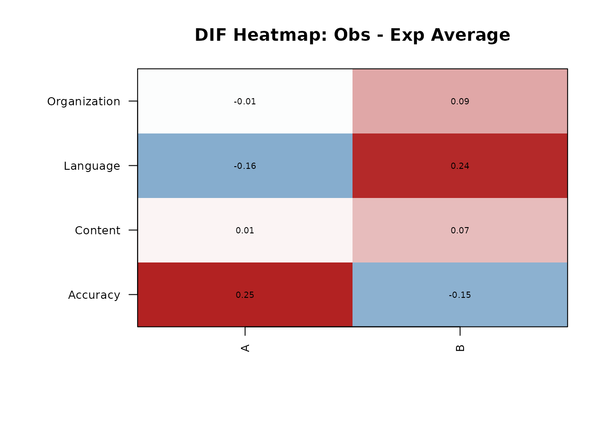

# mfrmr Linking and DFF

This vignette covers the package-native route for:

- checking whether a design is connected enough for a common scale
- exporting anchor candidates from an existing fit
- screening differential facet functioning (DFF)
- deciding when subgroup contrasts are descriptive versus formally
  comparable

For a broader workflow guide, see
[`vignette("mfrmr-workflow", package = "mfrmr")`](https://ryuya-dot-com.github.io/mfrmr/articles/mfrmr-workflow.md).
For the shorter help-page map, see
[`help("mfrmr_linking_and_dff", package = "mfrmr")`](https://ryuya-dot-com.github.io/mfrmr/reference/mfrmr_linking_and_dff.md).

## Minimal setup

``` r

library(mfrmr)

bias_df <- load_mfrmr_data("example_bias")

# The vignette uses compact quadrature so optional local execution stays fast.
# For final DFF or linking evidence, refit with the package default or a higher
# quadrature setting and record that setting in the analysis log.
fit <- fit_mfrm(
  bias_df,
  person = "Person",
  facets = c("Rater", "Criterion"),
  score = "Score",
  method = "MML",
  model = "RSM",
  quad_points = 7
)

diag <- diagnose_mfrm(fit, residual_pca = "none")
```

## 1. Check connectedness first

Use
[`subset_connectivity_report()`](https://ryuya-dot-com.github.io/mfrmr/reference/subset_connectivity_report.md)
before interpreting subgroup or cross-form contrasts.

``` r

sc <- subset_connectivity_report(fit, diagnostics = diag)

sc$summary[, c("Subset", "Observations", "ObservationPercent")]
#>   Subset Observations ObservationPercent
#> 1      1          384                100
plot(sc, type = "design_matrix", preset = "publication")
```



Interpretation:

- Sparse rows or columns indicate weaker design coverage.
- Weak coverage should lower confidence in subgroup comparisons.

## 2. Export anchor candidates

[`make_anchor_table()`](https://ryuya-dot-com.github.io/mfrmr/reference/make_anchor_table.md)
is the shortest route when you need reusable anchor elements from an
existing calibration.

``` r

anchors <- make_anchor_table(fit, facets = "Criterion")
head(anchors)
#> # A tibble: 4 × 3
#>   Facet     Level         Anchor
#>   <chr>     <chr>          <dbl>
#> 1 Criterion Accuracy      0.524 
#> 2 Criterion Content      -0.199 
#> 3 Criterion Language     -0.275 
#> 4 Criterion Organization -0.0498
```

Use
[`review_mfrm_anchors()`](https://ryuya-dot-com.github.io/mfrmr/reference/review_mfrm_anchors.md)
when you want a stricter review of anchor quality.

## 3. Residual DFF as a screening layer

Residual DFF is the fast screening route. It is useful for triage, but
it is not automatically a logit-scale inferential contrast.

``` r

dff_resid <- analyze_dff(
  fit,
  diag,
  facet = "Criterion",
  group = "Group",
  data = bias_df,
  method = "residual"
)

dff_resid$summary
#> # A tibble: 3 × 2
#>   Classification  Count
#>   <chr>           <int>
#> 1 Screen positive     2
#> 2 Screen negative     2
#> 3 Unclassified        0
head(
  dff_resid$dif_table[, c("Level", "Group1", "Group2", "Classification", "ClassificationSystem")],
  8
)
#> # A tibble: 4 × 5
#>   Level        Group1 Group2 Classification  ClassificationSystem
#>   <chr>        <chr>  <chr>  <chr>           <chr>               
#> 1 Accuracy     A      B      Screen positive screening           
#> 2 Content      A      B      Screen negative screening           
#> 3 Language     A      B      Screen positive screening           
#> 4 Organization A      B      Screen negative screening
plot_dif_heatmap(dff_resid)
```



Interpretation:

- Treat `residual` output as screening evidence.
- Check `ClassificationSystem` to see how the current residual screen
  was labeled.
- Reserve `ScaleLinkStatus` and `ContrastComparable` for refit-based
  contrasts.

## 4. Refit DFF when subgroup comparisons are defensible

The refit route can support logit-scale contrasts only when subgroup
linking is adequate and the precision layer supports it.

``` r

dff_refit <- analyze_dff(
  fit,
  diag,
  facet = "Criterion",
  group = "Group",
  data = bias_df,
  method = "refit"
)

dff_refit$summary
#> # A tibble: 5 × 2
#>   Classification                      Count
#>   <chr>                               <int>
#> 1 A (Negligible)                          0
#> 2 B (Moderate)                            0
#> 3 C (Large)                               0
#> 4 Linked contrast (screening only)        0
#> 5 Unclassified (insufficient linking)     4
head(
  dff_refit$dif_table[, c("Level", "Group1", "Group2", "Classification", "ContrastComparable")],
  8
)
#> # A tibble: 4 × 5
#>   Level        Group1 Group2 Classification                   ContrastComparable
#>   <chr>        <chr>  <chr>  <chr>                            <lgl>             
#> 1 Accuracy     A      B      Unclassified (insufficient link… FALSE             
#> 2 Content      A      B      Unclassified (insufficient link… FALSE             
#> 3 Language     A      B      Unclassified (insufficient link… FALSE             
#> 4 Organization A      B      Unclassified (insufficient link… FALSE
```

## 5. Cell-level follow-up

If the level-wise screen points to a specific facet, follow up with the
interaction table and narrative report.

``` r

dit <- dif_interaction_table(
  fit,
  diag,
  facet = "Criterion",
  group = "Group",
  data = bias_df
)

head(dit$table)
#> # A tibble: 6 × 15
#>   Level  GroupValue     N ObsScore ExpScore ObsExpAvg Var_sum sparse StdResidual
#>   <chr>  <chr>      <int>    <int>    <dbl>     <dbl>   <dbl> <lgl>        <dbl>
#> 1 Accur… A             48      125     113.   0.251      28.5 FALSE       2.26  
#> 2 Accur… B             48      117     124.  -0.150      29.2 FALSE      -1.33  
#> 3 Conte… A             48      134     134.   0.00969    27.8 FALSE       0.0882
#> 4 Conte… B             48      148     144.   0.0745     26.1 FALSE       0.700 
#> 5 Langu… A             48      128     136.  -0.159      27.5 FALSE      -1.46  
#> 6 Langu… B             48      158     146.   0.242      25.6 FALSE       2.30  
#> # ℹ 6 more variables: t <dbl>, df <dbl>, p_value <dbl>, p_adjusted <dbl>,
#> #   flag_t <lgl>, flag_bias <lgl>

dr <- dif_report(dff_resid)
cat(dr$narrative)
#> DIF screening was conducted for the Criterion facet across levels of Group using the residual method. A total of 4 pairwise facet-level comparisons were evaluated. 2 comparison(s) were screening-positive and 2 were screening-negative based on the residual-contrast test. 
#> The following Criterion level(s) showed screening-positive residual contrasts: Accuracy, Language.   - Accuracy: A vs B (contrast = 0.401 on the residual scale; A was higher).   - Language: A vs B (contrast = -0.401 on the residual scale; A was lower). 
#> Note: The presence of differential functioning does not necessarily indicate measurement bias. Differential functioning may reflect construct-relevant variation (e.g., true group differences in the attribute being measured) rather than unwanted measurement bias. Substantive review is recommended to distinguish between these possibilities (cf. Eckes, 2011; McNamara & Knoch, 2012).
```

## 6. Model-estimated facet interactions

Residual bias and DFF tools screen for unusual cells after fitting the
additive model. When the interaction hypothesis is specified in advance,
use `facet_interactions` to estimate the named two-way non-person facet
interaction in the model likelihood.

``` r

fit_add <- fit_mfrm(
  bias_df,
  person = "Person",
  facets = c("Rater", "Criterion"),
  score = "Score",
  method = "MML",
  model = "RSM",
  quad_points = 7
)

fit_interaction <- fit_mfrm(
  bias_df,
  person = "Person",
  facets = c("Rater", "Criterion"),
  score = "Score",
  method = "MML",
  model = "RSM",
  facet_interactions = "Rater:Criterion",
  quad_points = 7
)

interaction_effect_table(fit_interaction)
compare_mfrm(Additive = fit_add, Interaction = fit_interaction, nested = TRUE)
```

Interpretation:

- Name the facet pair explicitly before fitting.
- Treat the interaction estimates as fixed-effect deviations from the
  additive MFRM under zero marginal-sum constraints.
- Inspect sparse interaction cells before reporting substantive claims.
- Keep this route separate from residual screening with
  [`estimate_bias()`](https://ryuya-dot-com.github.io/mfrmr/reference/estimate_bias.md).

## 7. Multi-wave anchor review

When you work across administrations, the route usually moves from
anchor export to anchored fitting and then to drift review.

``` r

d1 <- load_mfrmr_data("study1")
d2 <- load_mfrmr_data("study2")

fit1 <- fit_mfrm(d1, "Person", c("Rater", "Criterion"), "Score",
                 method = "JML", maxit = 25)
fit2 <- fit_mfrm(d2, "Person", c("Rater", "Criterion"), "Score",
                 method = "JML", maxit = 25)

anchored <- anchor_to_baseline(
  d2,
  fit1,
  person = "Person",
  facets = c("Rater", "Criterion"),
  score = "Score"
)

drift <- detect_anchor_drift(list(Wave1 = fit1, Wave2 = fit2))
plot_anchor_drift(drift, type = "drift", preset = "publication")
```

## Recommended sequence

For a compact linking route:

1.  [`fit_mfrm()`](https://ryuya-dot-com.github.io/mfrmr/reference/fit_mfrm.md)
2.  [`diagnose_mfrm()`](https://ryuya-dot-com.github.io/mfrmr/reference/diagnose_mfrm.md)
3.  [`subset_connectivity_report()`](https://ryuya-dot-com.github.io/mfrmr/reference/subset_connectivity_report.md)
4.  [`make_anchor_table()`](https://ryuya-dot-com.github.io/mfrmr/reference/make_anchor_table.md)
    or
    [`review_mfrm_anchors()`](https://ryuya-dot-com.github.io/mfrmr/reference/review_mfrm_anchors.md)
5.  [`analyze_dff()`](https://ryuya-dot-com.github.io/mfrmr/reference/analyze_dff.md)
6.  [`dif_report()`](https://ryuya-dot-com.github.io/mfrmr/reference/dif_report.md)
    and
    [`plot_dif_heatmap()`](https://ryuya-dot-com.github.io/mfrmr/reference/plot_dif_heatmap.md)
7.  [`interaction_effect_table()`](https://ryuya-dot-com.github.io/mfrmr/reference/interaction_effect_table.md)
    after a confirmatory `facet_interactions` fit
8.  [`anchor_to_baseline()`](https://ryuya-dot-com.github.io/mfrmr/reference/anchor_to_baseline.md)
    /
    [`detect_anchor_drift()`](https://ryuya-dot-com.github.io/mfrmr/reference/detect_anchor_drift.md)
    when working across waves

## Related help

- [`help("mfrmr_linking_and_dff", package = "mfrmr")`](https://ryuya-dot-com.github.io/mfrmr/reference/mfrmr_linking_and_dff.md)
- [`help("subset_connectivity_report", package = "mfrmr")`](https://ryuya-dot-com.github.io/mfrmr/reference/subset_connectivity_report.md)
- [`help("analyze_dff", package = "mfrmr")`](https://ryuya-dot-com.github.io/mfrmr/reference/analyze_dff.md)
- [`help("interaction_effect_table", package = "mfrmr")`](https://ryuya-dot-com.github.io/mfrmr/reference/interaction_effect_table.md)
- [`help("detect_anchor_drift", package = "mfrmr")`](https://ryuya-dot-com.github.io/mfrmr/reference/detect_anchor_drift.md)
