# mfrmr Visual Diagnostics

This vignette is a compact map of the main base-R diagnostics in
`mfrmr`. It is organized around four practical questions:

- How well do persons, facet levels, and categories target each other?
- Which observations or levels look locally unstable?
- Is the design linked well enough across subsets or forms?
- Where do residual structure and interaction screens point next?

All examples use packaged data and `preset = "publication"` so the same
code is suitable for manuscript-oriented graphics.

If you are selecting figures for a report, use
[`reporting_checklist()`](https://ryuya-dot-com.github.io/mfrmr/reference/reporting_checklist.md)
before or alongside this vignette. Its `"Visual Displays"` rows now
mirror the public plotting family shown here.

## Minimal setup

``` r

library(mfrmr)

toy <- load_mfrmr_data("example_operational")

fit <- fit_mfrm(
  toy,
  person = "Person",
  facets = c("Rater", "Criterion"),
  score = "Score",
  method = "MML",
  model = "RSM"
)

diag <- diagnose_mfrm(fit, residual_pca = "none")
checklist <- reporting_checklist(fit, diagnostics = diag)
subset(
  checklist$checklist,
  Section == "Visual Displays",
  c("Item", "Available", "NextAction")
)
#>                                   Item Available
#> 25                          Wright map      TRUE
#> 26                QC / facet dashboard      TRUE
#> 27                Residual PCA visuals     FALSE
#> 28 Connectivity / design-matrix visual      TRUE
#> 29  Inter-rater / displacement visuals      TRUE
#> 30             Strict marginal visuals      TRUE
#> 31                  Bias / DIF visuals     FALSE
#> 32      Precision / information curves      TRUE
#> 33                Fit/category visuals      TRUE
#>                                                                                                                       NextAction
#> 25                                      Include a Wright map when the manuscript benefits from a shared-scale targeting display.
#> 26                     Use the dashboard as a first-pass triage view, then move to the specific follow-up plot behind each flag.
#> 27                                         Run residual PCA if you want scree/loadings visuals for residual-structure follow-up.
#> 28                                                       Use the design-matrix view to support linkage and comparability claims.
#> 29                                       Use displacement and inter-rater views to localize QC issues after dashboard screening.
#> 30 Treat strict marginal plots as exploratory corroboration screens, then corroborate with design review and legacy diagnostics.
#> 31                                                        Run bias or DIF screening before discussing interaction-level visuals.
#> 32                                Use information curves to describe precision across theta when that is the reporting question.
#> 33                                        Use category curves and fit visuals as local descriptive follow-up after QC screening.
```

## 1. Targeting and scale structure

Use the Wright map first when you want one shared logit view of persons,
facet levels, and step thresholds.

``` r

plot(fit, type = "wright", preset = "publication", show_ci = TRUE)
```

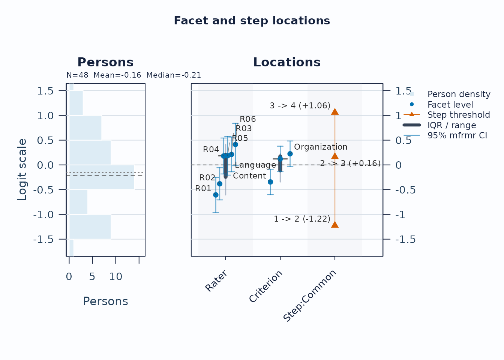

Interpretation:

- Compare person density on the left to facet and step locations on the
  right.
- Large gaps suggest weaker targeting in that logit region.
- Wide overlap in marginal confidence whiskers suggests imprecision;
  estimate the relevant pairwise contrast directly before claiming that
  two levels are separated or indistinguishable.

The native view above remains the recommended analytic figure because it
keeps facet uncertainty and fitted step locations visible. For a closer
FACETS-facing handoff, switch the renderer and leave `show_ci` at its
default `FALSE`. The fitted coordinates do not change.

``` r

plot(
  fit,
  type = "wright",
  renderer = "facets",
  category_labels = c(
    `1` = "Beginning", `2` = "Developing", `3` = "Secure", `4` = "Advanced"
  )
)
```

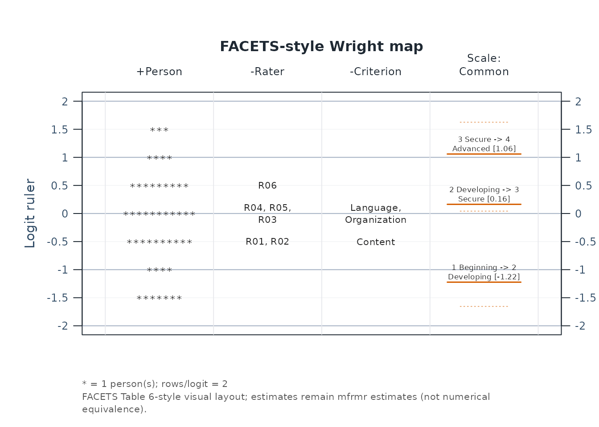

This renderer uses one common logit ruler, a `*` person-frequency
column, signed facet headers, every facet level, and short labeled
score-transition lines. It is FACETS-style visual correspondence, not a
claim that `mfrmr` and FACETS produce numerically identical estimates. A
numerical comparison requires output from a documented FACETS version
and aligned estimator, identification, score, and orientation settings.
Set `show_ci = TRUE` only when you deliberately want a hybrid
FACETS-style ruler with the mfrmr uncertainty extension. Use
`draw = FALSE` and inspect the `facets_style` tables when rebuilding the
display with ggplot2 or another graphics system.

Next, use the pathway map when you want to see how expected scores
progress across theta.

``` r

plot(fit, type = "pathway", preset = "publication")
```

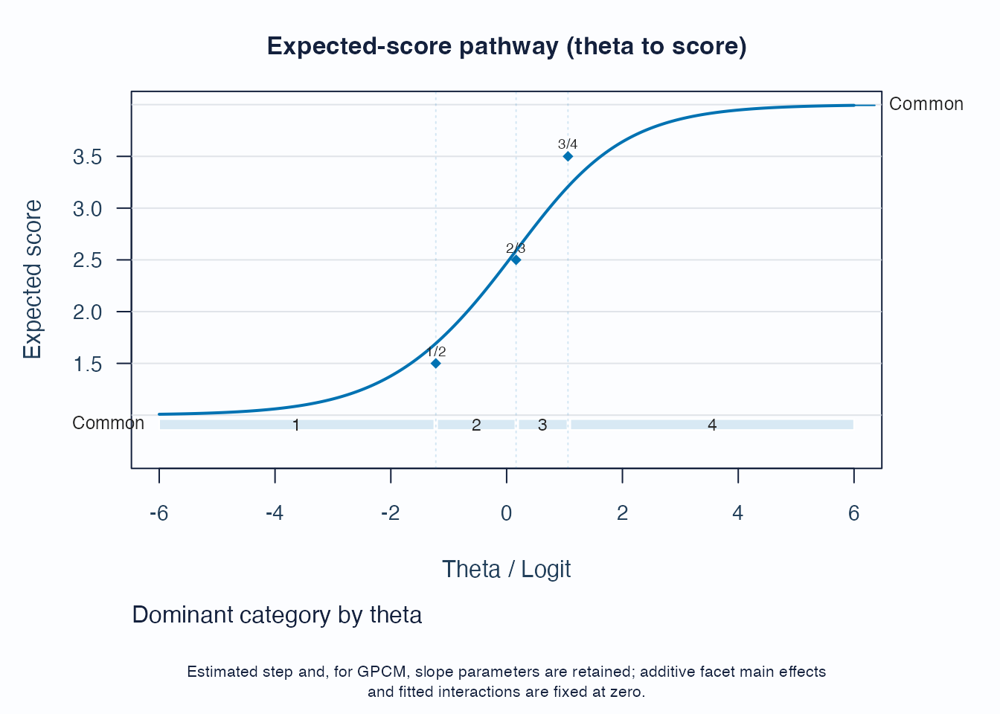

Interpretation:

- Steeper rises indicate stronger score progression.
- Dominant-category strips show where each category is most likely to
  govern the score.
- Flat or compressed regions suggest weaker category separation.

The expected-score pathway is not a fit pathway. To review measure
against Infit, place Infit on the horizontal axis and include person
rows explicitly:

``` r

plot(
  fit,
  type = "fit_pathway",
  diagnostics = diag,
  fit_stat = "Infit",
  fit_scale = "mnsq",
  include_person = TRUE,
  show_ci = TRUE,
  preset = "publication"
)
```

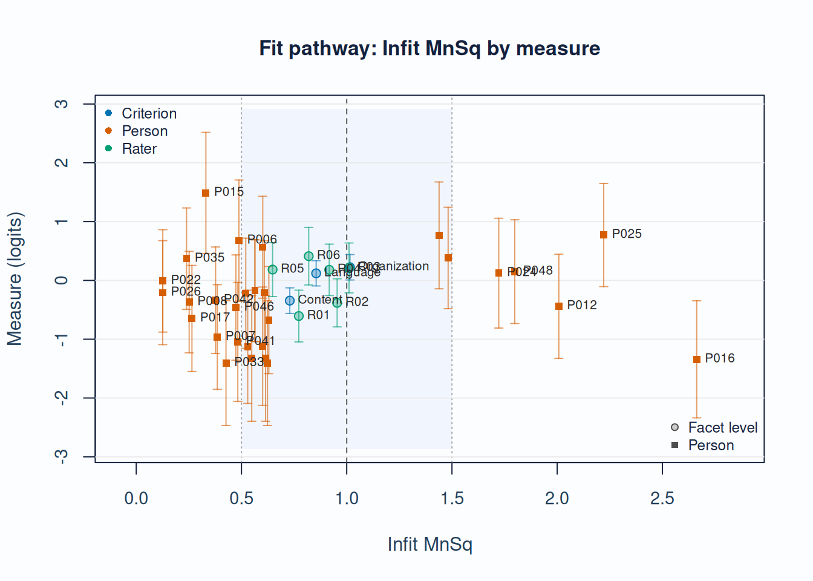

Interpretation:

- The vertical axis remains the fitted measure in logits.
- The horizontal axis is Infit MnSq; the 1.0 line is the
  model-expectation reference.
- Vertical whiskers show measure uncertainty; person and non-person rows
  have distinct uncertainty bases, recorded in the draw-free payload
  metadata.
- Treat displaced or flagged rows as review prompts, not automatic
  exclusions.

## 2. Local response and level issues

Unexpected-response screening is useful for case-level review.

``` r

plot_unexpected(
  fit,
  diagnostics = diag,
  abs_z_min = 1.5,
  prob_max = 0.4,
  plot_type = "scatter",
  preset = "publication"
)
```

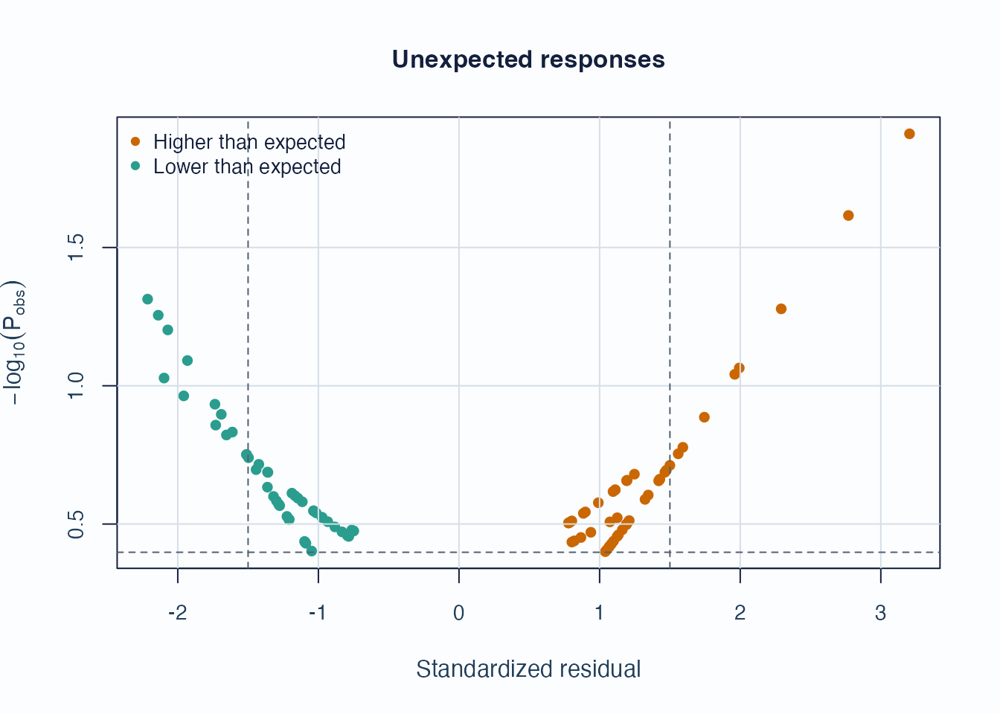

Interpretation:

- Upper corners combine large residual mismatch with low model
  probability.
- Repeated appearances of the same persons or levels are more
  informative than a single extreme point.

Displacement focuses on level movement rather than individual responses.

``` r

plot_displacement(
  fit,
  diagnostics = diag,
  anchored_only = FALSE,
  plot_type = "lollipop",
  preset = "publication"
)
```

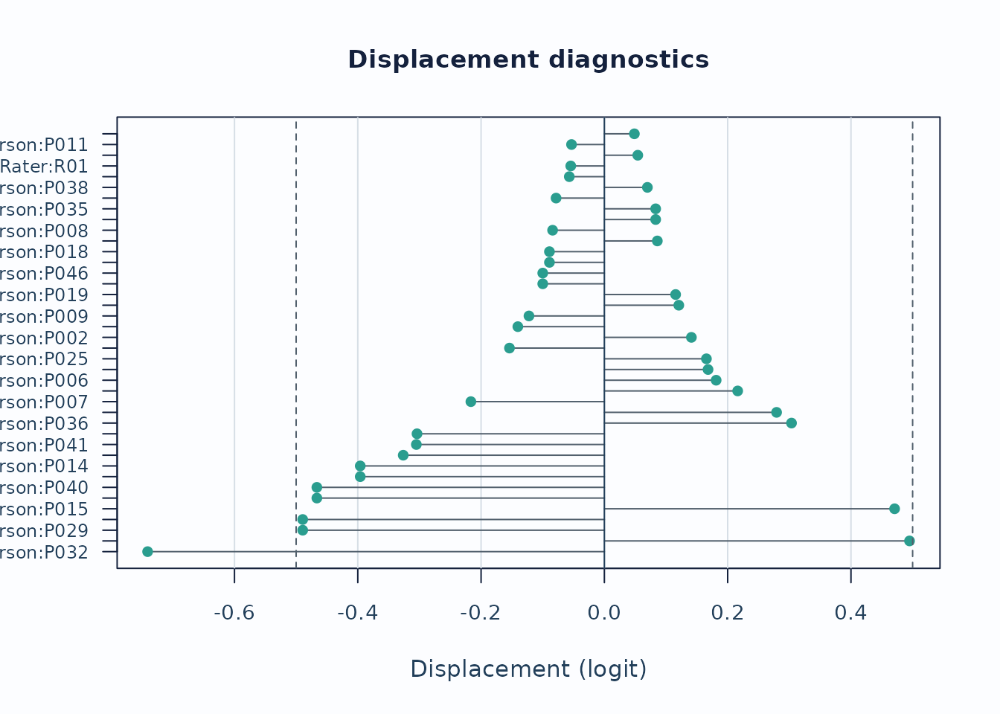

Interpretation:

- Large absolute displacement indicates stronger tension between
  observed data and current calibration.
- For anchored runs, this is especially useful as an anchor-robustness
  screen.

### Strict marginal follow-up

When you need the package’s latent-integrated follow-up path, switch to
`MML` and request `diagnostic_mode = "both"` so the legacy and strict
branches stay visible side by side. The chunk below uses compact
quadrature for optional local execution; final reporting should be refit
with the package default or a higher quadrature setting.

``` r

fit_strict <- fit_mfrm(
  toy,
  person = "Person",
  facets = c("Rater", "Criterion"),
  score = "Score",
  method = "MML",
  model = "RSM",
  quad_points = 7,
  maxit = 40
)

diag_strict <- diagnose_mfrm(
  fit_strict,
  residual_pca = "none",
  diagnostic_mode = "both"
)

strict_checklist <- reporting_checklist(fit_strict, diagnostics = diag_strict)
subset(
  strict_checklist$checklist,
  Section == "Visual Displays" &
    Item %in% c("QC / facet dashboard", "Strict marginal visuals"),
  c("Item", "Available", "NextAction")
)
#>                       Item Available
#> 26    QC / facet dashboard      TRUE
#> 30 Strict marginal visuals      TRUE
#>                                                                                                                       NextAction
#> 26                     Use the dashboard as a first-pass triage view, then move to the specific follow-up plot behind each flag.
#> 30 Treat strict marginal plots as exploratory corroboration screens, then corroborate with design review and legacy diagnostics.

plot_marginal_fit(
  diag_strict,
  top_n = 12,
  preset = "publication"
)
```

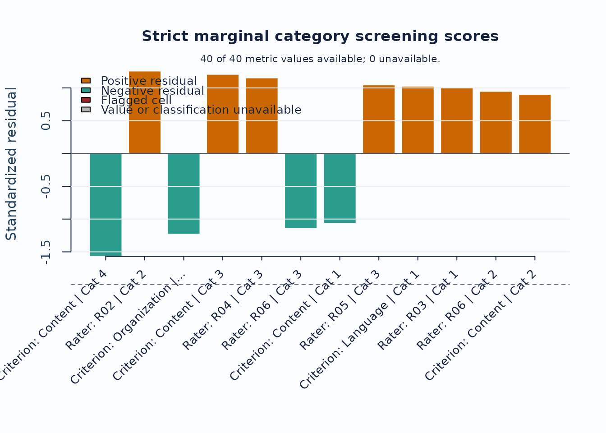

Interpretation:

- Treat strict marginal plots as exploratory corroboration screens, not
  as standalone inferential tests.
- Use the checklist rows to confirm that the current run actually
  supports the strict branch before routing figures into a report.
- When pairwise follow-up is needed, continue with
  `plot_marginal_pairwise(diag_strict, preset = "publication")`.

## 3. Linking and coverage

When the design may be incomplete or spread across subsets, inspect the
coverage matrix before interpreting cross-subset contrasts.

``` r

sc <- subset_connectivity_report(fit, diagnostics = diag)
plot(sc, type = "design_matrix", preset = "publication")
```

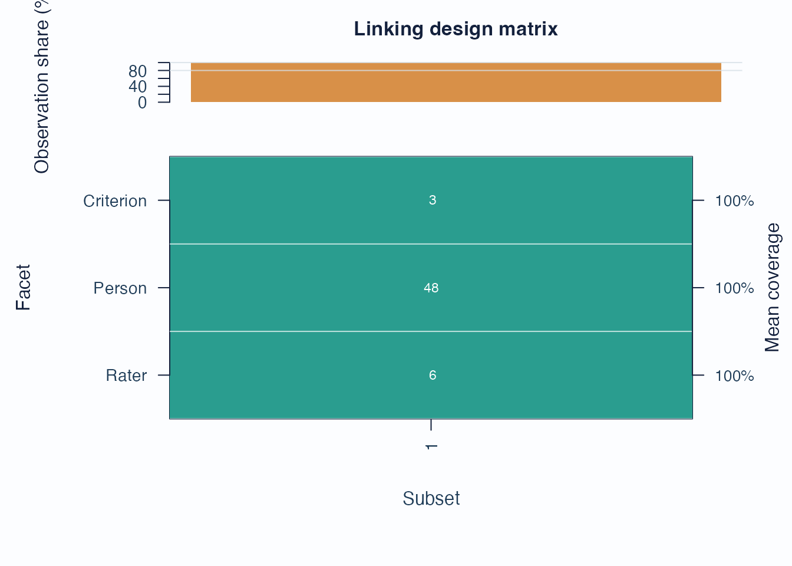

Interpretation:

- Sparse rows or columns indicate weak subset coverage.
- Facets with low overlap are weaker anchors for cross-subset
  comparisons.

If you are working across administrations, follow up with anchor-drift
plots:

``` r

drift <- detect_anchor_drift(current_fit, baseline = baseline_anchors)
plot_anchor_drift(drift, type = "heatmap", preset = "publication")
```

## 4. Residual structure and interaction screens

Residual PCA is a follow-up layer after the main fit screen.

``` r

diag_pca <- diagnose_mfrm(fit, residual_pca = "both", pca_max_factors = 4)
pca <- analyze_residual_pca(diag_pca, mode = "both")
plot_residual_pca(pca, mode = "overall", plot_type = "scree", preset = "publication")
```

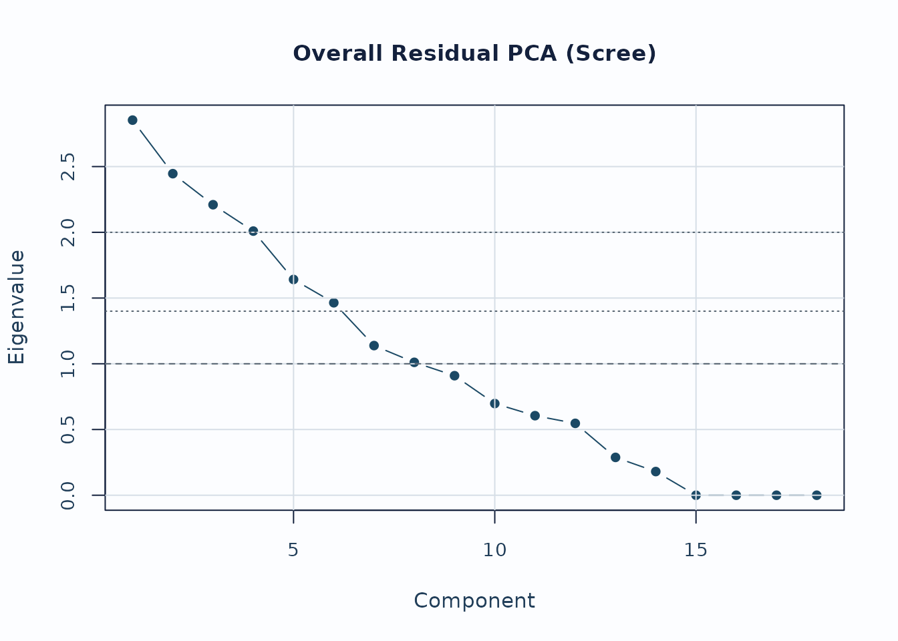

Interpretation:

- Early components with noticeably larger eigenvalues deserve follow-up.
- Scree review should usually be paired with loading review for the
  component of interest.

For interaction screening, use the packaged bias example.

``` r

bias_df <- load_mfrmr_data("example_bias")

fit_bias <- fit_mfrm(
  bias_df,
  person = "Person",
  facets = c("Rater", "Criterion"),
  score = "Score",
  method = "MML",
  model = "RSM",
  quad_points = 7
)

diag_bias <- diagnose_mfrm(fit_bias, residual_pca = "none")
bias <- estimate_bias(fit_bias, diag_bias, facet_a = "Rater", facet_b = "Criterion")

plot_bias_interaction(
  bias,
  plot = "facet_profile",
  preset = "publication"
)
```

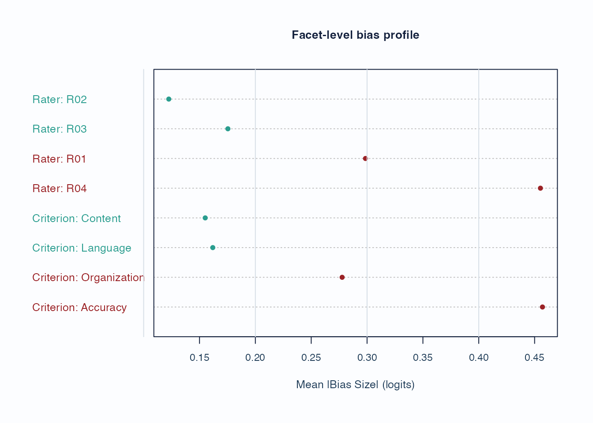

Interpretation:

- Facet profiles are useful for seeing whether a small number of levels
  drives most flagged interaction cells.
- Treat these plots as screening evidence; confirm with the
  corresponding tables and narrative reports.

## 5. Custom figures without losing the evidence boundary

The built-in plots are intended as safe defaults. Use
`preset = "monochrome"` when a journal, accessibility review, or print
workflow needs grayscale output. For journal figures, teaching material,
dashboards, or lab-specific styles, use `draw = FALSE` and the plot-data
accessors instead of editing screenshots.

``` r

plot(fit, type = "wright", preset = "monochrome")
```

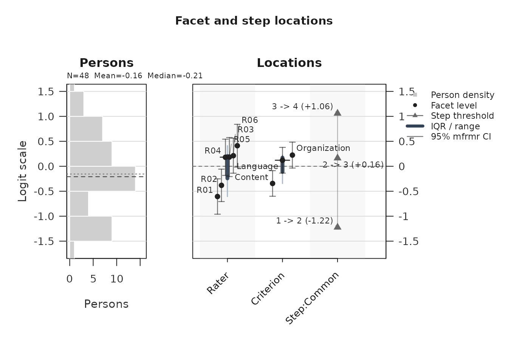

``` r


wright_payload <- plot(fit, type = "wright", draw = FALSE, preset = "publication")
plot_data_components(wright_payload)
#>      PlotName             Component                Role     ObjectType Rows
#> 1  wright_map          wright_style               style      character   NA
#> 2  wright_map              renderer    scalar_or_vector      character   NA
#> 3  wright_map       visual_contract    scalar_or_vector      character   NA
#> 4  wright_map                person          table_data     data.frame   48
#> 5  wright_map           person_hist            metadata list:histogram   NA
#> 6  wright_map          person_stats          table_data     data.frame    1
#> 7  wright_map             locations          table_data     data.frame   12
#> 8  wright_map          label_points          table_data     data.frame    7
#> 9  wright_map         group_summary summary_or_guidance     data.frame    3
#> 10 wright_map          group_levels            settings      character   NA
#> 11 wright_map               y_range            settings         double   NA
#> 12 wright_map      display_settings            settings     data.frame    1
#> 13 wright_map           label_limit    scalar_or_vector        integer   NA
#> 14 wright_map             retention          table_data     data.frame    3
#> 15 wright_map        retention_note summary_or_guidance      character   NA
#> 16 wright_map                 title    scalar_or_vector      character   NA
#> 17 wright_map              subtitle    scalar_or_vector      character   NA
#> 18 wright_map               show_ci    scalar_or_vector        logical   NA
#> 19 wright_map   uncertainty_display    scalar_or_vector      character   NA
#> 20 wright_map                 group    scalar_or_vector           NULL   NA
#> 21 wright_map                preset            settings      character   NA
#> 22 wright_map                legend               style     data.frame    5
#> 23 wright_map       reference_lines          annotation     data.frame    1
#> 24 wright_map             plot_name    scalar_or_vector      character   NA
#> 25 wright_map         fit_readiness          fit_review     data.frame    5
#> 26 wright_map interpretation_status summary_or_guidance      character   NA
#> 27 wright_map   interpretation_note summary_or_guidance      character   NA
#>    Columns Length IsTabular                                          Accessor
#> 1       NA      1     FALSE          plot_data(x, component = "wright_style")
#> 2       NA      1     FALSE              plot_data(x, component = "renderer")
#> 3       NA      1     FALSE       plot_data(x, component = "visual_contract")
#> 4        6      6      TRUE                plot_data(x, component = "person")
#> 5        6      6     FALSE           plot_data(x, component = "person_hist")
#> 6        4      4      TRUE          plot_data(x, component = "person_stats")
#> 7       30     30      TRUE             plot_data(x, component = "locations")
#> 8       30     30      TRUE          plot_data(x, component = "label_points")
#> 9       16     16      TRUE         plot_data(x, component = "group_summary")
#> 10      NA      3     FALSE          plot_data(x, component = "group_levels")
#> 11      NA      2     FALSE               plot_data(x, component = "y_range")
#> 12       8      8      TRUE      plot_data(x, component = "display_settings")
#> 13      NA      1     FALSE           plot_data(x, component = "label_limit")
#> 14       6      6      TRUE             plot_data(x, component = "retention")
#> 15      NA      1     FALSE        plot_data(x, component = "retention_note")
#> 16      NA      1     FALSE                 plot_data(x, component = "title")
#> 17      NA      1     FALSE              plot_data(x, component = "subtitle")
#> 18      NA      1     FALSE               plot_data(x, component = "show_ci")
#> 19      NA      1     FALSE   plot_data(x, component = "uncertainty_display")
#> 20      NA      0     FALSE                 plot_data(x, component = "group")
#> 21      NA      1     FALSE                plot_data(x, component = "preset")
#> 22       4      4      TRUE                plot_data(x, component = "legend")
#> 23       5      5      TRUE       plot_data(x, component = "reference_lines")
#> 24      NA      1     FALSE             plot_data(x, component = "plot_name")
#> 25       2      2      TRUE         plot_data(x, component = "fit_readiness")
#> 26      NA      1     FALSE plot_data(x, component = "interpretation_status")
#> 27      NA      1     FALSE   plot_data(x, component = "interpretation_note")
#>                                                                     Notes
#> 1                                                                        
#> 2                                                                        
#> 3                                                                        
#> 4                                                                        
#> 5                                                                        
#> 6                                                                        
#> 7                                                                        
#> 8                                                                        
#> 9                            Use for captions, QA checks, or report text.
#> 10                                                                       
#> 11                                                                       
#> 12                                                                       
#> 13                                                                       
#> 14                                                                       
#> 15                           Use for captions, QA checks, or report text.
#> 16                                                                       
#> 17                                                                       
#> 18                                                                       
#> 19                                                                       
#> 20                                                                       
#> 21                                                                       
#> 22                 Use to reproduce color, line-type, or legend mappings.
#> 23 Use with primary data to draw thresholds, labels, and reference lines.
#> 24                                                                       
#> 25                                                                       
#> 26                           Use for captions, QA checks, or report text.
#> 27                           Use for captions, QA checks, or report text.
#>                                                                                                                                                                                                                                                                                                                                                                          ColumnNames
#> 1                                                                                                                                                                                                                                                                                                                                                                                   
#> 2                                                                                                                                                                                                                                                                                                                                                                                   
#> 3                                                                                                                                                                                                                                                                                                                                                                                   
#> 4                                                                                                                                                                                                                                                                                                                                     Person, Estimate, SD, PosteriorSD, SE, Extreme
#> 5                                                                                                                                                                                                                                                                                                                                     breaks, counts, density, mids, xname, equidist
#> 6                                                                                                                                                                                                                                                                                                                                                                N, Mean, Median, SD
#> 7  Group, Label, PlotType, Estimate, SE, CI_Level, SE_Method, Measure_Source, CI_Lower, CI_Upper, Step, StepIndex, BoundarySeparated, XBase, X, OriginalEstimate, BelowRange, AboveRange, DisplayEstimate, DisplayLabel, OriginalCI_Lower, OriginalCI_Upper, DisplayCI_Lower, DisplayCI_Upper, CIClippedLower, CIClippedUpper, CIClipped, BoundaryEnd, CISuppressed, CIDisplayStatus
#> 8  Group, Label, PlotType, Estimate, SE, CI_Level, SE_Method, Measure_Source, CI_Lower, CI_Upper, Step, StepIndex, BoundarySeparated, XBase, X, OriginalEstimate, BelowRange, AboveRange, DisplayEstimate, DisplayLabel, OriginalCI_Lower, OriginalCI_Upper, DisplayCI_Lower, DisplayCI_Upper, CIClippedLower, CIClippedUpper, CIClipped, BoundaryEnd, CISuppressed, CIDisplayStatus
#> 9                                                                                                                                                                                                                                      Group, PlotType, Min, Q1, Median, Q3, Max, DisplayMin, DisplayQ1, DisplayMedian, DisplayQ3, DisplayMax, N, XBase, TargetGap, DisplayTargetGap
#> 10                                                                                                                                                                                                                                                                                                                                                                                  
#> 11                                                                                                                                                                                                                                                                                                                                                                                  
#> 12                                                                                                                                                                                                                                                 Renderer, LowerLogit, UpperLogit, AutoRangePolicy, BoundaryLevelsAtEnds, CIClippedCount, BoundaryCIEndpointCount, CIDisplayPolicy
#> 13                                                                                                                                                                                                                                                                                                                                                                                  
#> 14                                                                                                                                                                                                                                                                                                                         Component, Shown, Total, Omitted, RequestedTopN, Complete
#> 15                                                                                                                                                                                                                                                                                                                                                                                  
#> 16                                                                                                                                                                                                                                                                                                                                                                                  
#> 17                                                                                                                                                                                                                                                                                                                                                                                  
#> 18                                                                                                                                                                                                                                                                                                                                                                                  
#> 19                                                                                                                                                                                                                                                                                                                                                                                  
#> 20                                                                                                                                                                                                                                                                                                                                                                                  
#> 21                                                                                                                                                                                                                                                                                                                                                                                  
#> 22                                                                                                                                                                                                                                                                                                                                                     label, role, aesthetic, value
#> 23                                                                                                                                                                                                                                                                                                                                                axis, value, label, linetype, role
#> 24                                                                                                                                                                                                                                                                                                                                                                                  
#> 25                                                                                                                                                                                                                                                                                                                                                                    Domain, Status
#> 26                                                                                                                                                                                                                                                                                                                                                                                  
#> 27

locations <- plot_data(wright_payload, component = "locations")
head(locations)
#> # A tibble: 6 × 30
#>   Group Label PlotType Estimate    SE CI_Level SE_Method Measure_Source CI_Lower
#>   <fct> <chr> <chr>       <dbl> <dbl>    <dbl> <chr>     <chr>             <dbl>
#> 1 Rater R01   Facet l…   -0.606 0.181     0.95 Observat… fit + observa…  -0.960 
#> 2 Rater R02   Facet l…   -0.382 0.166     0.95 Observat… fit + observa…  -0.707 
#> 3 Rater R04   Facet l…    0.180 0.185     0.95 Observat… fit + observa…  -0.183 
#> 4 Rater R05   Facet l…    0.184 0.199     0.95 Observat… fit + observa…  -0.207 
#> 5 Rater R03   Facet l…    0.212 0.179     0.95 Observat… fit + observa…  -0.138 
#> 6 Rater R06   Facet l…    0.412 0.219     0.95 Observat… fit + observa…  -0.0168
#> # ℹ 21 more variables: CI_Upper <dbl>, Step <chr>, StepIndex <int>,
#> #   BoundarySeparated <lgl>, XBase <dbl>, X <dbl>, OriginalEstimate <dbl>,
#> #   BelowRange <lgl>, AboveRange <lgl>, DisplayEstimate <dbl>,
#> #   DisplayLabel <chr>, OriginalCI_Lower <dbl>, OriginalCI_Upper <dbl>,
#> #   DisplayCI_Lower <dbl>, DisplayCI_Upper <dbl>, CIClippedLower <lgl>,
#> #   CIClippedUpper <lgl>, CIClipped <lgl>, BoundaryEnd <chr>,
#> #   CISuppressed <lgl>, CIDisplayStatus <chr>

pathway_long <- plot_data(
  fit,
  type = "pathway",
  component = "pathway_long",
  preset = "publication"
)
head(pathway_long[, c("Layer", "CurveGroup", "Theta", "Value")])
#>            Layer CurveGroup Theta    Value
#> 1 expected_score     Common -6.00 1.008386
#> 2 expected_score     Common -5.95 1.008814
#> 3 expected_score     Common -5.90 1.009264
#> 4 expected_score     Common -5.85 1.009736
#> 5 expected_score     Common -5.80 1.010233
#> 6 expected_score     Common -5.75 1.010755
```

When you build a custom figure, keep the helper’s guidance tables with
the plot data:

``` r

names(wright_payload$data)
#>  [1] "wright_style"          "renderer"              "visual_contract"      
#>  [4] "person"                "person_hist"           "person_stats"         
#>  [7] "locations"             "label_points"          "group_summary"        
#> [10] "group_levels"          "y_range"               "display_settings"     
#> [13] "label_limit"           "retention"             "retention_note"       
#> [16] "title"                 "subtitle"              "show_ci"              
#> [19] "uncertainty_display"   "group"                 "preset"               
#> [22] "legend"                "reference_lines"       "plot_name"            
#> [25] "fit_readiness"         "interpretation_status" "interpretation_note"
wright_payload$data$reference_lines
#>   axis value                    label linetype      role
#> 1    h     0 Centered logit reference   dashed reference
```

Those metadata are the guardrails for captions and interpretation. They
let you change colors, labels, panels, or rendering technology while
preserving the same measurement scale, reference lines, caveats, and
reporting role used by the package-native plot.

## 6. Secondary visual layer

The package ships a complementary visual layer for teaching and
diagnostic follow-up. These helpers are not default reporting figures;
use them after the main screens above.

- `plot_guttman_scalogram(fit, diagnostics)` renders a person x
  facet-level response matrix with an unexpected-response overlay, for
  teaching-oriented scalogram intuition and local triage.
- `plot_residual_qq(fit, diagnostics)` plots a Normal Q-Q of
  person-level standardized residual aggregates as exploratory follow-up
  on residual tail behavior.
- `plot_rater_trajectory(list(T1 = fit_a, T2 = fit_b))` tracks rater
  severity across named waves. The helper does not perform linking;
  supply waves that have already been placed on a common anchored scale
  (see
  [`vignette("mfrmr-linking-and-dff")`](https://ryuya-dot-com.github.io/mfrmr/articles/mfrmr-linking-and-dff.md))
  before interpreting movement as rater drift.
- `plot_rater_agreement_heatmap(fit, diagnostics)` renders a compact
  pairwise rater x rater agreement matrix; pass `metric = "correlation"`
  to colour by the Pearson-style `Corr` column instead of exact
  agreement.
- `response_time_review(data, person, facets, time)` summarizes
  response-time metadata by person, facet, and score category. Pair it
  with
  [`plot_response_time_review()`](https://ryuya-dot-com.github.io/mfrmr/reference/plot_response_time_review.md)
  for distribution and grouped timing plots. This is a descriptive QC
  layer, not a joint speed-accuracy model.
- `plot_shrinkage_funnel(fit_eb, show_ci = TRUE)` draws raw and
  empirical-Bayes shrunken facet estimates on the same row, with
  optional confidence whiskers for both estimates. Use this only after
  [`apply_empirical_bayes_shrinkage()`](https://ryuya-dot-com.github.io/mfrmr/reference/apply_empirical_bayes_shrinkage.md)
  or `fit_mfrm(..., facet_shrinkage = "empirical_bayes")`.

### Response-time QC context

If your rating-event data include response times, review them separately
from the MFRM likelihood. Rapid and slow response-time flags are
descriptive quality-control prompts; they do not change measures and
should not be treated as proof of disengagement, cheating, or
speededness.

``` r

toy_rt <- toy
toy_rt$ResponseTime <- 12 + (seq_len(nrow(toy_rt)) %% 7) +
  as.numeric(toy_rt$Score)
toy_rt$ResponseTime[1] <- 2
toy_rt$ResponseTime[2] <- 38

rt <- response_time_review(
  toy_rt,
  person = "Person",
  facets = c("Rater", "Criterion"),
  score = "Score",
  time = "ResponseTime",
  rapid_quantile = 0.10,
  slow_quantile = 0.90
)

summary(rt)
#> mfrmr response-time review
#> 
#>  Rows ValidRows DroppedRows Persons Facets   TimeColumn ScoreColumn TimeUnit
#>   282       282           0      48      2 ResponseTime       Score  seconds
#>  MedianTime MeanLogTime RapidThreshold SlowThreshold RapidRate  SlowRate
#>        17.5    2.841728             14            20 0.1205674 0.1950355
#>  FlaggedGroups
#>             27
#>                                                                               InterpretationBoundary
#>  Descriptive response-time screening; not a joint speed-accuracy model and not a fit/pass-fail rule.
#> 
#> Thresholds:
#>  Threshold Value        Basis TimeUnit
#>      rapid    14 quantile_0.1  seconds
#>       slow    20 quantile_0.9  seconds
#> 
#> Flagged groups:
#>  Source Group                     Flag      Rate N ThresholdRate
#>  person  P014 high_rapid_response_rate 0.3333333 6          0.25
#>  person  P016 high_rapid_response_rate 0.3333333 6          0.25
#>  person  P023 high_rapid_response_rate 0.3333333 6          0.25
#>  person  P033 high_rapid_response_rate 0.3333333 6          0.25
#>  person  P040 high_rapid_response_rate 0.3333333 6          0.25
#>  person  P041 high_rapid_response_rate 0.3333333 6          0.25
#>  person  P002  high_slow_response_rate 0.3333333 6          0.25
#>  person  P003  high_slow_response_rate 0.3333333 6          0.25
#>  person  P005  high_slow_response_rate 0.3333333 6          0.25
#>  person  P006  high_slow_response_rate 0.6000000 5          0.25
#> 
#> Notes:
#> - Response-time review is descriptive; it does not change fit_mfrm estimates.
#> - Score-level summaries are descriptive and should not be read as response-time model parameters.
plot_response_time_review(rt, type = "distribution", preset = "publication")
```

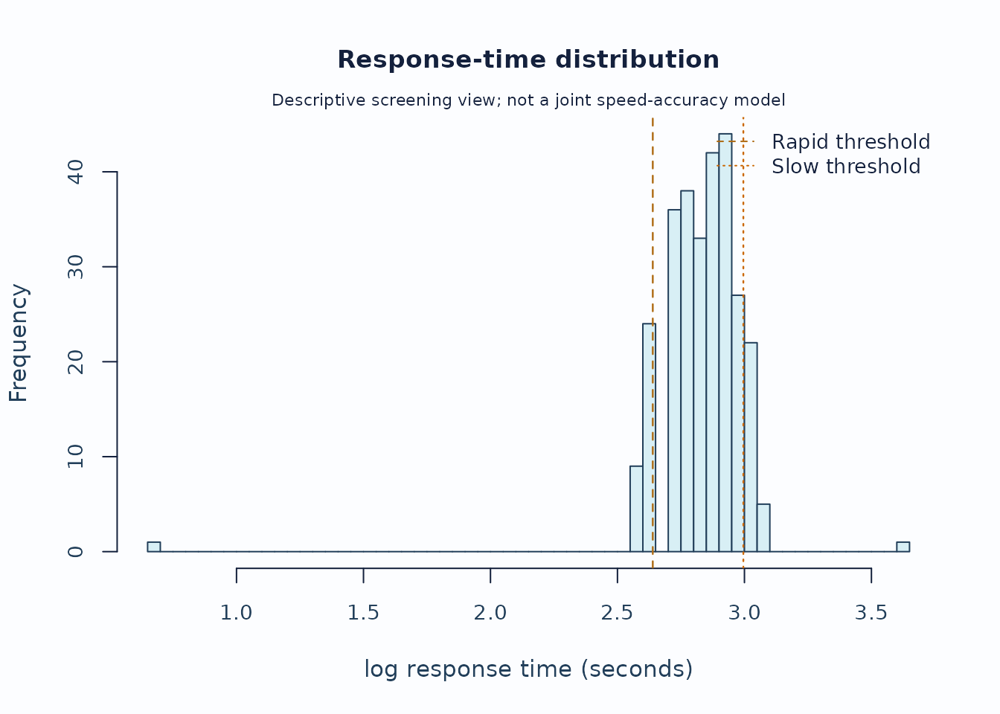

``` r

plot_response_time_review(rt, type = "person", preset = "publication")
```

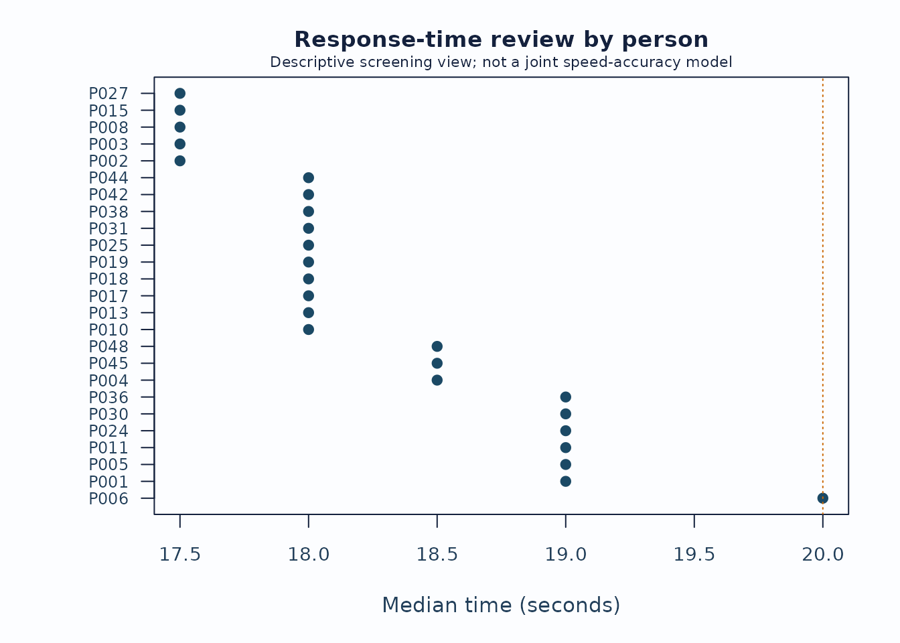

Interpretation:

- Start with the distribution plot to see whether the rapid/slow
  thresholds are sensible for this administration.
- Inspect person and facet summaries for concentrated rapid or slow
  rates rather than isolated events.
- Keep timing flags separate from fit, bias, and validity claims unless
  the study design explicitly supports stronger speed-accuracy modeling.

### Small-N shrinkage with uncertainty

When a non-person facet has few levels or sparse observations, a large
raw severity estimate can be a noisy estimate rather than a stable facet
signal. The shrinkage funnel shows how far empirical-Bayes pooling moved
each level toward the facet mean and whether the uncertainty remains
wide after pooling.

``` r

fit_eb <- apply_empirical_bayes_shrinkage(fit)

shrink <- plot_shrinkage_funnel(
  fit_eb,
  show_ci = TRUE,
  ci_level = 0.95,
  preset = "publication",
  draw = FALSE
)

head(shrink$data$table[, c(
  "Facet", "Level", "RawEstimate", "RawCI_Lower", "RawCI_Upper",
  "ShrunkEstimate", "ShrunkCI_Lower", "ShrunkCI_Upper",
  "ShrinkageFactor"
)])
#>   Facet Level RawEstimate RawCI_Lower RawCI_Upper ShrunkEstimate ShrunkCI_Lower
#> 1 Rater   R01  -0.6059776 -1.04569977 -0.16625550     -0.3739155     -0.7193270
#> 3 Rater   R02  -0.3820356 -0.79078871  0.02671748     -0.2486748     -0.5784554
#> 6 Rater   R04   0.1799462 -0.25645356  0.61634590      0.1116787     -0.2321154
#> 5 Rater   R05   0.1842365 -0.27475809  0.64323116      0.1099118     -0.2446091
#> 4 Rater   R03   0.2120388 -0.21248930  0.63656689      0.1343311     -0.2035680
#> 2 Rater   R06   0.4117917 -0.07719839  0.90078189      0.2329807     -0.1348274
#>   ShrunkCI_Upper ShrinkageFactor
#> 1    -0.02850402       0.3829550
#> 3     0.08110572       0.3490794
#> 6     0.45547282       0.3793770
#> 5     0.46443264       0.4034204
#> 4     0.47223032       0.3664785
#> 2     0.60078878       0.4342269

plot_shrinkage_funnel(
  fit_eb,
  show_ci = TRUE,
  ci_level = 0.95,
  preset = "publication"
)
```

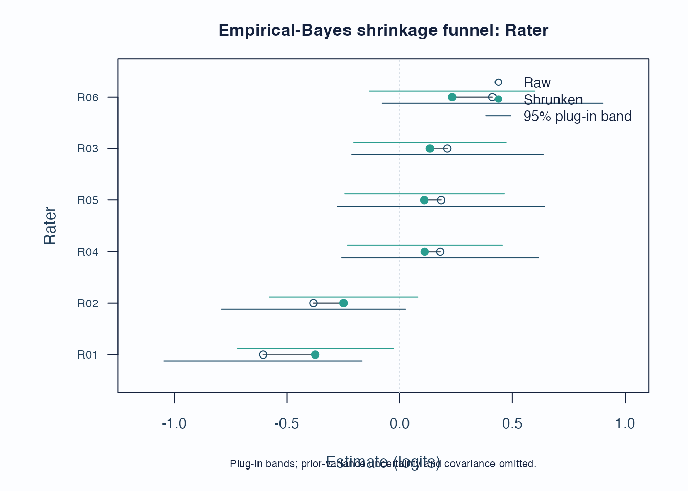

Interpretation:

- Long raw-to-shrunken segments identify levels most affected by the
  partial-pooling prior.
- Wide raw whiskers that narrow after pooling indicate estimation
  instability, not automatic rater-quality failure.
- Report the shrinkage method and keep this display separate from bias,
  fit, or validity claims.

## Recommended sequence

For a compact visual workflow:

1.  [`reporting_checklist()`](https://ryuya-dot-com.github.io/mfrmr/reference/reporting_checklist.md)
    when you want the package to route which figures are already
    supported.
2.  [`plot_qc_dashboard()`](https://ryuya-dot-com.github.io/mfrmr/reference/plot_qc_dashboard.md)
    for one-page triage.
3.  [`plot_unexpected()`](https://ryuya-dot-com.github.io/mfrmr/reference/plot_unexpected.md),
    [`plot_displacement()`](https://ryuya-dot-com.github.io/mfrmr/reference/plot_displacement.md),
    [`plot_marginal_fit()`](https://ryuya-dot-com.github.io/mfrmr/reference/plot_marginal_fit.md),
    and
    [`plot_interrater_agreement()`](https://ryuya-dot-com.github.io/mfrmr/reference/plot_interrater_agreement.md)
    for local follow-up.
4.  `plot(fit, type = "wright")` and `plot(fit, type = "pathway")` for
    targeting and scale interpretation.
5.  [`plot_residual_pca()`](https://ryuya-dot-com.github.io/mfrmr/reference/plot_residual_pca.md),
    [`plot_bias_interaction()`](https://ryuya-dot-com.github.io/mfrmr/reference/plot_bias_interaction.md),
    and
    [`plot_information()`](https://ryuya-dot-com.github.io/mfrmr/reference/plot_information.md)
    for deeper structural review.
6.  [`response_time_review()`](https://ryuya-dot-com.github.io/mfrmr/reference/response_time_review.md)
    and
    [`plot_response_time_review()`](https://ryuya-dot-com.github.io/mfrmr/reference/plot_response_time_review.md)
    when response-time metadata are available.
7.  `plot_shrinkage_funnel(show_ci = TRUE)` when empirical-Bayes
    shrinkage was applied.
8.  [`plot_guttman_scalogram()`](https://ryuya-dot-com.github.io/mfrmr/reference/plot_guttman_scalogram.md),
    [`plot_residual_qq()`](https://ryuya-dot-com.github.io/mfrmr/reference/plot_residual_qq.md),
    [`plot_rater_trajectory()`](https://ryuya-dot-com.github.io/mfrmr/reference/plot_rater_trajectory.md),
    and
    [`plot_rater_agreement_heatmap()`](https://ryuya-dot-com.github.io/mfrmr/reference/plot_rater_agreement_heatmap.md)
    as the teaching / drift / agreement-heatmap follow-up layer.

## Related help

- [`help("mfrmr_visual_diagnostics", package = "mfrmr")`](https://ryuya-dot-com.github.io/mfrmr/reference/mfrmr_visual_diagnostics.md)
- [`help("mfrmr_workflow_methods", package = "mfrmr")`](https://ryuya-dot-com.github.io/mfrmr/reference/mfrmr_workflow_methods.md)
- `mfrmr_interval_guide("shrinkage")`
