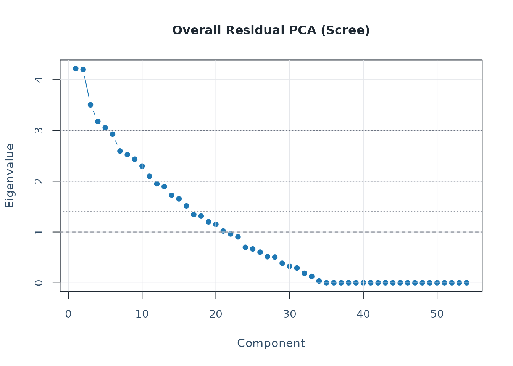
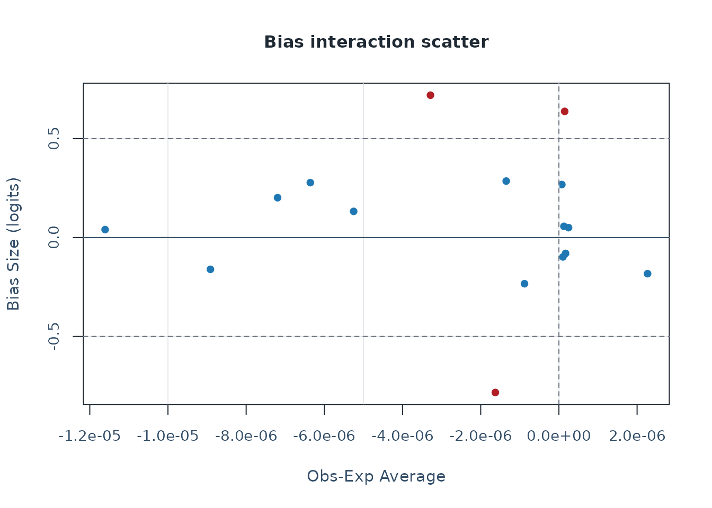

# mfrmr Workflow

This vignette outlines a reproducible workflow for:

- loading packaged simulation data
- fitting an MFRM with flexible facets
- running diagnostics and residual PCA
- generating APA and visual summary outputs
- moving from fitted models into design simulation and fixed-calibration
  prediction

For a plot-first companion guide, see the separate
`mfrmr-visual-diagnostics` vignette.

For speed-sensitive work, a useful pattern is:

- start with `method = "JML"` or `quad_points = 7`
- use `diagnose_mfrm(..., residual_pca = "none")` for the first pass
- reuse the same diagnostics object in downstream reports and plots

## MML and Diagnostic Modes

`mfrmr` treats `MML` and `JML` differently on purpose.

- `MML` integrates over the person distribution with Gauss-Hermite
  quadrature.
- The current `MML` branch optimizes the quadrature-based marginal
  log-likelihood directly; it is not an EM implementation.
- `JML` is often useful for quick exploratory passes, but `MML` remains
  the preferred route for final estimation and fixed-calibration
  follow-up.

For `RSM` and `PCM`, diagnostics now expose two distinct evidence paths:

- `diagnostic_mode = "legacy"` keeps the residual/EAP-based stack.
- `diagnostic_mode = "marginal_fit"` adds the strict latent-integrated
  screen.
- `diagnostic_mode = "both"` is the safest default when you want to
  inspect both views side by side.

The strict marginal branch is still screening-oriented in the current
release. Use `summary(diag)$diagnostic_basis` to separate the legacy
residual evidence from the strict marginal evidence rather than pooling
them into one decision.

## Load Data

``` r

library(mfrmr)

list_mfrmr_data()
#> [1] "example_core"     "example_bias"     "study1"           "study2"          
#> [5] "combined"         "study1_itercal"   "study2_itercal"   "combined_itercal"

data("ej2021_study1", package = "mfrmr")
head(ej2021_study1)
#>    Study Person Rater              Criterion Score
#> 1 Study1   P001   R08      Global_Impression     4
#> 2 Study1   P001   R08 Linguistic_Realization     3
#> 3 Study1   P001   R08       Task_Fulfillment     3
#> 4 Study1   P001   R10      Global_Impression     4
#> 5 Study1   P001   R10 Linguistic_Realization     3
#> 6 Study1   P001   R10       Task_Fulfillment     2

study1_alt <- load_mfrmr_data("study1")
identical(names(ej2021_study1), names(study1_alt))
#> [1] TRUE
```

## Minimal Runnable Example

Start with the packaged `example_core` dataset. It is intentionally
compact, category-complete, and generated from a single latent trait
plus facet main effects so that help-page examples stay fast without
relying on undersized toy data. The same object is also available via
`data("mfrmr_example_core", package = "mfrmr")`:

``` r

data("mfrmr_example_core", package = "mfrmr")
toy <- mfrmr_example_core

fit_toy <- fit_mfrm(
  data = toy,
  person = "Person",
  facets = c("Rater", "Criterion"),
  score = "Score",
  method = "JML",
  model = "RSM",
  maxit = 30
)
diag_toy <- diagnose_mfrm(fit_toy, residual_pca = "none")

summary(fit_toy)$overview
#> # A tibble: 1 × 42
#>   Model Method MethodUsed     N Persons Facets FacetInteractions
#>   <chr> <chr>  <chr>      <int>   <int>  <int>             <int>
#> 1 RSM   JML    JMLE         768      48      2                 0
#> # ℹ 35 more variables: InteractionParameters <int>, InteractionCells <int>,
#> #   InteractionSparseCells <int>, Categories <dbl>, LogLik <dbl>, AIC <dbl>,
#> #   BIC <dbl>, Converged <lgl>, Iterations <int>, IterationsBasis <chr>,
#> #   MMLEngineRequested <chr>, MMLEngineUsed <chr>, MMLEngineDetail <chr>,
#> #   EMIterations <int>, EMConverged <lgl>, EMRelativeChange <dbl>,
#> #   OptimizerMethod <chr>, ConvergenceCode <int>, ConvergenceBasis <chr>,
#> #   ConvergenceStatus <chr>, ConvergenceReason <chr>, …
summary(diag_toy)$overview
#> # A tibble: 1 × 10
#>   Observations Persons Facets Categories Subsets ResidualPCA DiagnosticMode
#>          <int>   <int>  <int>      <int>   <int> <chr>       <chr>         
#> 1          768      48      2          4       1 none        both          
#> # ℹ 3 more variables: Method <chr>, PrecisionTier <chr>, MarginalFit <chr>
names(plot(fit_toy, draw = FALSE))
#> [1] "name" "data"
```

The same fit can then move through the public first-contact route:

``` r

res_toy <- mfrm_results(fit_toy)
report_toy <- mfrm_report(res_toy, style = "qc")

summary(res_toy)$next_actions
#>   Priority               Area
#> 1        1           Overview
#> 2        2             Triage
#> 3        3        Diagnostics
#> 4        4 Visual diagnostics
#> 5        5          Precision
#> 6        6          Reporting
#> 7       11             Tables
#>                                                               Action
#> 1                                  Read the compact results summary.
#> 2                     Read the first-screen triage before branching.
#> 3             Review diagnostic key warnings before report drafting.
#> 4      Open the QC dashboard before drilling into individual tables.
#> 5 Inspect fit, separation, reliability, and ZSTD wording boundaries.
#> 6     Use the reporting checklist as the manuscript-routing surface.
#> 7                     Create an appendix-ready summary-table bundle.
#>                                            Route
#> 1                                   summary(res)
#> 2                            summary(res)$triage
#> 3          summary(res$diagnostics)$key_warnings
#> 4 plot(res, type = "qc", preset = "publication")
#> 5       summary(res$components$precision_review)
#> 6    summary(res$components$reporting_checklist)
#> 7                build_summary_table_bundle(res)
#>                                                                                                                      Reason
#> 1                                      Confirms input mode, model, method, section status, table coverage, and plot routes.
#> 2 Triage orders unavailable, review, information, and OK signals across diagnostics, tables, plots, and reporting surfaces.
#> 3               Diagnostic warnings identify the highest-priority fit, precision, residual, or category follow-up surfaces.
#> 4                                          The QC route gives a first visual check of fit, residual, and category surfaces.
#> 5                   Precision review keeps fit-size, standardized fit, and separation evidence in separate reporting lanes.
#> 6                                                     Checklist rows identify report-ready, missing, and caveated sections.
#> 7                                        The bundle exposes table roles, plot readiness, and conservative appendix presets.
summary(report_toy)$overview
#>   Style OverallStatus     FirstAction ReviewAreas CaveatAreas OptionalAreas
#> 1    qc        review Start with Fit.           2           0             3
#>   UnavailableAreas OkAreas
#> 1                0       0
#>                                                       SourceInclude
#> 1 fit, diagnostics, tables, precision, reporting, categories, plots

export_dir <- file.path(tempdir(), "mfrmr-workflow-export")
export_toy <- export_mfrm_results(
  res_toy,
  output_dir = export_dir,
  include = c("default", "report"),
  overwrite = TRUE
)
head(export_toy$written_files)
#>                 Component Format
#> 1        summary_overview    csv
#> 2          summary_status    csv
#> 3 summary_component_index    csv
#> 4     summary_table_index    csv
#> 5        summary_plot_map    csv
#> 6          summary_triage    csv
#>                                                                              Path
#> 1        /tmp/RtmptPm9l3/mfrmr-workflow-export/mfrmr_results_summary_overview.csv
#> 2          /tmp/RtmptPm9l3/mfrmr-workflow-export/mfrmr_results_summary_status.csv
#> 3 /tmp/RtmptPm9l3/mfrmr-workflow-export/mfrmr_results_summary_component_index.csv
#> 4     /tmp/RtmptPm9l3/mfrmr-workflow-export/mfrmr_results_summary_table_index.csv
#> 5        /tmp/RtmptPm9l3/mfrmr-workflow-export/mfrmr_results_summary_plot_map.csv
#> 6          /tmp/RtmptPm9l3/mfrmr-workflow-export/mfrmr_results_summary_triage.csv
#>   Note
#> 1     
#> 2     
#> 3     
#> 4     
#> 5     
#> 6
```

## Diagnostics and Reporting

``` r

t4_toy <- unexpected_response_table(
  fit_toy,
  diagnostics = diag_toy,
  abs_z_min = 1.5,
  prob_max = 0.4,
  top_n = 10
)
t12_toy <- fair_average_table(fit_toy, diagnostics = diag_toy)
t13_toy <- bias_interaction_report(
  estimate_bias(fit_toy, diag_toy,
                facet_a = "Rater", facet_b = "Criterion",
                max_iter = 2),
  top_n = 10
)

class(summary(t4_toy))
#> [1] "summary.mfrm_bundle"
class(summary(t12_toy))
#> [1] "summary.mfrm_bundle"
class(summary(t13_toy))
#> [1] "summary.mfrm_bundle"

names(plot(t4_toy, draw = FALSE))
#> [1] "name" "data"
names(plot(t12_toy, draw = FALSE))
#> [1] "name" "data"
names(plot(t13_toy, draw = FALSE))
#> [1] "name" "data"

chk_toy <- reporting_checklist(fit_toy, diagnostics = diag_toy)
subset(
  chk_toy$checklist,
  Section == "Visual Displays",
  c("Item", "DraftReady", "NextAction")
)
#>                                   Item DraftReady
#> 25                          Wright map       TRUE
#> 26                QC / facet dashboard       TRUE
#> 27                Residual PCA visuals      FALSE
#> 28 Connectivity / design-matrix visual       TRUE
#> 29  Inter-rater / displacement visuals       TRUE
#> 30             Strict marginal visuals      FALSE
#> 31                  Bias / DIF visuals      FALSE
#> 32      Precision / information curves      FALSE
#> 33                Fit/category visuals       TRUE
#>                                                                                                                                NextAction
#> 25                                               Include a Wright map when the manuscript benefits from a shared-scale targeting display.
#> 26                              Use the dashboard as a first-pass triage view, then move to the specific follow-up plot behind each flag.
#> 27                                                  Run residual PCA if you want scree/loadings visuals for residual-structure follow-up.
#> 28                                                                Use the design-matrix view to support linkage and comparability claims.
#> 29                                                Use displacement and inter-rater views to localize QC issues after dashboard screening.
#> 30 For MML reporting runs, call diagnose_mfrm(..., diagnostic_mode = "both") to enable strict marginal follow-up visuals where supported.
#> 31                                                                 Run bias or DIF screening before discussing interaction-level visuals.
#> 32                                      Use information curves descriptively and keep the current precision-tier caveat in the narrative.
#> 33                                                 Use category curves and fit visuals as local descriptive follow-up after QC screening.
```

## Fit and Diagnose with Full Data

For a realistic analysis, use the packaged Study 1 dataset:

``` r

fit <- fit_mfrm(
  data = ej2021_study1,
  person = "Person",
  facets = c("Rater", "Criterion"),
  score = "Score",
  method = "MML",
  model = "RSM",
  quad_points = 7
)

diag <- diagnose_mfrm(
  fit,
  residual_pca = "none"
)

summary(fit)
#> Many-Facet Rasch Model Summary
#>   Model: RSM | Method: MML | N: 1842 | Persons: 307 | Facets: 2 | Categories: 4
#>   MML engine: direct (requested: direct)
#> 
#> Status
#>  - Overall status: usable_fit
#>  - Convergence: converged (severity: pass, sup-norm: 0.002)
#>  - Estimation path: RSM / direct
#>  - Reporting readiness: ready_for_diagnostics_and_reporting_follow_up
#> 
#> Key warnings
#>  - No population model was requested; current MML output uses the package's legacy unconditional prior.
#> 
#> Next actions
#>  - Run `diagnose_mfrm(fit, diagnostic_mode = "both")` for element-level fit review.
#>  - Use `plot(fit, type = "wright", preset = "publication")` for targeting and scale review.
#>  - After diagnostics, use `reporting_checklist(fit, diagnostics = diagnostics)` for reporting readiness.
#> 
#> Fit overview
#>   LogLik: -2102.731 | AIC: 4247.462 | BIC: 4363.353
#>   Converged: Yes | Status: converged | Basis: optimizer_gradient | Fn evals: 95 | Gr evals: 26
#>   Terminal gradient: sup-norm = 0.002 | RMS = 0.001 | Review tol = 0
#>   Optimization note: Optimizer returned convergence code 0.
#> 
#> Population basis
#>  PopulationModel PosteriorBasis Formula PersonRows DesignColumns
#>            FALSE     legacy_mml    <NA>         NA            NA
#>  CodingVariables ContrastVariables Policy ResidualVariance OmittedPersons
#>                                      <NA>               NA              0
#>  OmittedRows
#>            0
#> 
#> Facet overview
#>      Facet Levels MeanEstimate SDEstimate MinEstimate MaxEstimate Span
#>  Criterion      3            0      0.693      -0.799       0.431 1.23
#>      Rater     18            0      0.667      -0.948       1.622 2.57
#> 
#> Person measure distribution
#>  Persons  Mean    SD Median    Min   Max  Span MeanPosteriorSD
#>      307 0.414 0.812  0.436 -1.451 2.385 3.835           0.482
#> 
#> Targeting (Person vs facet means; sum-to-zero ID makes Targeting = Person mean)
#>      Facet PersonMean FacetMean Targeting PersonSD FacetSD SpreadRatio
#>  Criterion      0.414         0     0.414    0.812   0.693       1.172
#>      Rater      0.414         0     0.414    0.812   0.667       1.219
#> 
#> Step parameter summary
#>  Steps    Min   Max  Span Monotonic
#>      3 -1.093 0.958 2.051      TRUE
#> 
#> Estimation settings
#>  StepFacet SlopeFacet NoncenterFacet WeightColumn QuadPoints RatingMin
#>       <NA>       <NA>         Person         <NA>          7         1
#>  RatingMax RatingRangeSource RatingMinSource RatingMaxSource DummyFacets
#>          4          observed        observed        observed            
#>  PositiveFacets FacetInteractions UnusedScoreCategories
#>                                                        
#>  UnusedScoreCategoryCount UnusedScoreCategoryType
#>                         0                    none
#> 
#> Most extreme facet levels (|estimate|)
#>      Facet             Level Estimate
#>      Rater               R13    1.622
#>      Rater               R08   -0.948
#>      Rater               R09   -0.917
#>      Rater               R06    0.892
#>  Criterion Global_Impression   -0.799
#> 
#> Highest person measures
#>  Person Estimate    SD PosteriorSD    SE Extreme
#>    P157    2.385 0.466       0.466 0.466    none
#>    P239    2.349 0.543       0.543 0.543    high
#>    P135    2.265 0.469       0.469 0.469    none
#>    P018    2.121 0.613       0.613 0.613    high
#>    P209    2.013 0.644       0.644 0.644    high
#> 
#> Lowest person measures
#>  Person Estimate    SD PosteriorSD    SE Extreme
#>    P136   -1.451 0.556       0.556 0.556    none
#>    P173   -1.400 0.526       0.526 0.526    none
#>    P159   -1.350 0.579       0.579 0.579    none
#>    P048   -1.333 0.468       0.468 0.468    none
#>    P089   -1.275 0.396       0.396 0.396    none
#> 
#> Paper reporting map
#>                                Area CoveredHere
#>  Model identification / convergence         yes
#>        Data structure / missingness          no
#>    Reliability / fit / residual PCA          no
#>                Category functioning     partial
#>     Bias / DIF / interaction checks          no
#>         Draft reporting / checklist          no
#>                                                                CompanionOutput
#>                                                                   summary(fit)
#>                                               summary(describe_mfrm_data(...))
#>                                                    summary(diagnose_mfrm(fit))
#>  rating_scale_table() / category_structure_report() / category_curves_report()
#>         summary(estimate_bias(...)) / analyze_dff() / related bundle summaries
#>                        reporting_checklist() / summary(build_apa_outputs(...))
#> 
#> Notes
#>  - No population model was requested; current MML output uses the package's legacy unconditional prior.
summary(diag)
#> Many-Facet Rasch Diagnostics Summary
#>   Observations: 1842 | Persons: 307 | Facets: 2 | Categories: 4 | Subsets: 1
#>   Residual PCA mode: none
#>   Method: MML | Precision tier: model_based
#>   Diagnostic mode: both | Strict marginal fit: available
#> 
#> Status
#>  - Overall status: follow_up_needed
#>  - Diagnostic path: both
#>  - Strict marginal fit: available
#>  - Precision tier: model_based
#>  - Primary screen: Read strict marginal fit first; use legacy residuals for continuity and follow-up.
#> 
#> Key warnings
#>  - Unexpected responses flagged: 100.
#>  - Flagged displacement levels: 40.
#>  - MnSq misfit flagged 130 element(s) outside 0.5-1.5 (Linacre threshold).
#>  - MnSq misfit: Person:P020 (Infit=0.03, Outfit=0.03; outside 0.5-1.5).
#>  - MnSq misfit: Person:P203 (Infit=0.04, Outfit=0.07; outside 0.5-1.5).
#> 
#> Next actions
#>  - Inspect `diagnostic_basis` before comparing legacy residual evidence with strict marginal evidence.
#>  - Review `top_marginal_cells` and `rating_scale_table(..., diagnostics = diag)` for first-order strict marginal follow-up.
#>  - Review `top_marginal_pairs` for pairwise local-dependence follow-up.
#>  - Use `unexpected_response_table()` / `plot_unexpected()` and `displacement_table()` / `plot_displacement()` for case-level follow-up.
#> 
#> Overall fit
#>  Infit Outfit InfitZSTD OutfitZSTD DF_Infit DF_Outfit
#>  0.811  0.786    -4.629      -7.01 1058.852      1842
#> 
#> Fit ZSTD standardization
#>  PrimaryFitDfMethod                   PrimaryZSTDColumns
#>              engine InfitZSTD / OutfitZSTD use engine df
#>                                               EngineDf
#>  DF_Infit = sum(Var * Weight); DF_Outfit = sum(Weight)
#>                                                                  FacetsDf
#>  DF = 2 / q^2 using the Wright-Masters/FACETS fourth-moment approximation
#>  FacetsColumnsAvailable   ZSTDTransform FacetsZSTDCap
#>                   FALSE Wilson-Hilferty            NA
#> 
#> Diagnostic basis guide
#>                    DiagnosticPath                      Component
#>               legacy_residual_fit           element_residual_fit
#>               strict_marginal_fit    first_order_category_counts
#>  strict_pairwise_local_dependence      pairwise_local_dependence
#>    posterior_predictive_follow_up posterior_predictive_follow_up
#>                   Status                                    Basis
#>                 computed          plugin_residuals_and_eap_tables
#>                 computed     latent_integrated_first_order_counts
#>                 computed latent_integrated_second_order_agreement
#>  planned_not_implemented         posterior_predictive_replication
#>                                    PrimaryStatistics
#>  Infit / Outfit / ZSTD / PTMEA / residual QC bundles
#>   category residuals / standardized residuals / RMSD
#>               exact and adjacent agreement residuals
#>                   replicated-data discrepancy checks
#>                 ReportingUse
#>  legacy_compatibility_screen
#>               screening_only
#>               screening_only
#>               screening_only
#>                                                                                                                                InterpretationNote
#>                        Legacy fit statistics use plug-in residual machinery and should not be interpreted as latent-integrated marginal evidence.
#>  Strict marginal fit integrates over the latent distribution and is the preferred strict screen for category-level misfit in the current release.
#>               Strict pairwise local-dependence checks are exploratory follow-ups to first-order marginal flags, not standalone inferential tests.
#>           Posterior predictive checking is reserved for corroborating strict marginal flags and practical-significance review in a later release.
#> 
#> Precision basis
#>  Method Converged PrecisionTier SupportsFormalInference HasFallbackSE
#>     MML      TRUE   model_based                    TRUE         FALSE
#>       PersonSEBasis           NonPersonSEBasis
#>  Posterior SD (EAP) Observed information (MML)
#>                              CIBasis
#>  Normal interval from model-based SE
#>                                                  ReliabilityBasis
#>  Observed variance with model-based and fit-adjusted error bounds
#>  HasFitAdjustedSE HasSamplePopulationCoverage
#>              TRUE                        TRUE
#>                                                         RecommendedUse
#>  Use for primary reporting of SE, CI, and reliability in this package.
#> 
#> Facet precision and spread
#>      Facet Levels Separation Strata Reliability RealSeparation RealStrata
#>  Criterion      3     14.918 20.223       0.996         14.918     20.223
#>     Person    307      1.322  2.096       0.636          1.226      1.968
#>      Rater     18      3.121  4.495       0.907          3.110      4.480
#>  RealReliability MeanInfit MeanOutfit
#>            0.996     0.810      0.786
#>            0.600     0.798      0.786
#>            0.906     0.813      0.786
#> 
#> Facet variability (fixed-effect chi-square; null = all elements equal)
#>      Facet Levels MeanMeasure    SD FixedChiSq FixedDF FixedProb RandomChiSq
#>  Criterion      3       0.000 0.693    413.140       2         0       1.999
#>     Person    307       0.414 0.812    888.264     306         0     302.435
#>      Rater     18       0.000 0.667    248.678      17         0      17.049
#>  RandomDF RandomProb
#>         1      0.157
#>       305      0.531
#>        16      0.382
#> 
#> Inter-rater agreement summary
#>  RaterFacet Raters Pairs OpportunityCount ExactAgreement ExpectedExactAgreement
#>       Rater     18   153              921          0.362                  0.355
#>  AgreementMinusExpected AdjacentAgreement MeanAbsDiff MeanCorr RaterSeparation
#>                   0.007             0.805       0.858    0.325           3.121
#>  RaterReliability
#>             0.907
#> 
#> Largest |ZSTD| rows
#>      Facet                  Level Infit Outfit InfitZSTD OutfitZSTD DF_Infit
#>  Criterion      Global_Impression 0.799  0.744    -2.590     -4.913  292.461
#>      Rater                    R08 0.702  0.661    -2.434     -4.103  110.307
#>  Criterion Linguistic_Realization 0.803  0.798    -2.907     -3.799  382.619
#>     Person                   P020 0.028  0.027    -2.744     -3.436    4.080
#>  Criterion       Task_Fulfillment 0.830  0.816    -2.481     -3.416  383.772
#>      Rater                    R10 0.738  0.726    -2.187     -2.939  118.696
#>     Person                   P203 0.041  0.073    -2.500     -2.836    3.885
#>     Person                   P098 2.328  3.387     1.549      2.800    3.539
#>      Rater                    R05 0.745  0.750    -1.916     -2.522   98.234
#>     Person                   P056 0.075  0.125    -1.727     -2.407    2.688
#>  DF_Outfit  AbsZ
#>        614 4.913
#>        228 4.103
#>        614 3.799
#>          6 3.436
#>        614 3.416
#>        192 2.939
#>          6 2.836
#>          6 2.800
#>        174 2.522
#>          6 2.407
#> 
#> MnSq misfit (outside 0.5-1.5 Linacre band; 130 element(s))
#>   Facet Level Infit InfitZSTD Outfit OutfitZSTD
#>  Person  P001 0.300    -1.082  0.307     -1.497
#>  Person  P005 0.467    -0.599  0.554     -0.736
#>  Person  P007 0.345    -0.369  0.277     -1.616
#>  Person  P012 1.537     0.841  1.569      1.035
#>  Person  P016 0.328    -1.052  0.332     -1.405
#>  Person  P017 0.202    -1.530  0.214     -1.896
#>  Person  P018 0.394    -0.361  0.325     -1.432
#>  Person  P020 0.028    -2.744  0.027     -3.436
#>  Person  P022 1.773     1.141  1.638      1.121
#>  Person  P023 0.478    -0.378  0.417     -1.122
#>  Person  P025 0.323    -1.105  0.349     -1.345
#>  Person  P026 0.440    -0.703  0.481     -0.932
#>  Person  P030 0.487    -0.703  0.475     -0.950
#>  Person  P035 0.356    -0.972  0.387     -1.218
#>  Person  P038 1.641     0.979  1.734      1.239
#>  Person  P039 0.263    -1.262  0.288     -1.573
#>  Person  P043 0.359    -1.009  0.382     -1.234
#>  Person  P046 0.251    -1.288  0.283     -1.594
#>  Person  P048 1.972     1.218  2.090      1.640
#>  Person  P049 0.436    -0.418  0.350     -1.341
#>  Person  P052 1.772     1.105  1.819      1.339
#>  Person  P055 1.696     1.007  1.443      0.868
#>  Person  P056 0.075    -1.727  0.125     -2.407
#>  Person  P057 0.329    -0.399  0.276     -1.622
#>  Person  P058 0.352    -1.055  0.353     -1.331
#>  Person  P062 0.249    -1.331  0.296     -1.541
#>  Person  P066 0.379    -0.979  0.390     -1.208
#>  Person  P067 0.499    -0.606  0.558     -0.726
#>  Person  P073 0.476    -0.499  1.022      0.231
#>  Person  P074 0.400    -0.773  0.486     -0.919
#>  Person  P075 0.350    -0.848  0.422     -1.106
#>  Person  P076 0.162    -1.594  0.185     -2.042
#>  Person  P079 0.521    -0.503  0.493     -0.900
#>  Person  P082 0.273    -0.987  0.279     -1.608
#>  Person  P083 1.132     0.414  1.559      1.022
#>  Person  P084 0.446    -0.354  0.372     -1.266
#>  Person  P085 0.208    -1.559  0.201     -1.959
#>  Person  P086 0.250    -1.382  0.270     -1.646
#>  Person  P090 0.278    -1.204  0.313     -1.474
#>  Person  P098 2.328     1.549  3.387      2.800
#>  Person  P102 0.146    -1.684  0.202     -1.956
#>  Person  P103 0.346    -1.071  0.361     -1.302
#>  Person  P104 1.783     1.128  1.616      1.094
#>  Person  P105 0.185    -1.157  0.233     -1.804
#>  Person  P106 0.444    -0.782  0.468     -0.969
#>  Person  P108 0.563    -0.215  0.480     -0.935
#>  Person  P112 0.297    -0.861  0.322     -1.444
#>  Person  P113 0.137    -1.702  0.201     -1.961
#>  Person  P114 0.239    -1.068  0.261     -1.684
#>  Person  P115 0.461    -0.738  0.465     -0.978
#>  Person  P116 0.549    -0.268  0.472     -0.959
#>  Person  P117 1.817     1.145  1.742      1.248
#>  Person  P118 0.255    -1.002  0.292     -1.558
#>  Person  P124 1.214     0.517  1.582      1.051
#>  Person  P125 0.482    -0.493  0.440     -1.050
#>  Person  P127 0.431    -0.395  0.359     -1.311
#>  Person  P129 0.487    -0.700  0.502     -0.874
#>  Person  P132 0.271    -1.244  0.296     -1.541
#>  Person  P133 0.480    -0.686  0.498     -0.884
#>  Person  P135 0.483    -0.400  0.410     -1.143
#>  Person  P136 0.412    -0.553  0.390     -1.206
#>  Person  P137 0.468    -0.606  0.450     -1.022
#>  Person  P138 1.717     1.078  1.567      1.032
#>  Person  P140 0.440    -0.670  0.433     -1.072
#>  Person  P141 2.353     1.591  2.441      1.992
#>  Person  P142 1.864     1.219  1.772      1.284
#>  Person  P143 1.552     0.895  1.714      1.215
#>  Person  P146 0.414    -0.670  0.485     -0.923
#>  Person  P148 0.323    -1.138  0.319     -1.452
#>  Person  P149 0.446    -0.354  0.372     -1.266
#>  Person  P155 0.451    -0.644  0.443     -1.042
#>  Person  P156 0.399    -0.453  0.341     -1.373
#>  Person  P159 0.222    -0.746  0.235     -1.799
#>  Person  P161 0.541    -0.256  0.462     -0.986
#>  Person  P164 0.483    -0.685  0.495     -0.892
#>  Person  P167 0.330    -1.085  0.331     -1.411
#>  Person  P170 0.256    -1.221  0.308     -1.494
#>  Person  P175 0.275    -0.939  0.302     -1.519
#>  Person  P176 0.500    -0.309  0.429     -1.086
#>  Person  P177 0.202    -1.530  0.214     -1.896
#>  Person  P178 0.455    -0.617  0.439     -1.056
#>  Person  P182 0.448    -0.795  0.470     -0.962
#>  Person  P188 0.435    -0.261  0.312     -1.478
#>  Person  P190 0.306    -1.122  0.306     -1.503
#>  Person  P191 0.371    -0.840  0.362     -1.300
#>  Person  P193 0.297    -0.861  0.322     -1.444
#>  Person  P195 0.419    -0.764  0.445     -1.037
#>  Person  P196 2.064     1.214  1.405      0.816
#>  Person  P198 0.526    -0.201  0.443     -1.042
#>  Person  P199 1.999     1.208  1.436      0.858
#>  Person  P203 0.041    -2.500  0.073     -2.836
#>  Person  P204 0.454    -0.411  0.389     -1.212
#>  Person  P207 0.480    -0.696  0.468     -0.969
#>  Person  P208 0.422    -0.470  0.371     -1.269
#>  Person  P209 0.463    -0.226  0.323     -1.439
#>  Person  P211 1.900     1.223  1.745      1.252
#>  Person  P215 0.315    -1.093  0.325     -1.431
#>  Person  P217 0.436    -0.578  0.536     -0.783
#>  Person  P219 2.017     1.302  2.047      1.594
#>  Person  P222 0.343    -0.802  0.323     -1.439
#>  Person  P223 0.415    -0.723  0.645     -0.514
#>  Person  P224 1.621     0.980  1.601      1.075
#>  Person  P227 0.333    -1.040  0.336     -1.392
#>  Person  P235 1.589     0.894  1.448      0.875
#>  Person  P237 0.499    -0.349  0.436     -1.065
#>  Person  P239 0.712     0.052  0.420     -1.113
#>  Person  P242 0.391    -0.890  0.380     -1.240
#>  Person  P243 1.464     0.809  1.613      1.090
#>  Person  P244 0.375    -0.984  0.377     -1.250
#>  Person  P247 1.585     0.849  1.429      0.849
#>  Person  P250 0.329    -1.114  0.308     -1.495
#>  Person  P255 0.518    -0.421  0.465     -0.978
#>  Person  P261 0.208    -1.541  0.228     -1.830
#>  Person  P262 1.682     1.006  1.639      1.122
#>  Person  P264 0.426    -0.706  0.598     -0.625
#>  Person  P266 0.433    -0.783  0.458     -0.999
#>  Person  P267 0.484    -0.675  0.505     -0.866
#>  Person  P269 0.451    -0.614  0.434     -1.068
#>  Person  P271 1.456     0.810  1.502      0.947
#>  Person  P272 0.208    -1.467  0.232     -1.812
#>  Person  P277 0.359    -0.921  0.358     -1.314
#>  Person  P278 0.483    -0.503  0.442     -1.044
#>  Person  P281 0.326    -1.086  0.352     -1.336
#>  Person  P282 1.770     1.094  1.670      1.161
#>  Person  P285 1.526     0.873  1.472      0.907
#>  Person  P287 0.578    -0.307  0.500     -0.881
#>  Person  P290 0.462    -0.549  0.431     -1.080
#>  Person  P293 0.480    -0.624  0.477     -0.944
#>  Person  P300 0.427    -0.631  0.416     -1.124
#>  Person  P306 1.717     1.075  1.589      1.060
#> 
#> Category usage (Count + AvgMeasure within each observed score)
#>  Category Count AvgMeasure Disordering
#>         1   215     -0.404            
#>         2   451     -0.005            
#>         3   525      0.450            
#>         4   651      0.945            
#> 
#> Strict marginal fit
#>  Available Method Model                                Basis ObservationCount
#>       TRUE    MML   RSM latent_integrated_first_order_counts             1842
#>  CategoryCount OverallRMSD OverallMaxAbsStdResidual StepGroupsFlagged
#>              4       0.016                    3.137                 1
#>  FacetLevelsFlagged PairwiseAvailable PairwiseFlaggedLevelPairs
#>                   3              TRUE                        90
#>  PosteriorPredictiveFollowUp InferenceTier SupportsFormalInference
#>      planned_not_implemented   exploratory                   FALSE
#>  FormalInferenceEligible PrimaryReportingEligible ClassificationSystem
#>                    FALSE                    FALSE            screening
#>    ReportingUse             StatisticLabel
#>  screening_only strict marginal fit screen
#>                                                                                        LiteratureSeries
#>  limited_information_inspired_marginal_screen + agreement_screen_informed_by_generalized_residual_logic
#>  InterpretationBasis
#>    latent_integrated
#>                                                                                                   FollowUpRecommendation
#>  Use as screening evidence and corroborate with companion diagnostics, model comparisons, and substantive design review.
#> 
#> Largest marginal residual cells
#>     CellType StepFacet     Facet                  Level Category ObservedCount
#>   step_facet    Common      <NA>                   <NA>        1           215
#>  facet_level      <NA>     Rater                    R17        3            14
#>  facet_level      <NA>     Rater                    R17        4            36
#>   step_facet    Common      <NA>                   <NA>        4           651
#>  facet_level      <NA>     Rater                    R18        2            19
#>  facet_level      <NA> Criterion Linguistic_Realization        1            93
#>  facet_level      <NA> Criterion       Task_Fulfillment        1            99
#>  facet_level      <NA>     Rater                    R14        1             0
#>  facet_level      <NA>     Rater                    R15        1             1
#>  facet_level      <NA>     Rater                    R08        2            45
#>  ExpectedCount PropDiff StdResidual AbsStdResidual
#>        255.396   -0.022      -3.137          3.137
#>         24.202   -0.121      -2.508          2.508
#>         26.894    0.108       2.476          2.476
#>        610.605    0.022       2.356          2.356
#>         28.274   -0.075      -2.100          2.100
#>        108.761   -0.026      -1.896          1.896
#>        114.751   -0.026      -1.858          1.858
#>          2.690   -0.064      -1.847          1.847
#>          3.788   -0.186      -1.796          1.796
#>         35.807    0.040       1.789          1.789
#> 
#> Strict pairwise local dependence
#>      Facet LevelPairs ContextPairs MeanAbsExactGap MeanAbsAdjacentGap
#>  Criterion          3         1842           0.007              0.008
#>      Rater        111          921           0.122              0.097
#>  MaxAbsExactStdResidual MaxAbsAdjacentStdResidual OpportunityWeight
#>                   0.624                     0.923              1842
#>                   2.547                     2.674               921
#>  FlaggedLevelPairs InferenceTier SupportsFormalInference
#>                  0   exploratory                   FALSE
#>                 90   exploratory                   FALSE
#>  FormalInferenceEligible PrimaryReportingEligible ClassificationSystem
#>                    FALSE                    FALSE            screening
#>                    FALSE                    FALSE            screening
#>    ReportingUse                     StatisticLabel
#>  screening_only strict pairwise agreement residual
#>  screening_only strict pairwise agreement residual
#>                                         LiteratureSeries
#>  agreement_screen_informed_by_generalized_residual_logic
#>  agreement_screen_informed_by_generalized_residual_logic
#> 
#> Largest marginal pairwise residuals
#>  Facet Level1 Level2 LevelPairCount OpportunityWeight ExactAgreement
#>  Rater    R05    R10             30                30          0.167
#>  Rater    R01    R12              6                 6          0.833
#>  Rater    R02    R08              9                 9          0.000
#>  Rater    R13    R16              6                 6          0.667
#>  Rater    R11    R12             12                12          0.083
#>  Rater    R05    R12              6                 6          0.000
#>  Rater    R03    R09             12                12          0.167
#>  Rater    R08    R17             18                18          0.611
#>  Rater    R04    R12              6                 6          0.667
#>  Rater    R02    R04              9                 9          0.111
#>  ExpectedExactAgreement ExactGap ExactStdResidual AdjacentAgreement
#>                   0.389   -0.222           -2.547             0.767
#>                   0.355    0.479            2.482             1.000
#>                   0.377   -0.377           -2.391             0.778
#>                   0.252    0.415            2.348             0.667
#>                   0.362   -0.279           -2.029             0.667
#>                   0.351   -0.351           -1.818             0.667
#>                   0.412   -0.246           -1.774             0.833
#>                   0.417    0.194            1.752             0.944
#>                   0.336    0.330            1.727             0.833
#>                   0.382   -0.270           -1.716             0.778
#>  ExpectedAdjacentAgreement AdjacentGap AdjacentStdResidual Flagged
#>                      0.827      -0.060              -0.878    TRUE
#>                      0.803       0.197               1.225    TRUE
#>                      0.800      -0.022              -0.167    TRUE
#>                      0.673      -0.006              -0.034    TRUE
#>                      0.819      -0.152              -1.376    TRUE
#>                      0.800      -0.133              -0.823    TRUE
#>                      0.838      -0.005              -0.043    TRUE
#>                      0.821       0.124               1.406    TRUE
#>                      0.780       0.053               0.315    TRUE
#>                      0.807      -0.029              -0.228    TRUE
#> 
#> Strict marginal guidance
#>                       Component                     StatisticLabel
#>     first_order_category_counts  strict marginal category residual
#>       pairwise_local_dependence strict pairwise agreement residual
#>  posterior_predictive_follow_up     posterior predictive follow-up
#>                                         LiteratureSeries
#>             limited_information_inspired_marginal_screen
#>  agreement_screen_informed_by_generalized_residual_logic
#>               posterior_predictive_model_check_follow_up
#>                                              PrimaryRole InferenceTier
#>                               category / facet screening   exploratory
#>                               local dependence follow-up   exploratory
#>  misfit corroboration / practical-significance follow-up   exploratory
#>  SupportsFormalInference FormalInferenceEligible PrimaryReportingEligible
#>                    FALSE                   FALSE                    FALSE
#>                    FALSE                   FALSE                    FALSE
#>                    FALSE                   FALSE                    FALSE
#>  ClassificationSystem   ReportingUse
#>             screening screening_only
#>             screening screening_only
#>             screening screening_only
#>                                                                                                                                                                                      InterpretationNote
#>                                                                                  Use as a latent-integrated limited-information screen; do not treat isolated flags as definitive inferential evidence.
#>  Use as an exploratory local-dependence follow-up after first-order marginal screening; this is informed by generalized-residual logic but is not a formal Haberman-Sinharay generalized residual test.
#>              Reserve for corroborating strict marginal flags and assessing practical significance; the current release labels this follow-up path but does not yet compute posterior predictive checks.
#> 
#> Paper reporting map
#>                                   Area CoveredHere
#>              Overall fit / reliability         yes
#>  Precision basis / inferential caveats         yes
#>                    Strict marginal fit         yes
#>         Residual PCA / local structure     partial
#>    Unexpected responses / displacement     partial
#>                 Connectivity / subsets     partial
#>          Manuscript checklist / export          no
#>                                                                CompanionOutput
#>                                                           summary(diagnostics)
#>                                                           summary(diagnostics)
#>  diagnostics$marginal_fit / rating_scale_table(..., diagnostics = diagnostics)
#>                               analyze_residual_pca() / diagnostics$pca details
#>        unexpected_response_table() / displacement_table() / interaction tables
#>                      subset_connectivity_report() / measurable_summary_table()
#>                        reporting_checklist() / summary(build_apa_outputs(...))
#> 
#> Flag counts
#>                                 Metric Count
#>                   Unexpected responses   100
#>            Flagged displacement levels    40
#>                       Interaction rows    20
#>                      Inter-rater pairs   153
#>            Marginal fit flagged groups     4
#>  Marginal pairwise flagged level pairs    90
#> 
#> Notes
#>  - Unexpected responses were flagged under current thresholds.
#>  - SE/ModelSE, CI, and reliability conventions depend on the estimation path; see diagnostics$approximation_notes for MML-vs-JML details.
#>  - Use `diagnostics$reliability` for facet-level separation/reliability. Use `diagnostics$interrater` only for observed agreement across matched rater contexts.
#>  - Strict marginal fit was computed from latent-integrated first-order category counts.
#>  - Strict pairwise local-dependence checks were computed from posterior-integrated expected exact and adjacent agreement and should be read as exploratory screening summaries.
#>  - Posterior predictive checking remains a planned corroborating follow-up for strict marginal flags and practical-significance review.
#>  - Legacy residual diagnostics and strict marginal diagnostics target different quantities; do not compare their residual magnitudes directly.
```

If you need residual-structure evidence for a final report, you can add
residual PCA after the initial diagnostic pass. Treat this as an
exploratory screen, not as a standalone unidimensionality test or as a
DIMTEST/UNIDIM substitute. In MFRM reporting, a cautious claim should
combine global residual fit, element-level fit, residual PCA, and
local-dependence screens, for example: “evidence consistent with
essential unidimensionality under the specified facet structure.”

``` r

diag_pca <- diagnose_mfrm(
  fit,
  residual_pca = "both",
  pca_max_factors = 6
)

summary(diag_pca)
#> Many-Facet Rasch Diagnostics Summary
#>   Observations: 1842 | Persons: 307 | Facets: 2 | Categories: 4 | Subsets: 1
#>   Residual PCA mode: both
#>   Method: MML | Precision tier: model_based
#>   Diagnostic mode: both | Strict marginal fit: available
#> 
#> Status
#>  - Overall status: follow_up_needed
#>  - Diagnostic path: both
#>  - Strict marginal fit: available
#>  - Precision tier: model_based
#>  - Primary screen: Read strict marginal fit first; use legacy residuals for continuity and follow-up.
#> 
#> Key warnings
#>  - Unexpected responses flagged: 100.
#>  - Flagged displacement levels: 40.
#>  - MnSq misfit flagged 130 element(s) outside 0.5-1.5 (Linacre threshold).
#>  - MnSq misfit: Person:P020 (Infit=0.03, Outfit=0.03; outside 0.5-1.5).
#>  - MnSq misfit: Person:P203 (Infit=0.04, Outfit=0.07; outside 0.5-1.5).
#> 
#> Next actions
#>  - Inspect `diagnostic_basis` before comparing legacy residual evidence with strict marginal evidence.
#>  - Review `top_marginal_cells` and `rating_scale_table(..., diagnostics = diag)` for first-order strict marginal follow-up.
#>  - Review `top_marginal_pairs` for pairwise local-dependence follow-up.
#>  - Use `unexpected_response_table()` / `plot_unexpected()` and `displacement_table()` / `plot_displacement()` for case-level follow-up.
#> 
#> Overall fit
#>  Infit Outfit InfitZSTD OutfitZSTD DF_Infit DF_Outfit
#>  0.811  0.786    -4.629      -7.01 1058.852      1842
#> 
#> Fit ZSTD standardization
#>  PrimaryFitDfMethod                   PrimaryZSTDColumns
#>              engine InfitZSTD / OutfitZSTD use engine df
#>                                               EngineDf
#>  DF_Infit = sum(Var * Weight); DF_Outfit = sum(Weight)
#>                                                                  FacetsDf
#>  DF = 2 / q^2 using the Wright-Masters/FACETS fourth-moment approximation
#>  FacetsColumnsAvailable   ZSTDTransform FacetsZSTDCap
#>                   FALSE Wilson-Hilferty            NA
#> 
#> Diagnostic basis guide
#>                    DiagnosticPath                      Component
#>               legacy_residual_fit           element_residual_fit
#>               strict_marginal_fit    first_order_category_counts
#>  strict_pairwise_local_dependence      pairwise_local_dependence
#>    posterior_predictive_follow_up posterior_predictive_follow_up
#>                   Status                                    Basis
#>                 computed          plugin_residuals_and_eap_tables
#>                 computed     latent_integrated_first_order_counts
#>                 computed latent_integrated_second_order_agreement
#>  planned_not_implemented         posterior_predictive_replication
#>                                    PrimaryStatistics
#>  Infit / Outfit / ZSTD / PTMEA / residual QC bundles
#>   category residuals / standardized residuals / RMSD
#>               exact and adjacent agreement residuals
#>                   replicated-data discrepancy checks
#>                 ReportingUse
#>  legacy_compatibility_screen
#>               screening_only
#>               screening_only
#>               screening_only
#>                                                                                                                                InterpretationNote
#>                        Legacy fit statistics use plug-in residual machinery and should not be interpreted as latent-integrated marginal evidence.
#>  Strict marginal fit integrates over the latent distribution and is the preferred strict screen for category-level misfit in the current release.
#>               Strict pairwise local-dependence checks are exploratory follow-ups to first-order marginal flags, not standalone inferential tests.
#>           Posterior predictive checking is reserved for corroborating strict marginal flags and practical-significance review in a later release.
#> 
#> Precision basis
#>  Method Converged PrecisionTier SupportsFormalInference HasFallbackSE
#>     MML      TRUE   model_based                    TRUE         FALSE
#>       PersonSEBasis           NonPersonSEBasis
#>  Posterior SD (EAP) Observed information (MML)
#>                              CIBasis
#>  Normal interval from model-based SE
#>                                                  ReliabilityBasis
#>  Observed variance with model-based and fit-adjusted error bounds
#>  HasFitAdjustedSE HasSamplePopulationCoverage
#>              TRUE                        TRUE
#>                                                         RecommendedUse
#>  Use for primary reporting of SE, CI, and reliability in this package.
#> 
#> Facet precision and spread
#>      Facet Levels Separation Strata Reliability RealSeparation RealStrata
#>  Criterion      3     14.918 20.223       0.996         14.918     20.223
#>     Person    307      1.322  2.096       0.636          1.226      1.968
#>      Rater     18      3.121  4.495       0.907          3.110      4.480
#>  RealReliability MeanInfit MeanOutfit
#>            0.996     0.810      0.786
#>            0.600     0.798      0.786
#>            0.906     0.813      0.786
#> 
#> Facet variability (fixed-effect chi-square; null = all elements equal)
#>      Facet Levels MeanMeasure    SD FixedChiSq FixedDF FixedProb RandomChiSq
#>  Criterion      3       0.000 0.693    413.140       2         0       1.999
#>     Person    307       0.414 0.812    888.264     306         0     302.435
#>      Rater     18       0.000 0.667    248.678      17         0      17.049
#>  RandomDF RandomProb
#>         1      0.157
#>       305      0.531
#>        16      0.382
#> 
#> Inter-rater agreement summary
#>  RaterFacet Raters Pairs OpportunityCount ExactAgreement ExpectedExactAgreement
#>       Rater     18   153              921          0.362                  0.355
#>  AgreementMinusExpected AdjacentAgreement MeanAbsDiff MeanCorr RaterSeparation
#>                   0.007             0.805       0.858    0.325           3.121
#>  RaterReliability
#>             0.907
#> 
#> Largest |ZSTD| rows
#>      Facet                  Level Infit Outfit InfitZSTD OutfitZSTD DF_Infit
#>  Criterion      Global_Impression 0.799  0.744    -2.590     -4.913  292.461
#>      Rater                    R08 0.702  0.661    -2.434     -4.103  110.307
#>  Criterion Linguistic_Realization 0.803  0.798    -2.907     -3.799  382.619
#>     Person                   P020 0.028  0.027    -2.744     -3.436    4.080
#>  Criterion       Task_Fulfillment 0.830  0.816    -2.481     -3.416  383.772
#>      Rater                    R10 0.738  0.726    -2.187     -2.939  118.696
#>     Person                   P203 0.041  0.073    -2.500     -2.836    3.885
#>     Person                   P098 2.328  3.387     1.549      2.800    3.539
#>      Rater                    R05 0.745  0.750    -1.916     -2.522   98.234
#>     Person                   P056 0.075  0.125    -1.727     -2.407    2.688
#>  DF_Outfit  AbsZ
#>        614 4.913
#>        228 4.103
#>        614 3.799
#>          6 3.436
#>        614 3.416
#>        192 2.939
#>          6 2.836
#>          6 2.800
#>        174 2.522
#>          6 2.407
#> 
#> MnSq misfit (outside 0.5-1.5 Linacre band; 130 element(s))
#>   Facet Level Infit InfitZSTD Outfit OutfitZSTD
#>  Person  P001 0.300    -1.082  0.307     -1.497
#>  Person  P005 0.467    -0.599  0.554     -0.736
#>  Person  P007 0.345    -0.369  0.277     -1.616
#>  Person  P012 1.537     0.841  1.569      1.035
#>  Person  P016 0.328    -1.052  0.332     -1.405
#>  Person  P017 0.202    -1.530  0.214     -1.896
#>  Person  P018 0.394    -0.361  0.325     -1.432
#>  Person  P020 0.028    -2.744  0.027     -3.436
#>  Person  P022 1.773     1.141  1.638      1.121
#>  Person  P023 0.478    -0.378  0.417     -1.122
#>  Person  P025 0.323    -1.105  0.349     -1.345
#>  Person  P026 0.440    -0.703  0.481     -0.932
#>  Person  P030 0.487    -0.703  0.475     -0.950
#>  Person  P035 0.356    -0.972  0.387     -1.218
#>  Person  P038 1.641     0.979  1.734      1.239
#>  Person  P039 0.263    -1.262  0.288     -1.573
#>  Person  P043 0.359    -1.009  0.382     -1.234
#>  Person  P046 0.251    -1.288  0.283     -1.594
#>  Person  P048 1.972     1.218  2.090      1.640
#>  Person  P049 0.436    -0.418  0.350     -1.341
#>  Person  P052 1.772     1.105  1.819      1.339
#>  Person  P055 1.696     1.007  1.443      0.868
#>  Person  P056 0.075    -1.727  0.125     -2.407
#>  Person  P057 0.329    -0.399  0.276     -1.622
#>  Person  P058 0.352    -1.055  0.353     -1.331
#>  Person  P062 0.249    -1.331  0.296     -1.541
#>  Person  P066 0.379    -0.979  0.390     -1.208
#>  Person  P067 0.499    -0.606  0.558     -0.726
#>  Person  P073 0.476    -0.499  1.022      0.231
#>  Person  P074 0.400    -0.773  0.486     -0.919
#>  Person  P075 0.350    -0.848  0.422     -1.106
#>  Person  P076 0.162    -1.594  0.185     -2.042
#>  Person  P079 0.521    -0.503  0.493     -0.900
#>  Person  P082 0.273    -0.987  0.279     -1.608
#>  Person  P083 1.132     0.414  1.559      1.022
#>  Person  P084 0.446    -0.354  0.372     -1.266
#>  Person  P085 0.208    -1.559  0.201     -1.959
#>  Person  P086 0.250    -1.382  0.270     -1.646
#>  Person  P090 0.278    -1.204  0.313     -1.474
#>  Person  P098 2.328     1.549  3.387      2.800
#>  Person  P102 0.146    -1.684  0.202     -1.956
#>  Person  P103 0.346    -1.071  0.361     -1.302
#>  Person  P104 1.783     1.128  1.616      1.094
#>  Person  P105 0.185    -1.157  0.233     -1.804
#>  Person  P106 0.444    -0.782  0.468     -0.969
#>  Person  P108 0.563    -0.215  0.480     -0.935
#>  Person  P112 0.297    -0.861  0.322     -1.444
#>  Person  P113 0.137    -1.702  0.201     -1.961
#>  Person  P114 0.239    -1.068  0.261     -1.684
#>  Person  P115 0.461    -0.738  0.465     -0.978
#>  Person  P116 0.549    -0.268  0.472     -0.959
#>  Person  P117 1.817     1.145  1.742      1.248
#>  Person  P118 0.255    -1.002  0.292     -1.558
#>  Person  P124 1.214     0.517  1.582      1.051
#>  Person  P125 0.482    -0.493  0.440     -1.050
#>  Person  P127 0.431    -0.395  0.359     -1.311
#>  Person  P129 0.487    -0.700  0.502     -0.874
#>  Person  P132 0.271    -1.244  0.296     -1.541
#>  Person  P133 0.480    -0.686  0.498     -0.884
#>  Person  P135 0.483    -0.400  0.410     -1.143
#>  Person  P136 0.412    -0.553  0.390     -1.206
#>  Person  P137 0.468    -0.606  0.450     -1.022
#>  Person  P138 1.717     1.078  1.567      1.032
#>  Person  P140 0.440    -0.670  0.433     -1.072
#>  Person  P141 2.353     1.591  2.441      1.992
#>  Person  P142 1.864     1.219  1.772      1.284
#>  Person  P143 1.552     0.895  1.714      1.215
#>  Person  P146 0.414    -0.670  0.485     -0.923
#>  Person  P148 0.323    -1.138  0.319     -1.452
#>  Person  P149 0.446    -0.354  0.372     -1.266
#>  Person  P155 0.451    -0.644  0.443     -1.042
#>  Person  P156 0.399    -0.453  0.341     -1.373
#>  Person  P159 0.222    -0.746  0.235     -1.799
#>  Person  P161 0.541    -0.256  0.462     -0.986
#>  Person  P164 0.483    -0.685  0.495     -0.892
#>  Person  P167 0.330    -1.085  0.331     -1.411
#>  Person  P170 0.256    -1.221  0.308     -1.494
#>  Person  P175 0.275    -0.939  0.302     -1.519
#>  Person  P176 0.500    -0.309  0.429     -1.086
#>  Person  P177 0.202    -1.530  0.214     -1.896
#>  Person  P178 0.455    -0.617  0.439     -1.056
#>  Person  P182 0.448    -0.795  0.470     -0.962
#>  Person  P188 0.435    -0.261  0.312     -1.478
#>  Person  P190 0.306    -1.122  0.306     -1.503
#>  Person  P191 0.371    -0.840  0.362     -1.300
#>  Person  P193 0.297    -0.861  0.322     -1.444
#>  Person  P195 0.419    -0.764  0.445     -1.037
#>  Person  P196 2.064     1.214  1.405      0.816
#>  Person  P198 0.526    -0.201  0.443     -1.042
#>  Person  P199 1.999     1.208  1.436      0.858
#>  Person  P203 0.041    -2.500  0.073     -2.836
#>  Person  P204 0.454    -0.411  0.389     -1.212
#>  Person  P207 0.480    -0.696  0.468     -0.969
#>  Person  P208 0.422    -0.470  0.371     -1.269
#>  Person  P209 0.463    -0.226  0.323     -1.439
#>  Person  P211 1.900     1.223  1.745      1.252
#>  Person  P215 0.315    -1.093  0.325     -1.431
#>  Person  P217 0.436    -0.578  0.536     -0.783
#>  Person  P219 2.017     1.302  2.047      1.594
#>  Person  P222 0.343    -0.802  0.323     -1.439
#>  Person  P223 0.415    -0.723  0.645     -0.514
#>  Person  P224 1.621     0.980  1.601      1.075
#>  Person  P227 0.333    -1.040  0.336     -1.392
#>  Person  P235 1.589     0.894  1.448      0.875
#>  Person  P237 0.499    -0.349  0.436     -1.065
#>  Person  P239 0.712     0.052  0.420     -1.113
#>  Person  P242 0.391    -0.890  0.380     -1.240
#>  Person  P243 1.464     0.809  1.613      1.090
#>  Person  P244 0.375    -0.984  0.377     -1.250
#>  Person  P247 1.585     0.849  1.429      0.849
#>  Person  P250 0.329    -1.114  0.308     -1.495
#>  Person  P255 0.518    -0.421  0.465     -0.978
#>  Person  P261 0.208    -1.541  0.228     -1.830
#>  Person  P262 1.682     1.006  1.639      1.122
#>  Person  P264 0.426    -0.706  0.598     -0.625
#>  Person  P266 0.433    -0.783  0.458     -0.999
#>  Person  P267 0.484    -0.675  0.505     -0.866
#>  Person  P269 0.451    -0.614  0.434     -1.068
#>  Person  P271 1.456     0.810  1.502      0.947
#>  Person  P272 0.208    -1.467  0.232     -1.812
#>  Person  P277 0.359    -0.921  0.358     -1.314
#>  Person  P278 0.483    -0.503  0.442     -1.044
#>  Person  P281 0.326    -1.086  0.352     -1.336
#>  Person  P282 1.770     1.094  1.670      1.161
#>  Person  P285 1.526     0.873  1.472      0.907
#>  Person  P287 0.578    -0.307  0.500     -0.881
#>  Person  P290 0.462    -0.549  0.431     -1.080
#>  Person  P293 0.480    -0.624  0.477     -0.944
#>  Person  P300 0.427    -0.631  0.416     -1.124
#>  Person  P306 1.717     1.075  1.589      1.060
#> 
#> Category usage (Count + AvgMeasure within each observed score)
#>  Category Count AvgMeasure Disordering
#>         1   215     -0.404            
#>         2   451     -0.005            
#>         3   525      0.450            
#>         4   651      0.945            
#> 
#> Strict marginal fit
#>  Available Method Model                                Basis ObservationCount
#>       TRUE    MML   RSM latent_integrated_first_order_counts             1842
#>  CategoryCount OverallRMSD OverallMaxAbsStdResidual StepGroupsFlagged
#>              4       0.016                    3.137                 1
#>  FacetLevelsFlagged PairwiseAvailable PairwiseFlaggedLevelPairs
#>                   3              TRUE                        90
#>  PosteriorPredictiveFollowUp InferenceTier SupportsFormalInference
#>      planned_not_implemented   exploratory                   FALSE
#>  FormalInferenceEligible PrimaryReportingEligible ClassificationSystem
#>                    FALSE                    FALSE            screening
#>    ReportingUse             StatisticLabel
#>  screening_only strict marginal fit screen
#>                                                                                        LiteratureSeries
#>  limited_information_inspired_marginal_screen + agreement_screen_informed_by_generalized_residual_logic
#>  InterpretationBasis
#>    latent_integrated
#>                                                                                                   FollowUpRecommendation
#>  Use as screening evidence and corroborate with companion diagnostics, model comparisons, and substantive design review.
#> 
#> Largest marginal residual cells
#>     CellType StepFacet     Facet                  Level Category ObservedCount
#>   step_facet    Common      <NA>                   <NA>        1           215
#>  facet_level      <NA>     Rater                    R17        3            14
#>  facet_level      <NA>     Rater                    R17        4            36
#>   step_facet    Common      <NA>                   <NA>        4           651
#>  facet_level      <NA>     Rater                    R18        2            19
#>  facet_level      <NA> Criterion Linguistic_Realization        1            93
#>  facet_level      <NA> Criterion       Task_Fulfillment        1            99
#>  facet_level      <NA>     Rater                    R14        1             0
#>  facet_level      <NA>     Rater                    R15        1             1
#>  facet_level      <NA>     Rater                    R08        2            45
#>  ExpectedCount PropDiff StdResidual AbsStdResidual
#>        255.396   -0.022      -3.137          3.137
#>         24.202   -0.121      -2.508          2.508
#>         26.894    0.108       2.476          2.476
#>        610.605    0.022       2.356          2.356
#>         28.274   -0.075      -2.100          2.100
#>        108.761   -0.026      -1.896          1.896
#>        114.751   -0.026      -1.858          1.858
#>          2.690   -0.064      -1.847          1.847
#>          3.788   -0.186      -1.796          1.796
#>         35.807    0.040       1.789          1.789
#> 
#> Strict pairwise local dependence
#>      Facet LevelPairs ContextPairs MeanAbsExactGap MeanAbsAdjacentGap
#>  Criterion          3         1842           0.007              0.008
#>      Rater        111          921           0.122              0.097
#>  MaxAbsExactStdResidual MaxAbsAdjacentStdResidual OpportunityWeight
#>                   0.624                     0.923              1842
#>                   2.547                     2.674               921
#>  FlaggedLevelPairs InferenceTier SupportsFormalInference
#>                  0   exploratory                   FALSE
#>                 90   exploratory                   FALSE
#>  FormalInferenceEligible PrimaryReportingEligible ClassificationSystem
#>                    FALSE                    FALSE            screening
#>                    FALSE                    FALSE            screening
#>    ReportingUse                     StatisticLabel
#>  screening_only strict pairwise agreement residual
#>  screening_only strict pairwise agreement residual
#>                                         LiteratureSeries
#>  agreement_screen_informed_by_generalized_residual_logic
#>  agreement_screen_informed_by_generalized_residual_logic
#> 
#> Largest marginal pairwise residuals
#>  Facet Level1 Level2 LevelPairCount OpportunityWeight ExactAgreement
#>  Rater    R05    R10             30                30          0.167
#>  Rater    R01    R12              6                 6          0.833
#>  Rater    R02    R08              9                 9          0.000
#>  Rater    R13    R16              6                 6          0.667
#>  Rater    R11    R12             12                12          0.083
#>  Rater    R05    R12              6                 6          0.000
#>  Rater    R03    R09             12                12          0.167
#>  Rater    R08    R17             18                18          0.611
#>  Rater    R04    R12              6                 6          0.667
#>  Rater    R02    R04              9                 9          0.111
#>  ExpectedExactAgreement ExactGap ExactStdResidual AdjacentAgreement
#>                   0.389   -0.222           -2.547             0.767
#>                   0.355    0.479            2.482             1.000
#>                   0.377   -0.377           -2.391             0.778
#>                   0.252    0.415            2.348             0.667
#>                   0.362   -0.279           -2.029             0.667
#>                   0.351   -0.351           -1.818             0.667
#>                   0.412   -0.246           -1.774             0.833
#>                   0.417    0.194            1.752             0.944
#>                   0.336    0.330            1.727             0.833
#>                   0.382   -0.270           -1.716             0.778
#>  ExpectedAdjacentAgreement AdjacentGap AdjacentStdResidual Flagged
#>                      0.827      -0.060              -0.878    TRUE
#>                      0.803       0.197               1.225    TRUE
#>                      0.800      -0.022              -0.167    TRUE
#>                      0.673      -0.006              -0.034    TRUE
#>                      0.819      -0.152              -1.376    TRUE
#>                      0.800      -0.133              -0.823    TRUE
#>                      0.838      -0.005              -0.043    TRUE
#>                      0.821       0.124               1.406    TRUE
#>                      0.780       0.053               0.315    TRUE
#>                      0.807      -0.029              -0.228    TRUE
#> 
#> Strict marginal guidance
#>                       Component                     StatisticLabel
#>     first_order_category_counts  strict marginal category residual
#>       pairwise_local_dependence strict pairwise agreement residual
#>  posterior_predictive_follow_up     posterior predictive follow-up
#>                                         LiteratureSeries
#>             limited_information_inspired_marginal_screen
#>  agreement_screen_informed_by_generalized_residual_logic
#>               posterior_predictive_model_check_follow_up
#>                                              PrimaryRole InferenceTier
#>                               category / facet screening   exploratory
#>                               local dependence follow-up   exploratory
#>  misfit corroboration / practical-significance follow-up   exploratory
#>  SupportsFormalInference FormalInferenceEligible PrimaryReportingEligible
#>                    FALSE                   FALSE                    FALSE
#>                    FALSE                   FALSE                    FALSE
#>                    FALSE                   FALSE                    FALSE
#>  ClassificationSystem   ReportingUse
#>             screening screening_only
#>             screening screening_only
#>             screening screening_only
#>                                                                                                                                                                                      InterpretationNote
#>                                                                                  Use as a latent-integrated limited-information screen; do not treat isolated flags as definitive inferential evidence.
#>  Use as an exploratory local-dependence follow-up after first-order marginal screening; this is informed by generalized-residual logic but is not a formal Haberman-Sinharay generalized residual test.
#>              Reserve for corroborating strict marginal flags and assessing practical significance; the current release labels this follow-up path but does not yet compute posterior predictive checks.
#> 
#> Paper reporting map
#>                                   Area CoveredHere
#>              Overall fit / reliability         yes
#>  Precision basis / inferential caveats         yes
#>                    Strict marginal fit         yes
#>         Residual PCA / local structure     partial
#>    Unexpected responses / displacement     partial
#>                 Connectivity / subsets     partial
#>          Manuscript checklist / export          no
#>                                                                CompanionOutput
#>                                                           summary(diagnostics)
#>                                                           summary(diagnostics)
#>  diagnostics$marginal_fit / rating_scale_table(..., diagnostics = diagnostics)
#>                               analyze_residual_pca() / diagnostics$pca details
#>        unexpected_response_table() / displacement_table() / interaction tables
#>                      subset_connectivity_report() / measurable_summary_table()
#>                        reporting_checklist() / summary(build_apa_outputs(...))
#> 
#> Flag counts
#>                                 Metric Count
#>                   Unexpected responses   100
#>            Flagged displacement levels    40
#>                       Interaction rows    20
#>                      Inter-rater pairs   153
#>            Marginal fit flagged groups     4
#>  Marginal pairwise flagged level pairs    90
#> 
#> Notes
#>  - Unexpected responses were flagged under current thresholds.
#>  - SE/ModelSE, CI, and reliability conventions depend on the estimation path; see diagnostics$approximation_notes for MML-vs-JML details.
#>  - Use `diagnostics$reliability` for facet-level separation/reliability. Use `diagnostics$interrater` only for observed agreement across matched rater contexts.
#>  - Strict marginal fit was computed from latent-integrated first-order category counts.
#>  - Strict pairwise local-dependence checks were computed from posterior-integrated expected exact and adjacent agreement and should be read as exploratory screening summaries.
#>  - Posterior predictive checking remains a planned corroborating follow-up for strict marginal flags and practical-significance review.
#>  - Legacy residual diagnostics and strict marginal diagnostics target different quantities; do not compare their residual magnitudes directly.
```

## Strict Diagnostics for RSM and PCM

For `RSM` and `PCM`, the package can now keep the legacy residual path
and the strict marginal path side by side:

``` r

fit_rsm_strict <- fit_mfrm(
  data = toy,
  person = "Person",
  facets = c("Rater", "Criterion"),
  score = "Score",
  method = "MML",
  model = "RSM",
  quad_points = 7,
  maxit = 30
)
diag_rsm_strict <- diagnose_mfrm(
  fit_rsm_strict,
  diagnostic_mode = "both",
  residual_pca = "none"
)

fit_pcm_strict <- fit_mfrm(
  data = toy,
  person = "Person",
  facets = c("Rater", "Criterion"),
  score = "Score",
  method = "MML",
  model = "PCM",
  step_facet = "Criterion",
  quad_points = 7,
  maxit = 30
)
diag_pcm_strict <- diagnose_mfrm(
  fit_pcm_strict,
  diagnostic_mode = "both",
  residual_pca = "none"
)

summary(diag_rsm_strict)$diagnostic_basis[, c("DiagnosticPath", "Status", "Basis")]
#> # A tibble: 4 × 3
#>   DiagnosticPath                   Status                  Basis                
#>   <chr>                            <chr>                   <chr>                
#> 1 legacy_residual_fit              computed                plugin_residuals_and…
#> 2 strict_marginal_fit              computed                latent_integrated_fi…
#> 3 strict_pairwise_local_dependence computed                latent_integrated_se…
#> 4 posterior_predictive_follow_up   planned_not_implemented posterior_predictive…
summary(diag_pcm_strict)$diagnostic_basis[, c("DiagnosticPath", "Status", "Basis")]
#> # A tibble: 4 × 3
#>   DiagnosticPath                   Status                  Basis                
#>   <chr>                            <chr>                   <chr>                
#> 1 legacy_residual_fit              computed                plugin_residuals_and…
#> 2 strict_marginal_fit              computed                latent_integrated_fi…
#> 3 strict_pairwise_local_dependence computed                latent_integrated_se…
#> 4 posterior_predictive_follow_up   planned_not_implemented posterior_predictive…
```

When you want a compact simulation-based screening check for the strict
branch, use
[`evaluate_mfrm_diagnostic_screening()`](https://ryuya-dot-com.github.io/mfrmr/reference/evaluate_mfrm_diagnostic_screening.md)
on a small design:

``` r

screen_rsm <- evaluate_mfrm_diagnostic_screening(
  design = list(person = 18, rater = 3, criterion = 3, assignment = 3),
  reps = 1,
  scenarios = c("well_specified", "local_dependence"),
  model = "RSM",
  maxit = 30,
  quad_points = 7,
  seed = 123
)
screen_pcm <- evaluate_mfrm_diagnostic_screening(
  design = list(person = 18, rater = 3, criterion = 3, assignment = 3),
  reps = 1,
  scenarios = c("well_specified", "step_structure_misspecification"),
  model = "PCM",
  maxit = 30,
  quad_points = 7,
  seed = 123
)

screen_rsm$performance_summary[, c("Scenario", "EvaluationUse", "LegacyAnyFlagRate", "StrictAnyFlagRate")]
#> # A tibble: 2 × 4
#>   Scenario         EvaluationUse     LegacyAnyFlagRate StrictAnyFlagRate
#>   <chr>            <chr>                         <dbl>             <dbl>
#> 1 local_dependence sensitivity_proxy                 0                 1
#> 2 well_specified   type_I_proxy                      1                 1
screen_pcm$performance_summary[, c("Scenario", "EvaluationUse", "LegacySensitivityProxy", "StrictSensitivityProxy", "DeltaStrictMinusLegacyFlagRate")]
#> # A tibble: 2 × 5
#>   Scenario           EvaluationUse LegacySensitivityProxy StrictSensitivityProxy
#>   <chr>              <chr>                          <dbl>                  <dbl>
#> 1 step_structure_mi… sensitivity_…                      1                      1
#> 2 well_specified     type_I_proxy                      NA                     NA
#> # ℹ 1 more variable: DeltaStrictMinusLegacyFlagRate <dbl>
```

The same strict branch is now reflected in the reporting router:

``` r

chk_rsm_strict <- reporting_checklist(fit_rsm_strict, diagnostics = diag_rsm_strict)
subset(
  chk_rsm_strict$checklist,
  Section == "Visual Displays" &
    Item %in% c("QC / facet dashboard", "Strict marginal visuals", "Precision / information curves"),
  c("Item", "Available", "DraftReady", "NextAction")
)
#>                              Item Available DraftReady
#> 26           QC / facet dashboard      TRUE       TRUE
#> 30        Strict marginal visuals      TRUE      FALSE
#> 32 Precision / information curves      TRUE       TRUE
#>                                                                                                                       NextAction
#> 26                     Use the dashboard as a first-pass triage view, then move to the specific follow-up plot behind each flag.
#> 30 Treat strict marginal plots as exploratory corroboration screens, then corroborate with design review and legacy diagnostics.
#> 32                                Use information curves to describe precision across theta when that is the reporting question.
```

## Residual PCA and Reporting

``` r

pca <- analyze_residual_pca(diag_pca, mode = "both")
plot_residual_pca(pca, mode = "overall", plot_type = "scree")
```



``` r

data("mfrmr_example_bias", package = "mfrmr")
bias_df <- mfrmr_example_bias
fit_bias <- fit_mfrm(
  bias_df,
  person = "Person",
  facets = c("Rater", "Criterion"),
  score = "Score",
  method = "MML",
  model = "RSM",
  quad_points = 7
)
diag_bias <- diagnose_mfrm(fit_bias, residual_pca = "none")
bias <- estimate_bias(fit_bias, diag_bias, facet_a = "Rater", facet_b = "Criterion")
fixed <- build_fixed_reports(bias)
apa <- build_apa_outputs(fit_bias, diag_bias, bias_results = bias)

mfrm_threshold_profiles()
#> mfrmr Threshold Profile Summary
#> 
#> Overview
#>  Profiles ThresholdCount PCAReferenceCount DefaultProfile
#>         3             11                 7       standard
#> 
#> Profile thresholds
#>               Threshold strict standard lenient
#>        expected_var_min   0.30    2e-01    0.10
#>             low_cat_min  15.00    1e+01    5.00
#>        min_facet_levels   4.00    3e+00    2.00
#>       misfit_ratio_warn   0.08    1e-01    0.15
#>  missing_fit_ratio_warn   0.15    2e-01    0.30
#>               n_obs_min 200.00    1e+02   60.00
#>            n_person_min  50.00    3e+01   20.00
#>    pca_first_eigen_warn   1.50    2e+00    3.00
#>     pca_first_prop_warn   0.10    1e-01    0.20
#>        zstd2_ratio_warn   0.08    1e-01    0.15
#>        zstd3_ratio_warn   0.03    5e-02    0.08
#> 
#> Threshold ranges across profiles
#>               Threshold   Min Median    Max   Span
#>        expected_var_min  0.10  2e-01   0.30   0.20
#>             low_cat_min  5.00  1e+01  15.00  10.00
#>        min_facet_levels  2.00  3e+00   4.00   2.00
#>       misfit_ratio_warn  0.08  1e-01   0.15   0.07
#>  missing_fit_ratio_warn  0.15  2e-01   0.30   0.15
#>               n_obs_min 60.00  1e+02 200.00 140.00
#>            n_person_min 20.00  3e+01  50.00  30.00
#>    pca_first_eigen_warn  1.50  2e+00   3.00   1.50
#>     pca_first_prop_warn  0.10  1e-01   0.20   0.10
#>        zstd2_ratio_warn  0.08  1e-01   0.15   0.07
#>        zstd3_ratio_warn  0.03  5e-02   0.08   0.05
#> 
#> PCA reference bands
#>        Band              Key Value
#>  eigenvalue critical_minimum  1.40
#>  eigenvalue          caution  1.50
#>  eigenvalue           common  2.00
#>  eigenvalue           strong  3.00
#>  proportion            minor  0.05
#>  proportion          caution  0.10
#>  proportion           strong  0.20
#> 
#> Notes
#>  - Profiles tune warning strictness for build_visual_summaries().Use `thresholds` in build_visual_summaries() to override selected values.
vis <- build_visual_summaries(fit_bias, diag_bias, threshold_profile = "standard")
vis$warning_map$residual_pca_overall
#> [1] "Threshold profile: standard (PC1 EV >= 2.0, variance >= 10%)."                                                                                                          
#> [2] "Heuristic reference bands: EV >= 1.4 (critical minimum), >= 1.5 (caution), >= 2.0 (common), >= 3.0 (strong); variance >= 5% (minor), >= 10% (caution), >= 20% (strong)."
#> [3] "Current exploratory PC1 checks: EV>=1.5:Y, EV>=2.0:Y, EV>=3.0:Y, Var>=10%:Y, Var>=20%:Y."                                                                               
#> [4] "Overall residual PCA PC1 exceeds the current heuristic eigenvalue band (3.22)."                                                                                         
#> [5] "Overall residual PCA PC1 explains 20.1% variance."
```

The same `example_bias` dataset also carries a `Group` variable so
DIF-oriented examples can show a non-null pattern instead of a fully
clean result. It can be loaded either with
`load_mfrmr_data("example_bias")` or
`data("mfrmr_example_bias", package = "mfrmr")`.

## Human-Readable Reporting API

``` r

spec <- specifications_report(fit, title = "Study run")
data_qc <- data_quality_report(
  fit,
  data = ej2021_study1,
  person = "Person",
  facets = c("Rater", "Criterion"),
  score = "Score"
)
iter <- estimation_iteration_report(fit, max_iter = 8)
subset_rep <- subset_connectivity_report(fit, diagnostics = diag)
facet_stats <- facet_statistics_report(fit, diagnostics = diag)
cat_structure <- category_structure_report(fit, diagnostics = diag)
cat_curves <- category_curves_report(fit, theta_points = 101)
bias_rep <- bias_interaction_report(bias, top_n = 20)
plot_bias_interaction(bias_rep, plot = "scatter")
```



## Design Simulation and Prediction

The package also supports a separate simulation/prediction layer. The
key distinction is:

- [`evaluate_mfrm_recovery()`](https://ryuya-dot-com.github.io/mfrmr/reference/evaluate_mfrm_recovery.md)
  checks whether known generating parameters are recovered under a
  stated simulation design. It is the first simulation check to run when
  you are validating a model specification or a planned design.
- [`evaluate_mfrm_design()`](https://ryuya-dot-com.github.io/mfrmr/reference/evaluate_mfrm_design.md)
  and
  [`predict_mfrm_population()`](https://ryuya-dot-com.github.io/mfrmr/reference/predict_mfrm_population.md)
  are design-level helpers that summarize expected operating
  characteristics under an explicit simulation specification.
- [`mfrm_generalizability()`](https://ryuya-dot-com.github.io/mfrmr/reference/mfrm_generalizability.md)
  and
  [`mfrm_d_study()`](https://ryuya-dot-com.github.io/mfrmr/reference/mfrm_d_study.md)
  summarize observed univariate G-study components and analytic D-study
  projections. Read `IdentificationStatus`, `GStatus`, and `PhiStatus`
  before reporting projected coefficients; boundary or singular
  mixed-model fits are design-identification warnings rather than
  high-stakes-ready reliability evidence.
- [`predict_mfrm_units()`](https://ryuya-dot-com.github.io/mfrmr/reference/predict_mfrm_units.md)
  and
  [`sample_mfrm_plausible_values()`](https://ryuya-dot-com.github.io/mfrmr/reference/sample_mfrm_plausible_values.md)
  score future or partially observed persons under a fixed `MML`
  calibration.

``` r

if (requireNamespace("lme4", quietly = TRUE)) {
  gt <- mfrm_generalizability(fit)
  gt$coefficients[, c("G", "Phi", "GStatus", "PhiStatus",
                      "IdentificationStatus")]

  ds <- mfrm_d_study(
    gt,
    data.frame(Rater = c(2, 3, 4), Criterion = 4),
    residual_scaling = "sensitivity"
  )
  ds[, c("n_Rater", "n_Criterion", "ResidualScaling",
         "G", "Phi", "GStatus", "PhiStatus", "IdentificationStatus")]
}
```

``` r

sim_spec <- build_mfrm_sim_spec(
  n_person = 30,
  n_rater = 4,
  n_criterion = 4,
  raters_per_person = 2,
  assignment = "rotating"
)

recovery <- suppressWarnings(
  evaluate_mfrm_recovery(
    sim_spec = sim_spec,
    reps = 2,
    maxit = 30,
    include_diagnostics = TRUE,
    diagnostic_fit_df_method = "both",
    seed = 2
  )
)

summary(recovery)$recovery_summary[, c("ParameterType", "Facet", "RMSE", "Bias")]
#> # A tibble: 4 × 4
#>   ParameterType Facet      RMSE      Bias
#>   <chr>         <chr>     <dbl>     <dbl>
#> 1 facet         Criterion 0.151 -3.47e-18
#> 2 facet         Rater     0.161  0       
#> 3 person        Person    0.480 -8.56e-18
#> 4 step          Common    0.200  4.62e-18
plot(recovery, type = "summary", metric = "rmse", draw = FALSE)$data$plot_table
#> # A tibble: 4 × 22
#>   ParameterType Facet     ComparisonScale  Rows  Reps ComparableRate MeanTruth
#>   <chr>         <chr>     <chr>           <int> <int>          <dbl>     <dbl>
#> 1 facet         Criterion logit               8     2              1   -0.176 
#> 2 facet         Rater     logit               8     2              1   -0.0221
#> 3 person        Person    logit              60     2              1    0.0229
#> 4 step          Common    logit               6     2              1    0     
#> # ℹ 15 more variables: MeanEstimate <dbl>, Bias <dbl>, McseBias <dbl>,
#> #   RMSE <dbl>, McseRMSE <dbl>, MAE <dbl>, RawBias <dbl>, RawRMSE <dbl>,
#> #   Correlation <dbl>, MeanSE <dbl>, SEAvailableRate <dbl>, Coverage95 <dbl>,
#> #   RecoveryBasis <chr>, PlotGroup <chr>, Value <dbl>

recovery_review <- assess_mfrm_recovery(
  recovery,
  min_reps = 2,
  min_se_available = NULL,
  max_mcse_rmse_ratio = NULL,
  max_rmse = c(facet = 1, step = 1, default = 1.5),
  max_abs_bias = c(default = 0.75)
)

summary(recovery_review)$checklist[, c("Section", "Item", "Status")]
#> # A tibble: 11 × 3
#>    Section               Item                             Status      
#>    <chr>                 <chr>                            <chr>       
#>  1 Run completion        Replication count                ok          
#>  2 Run completion        Simulation and refit success     ok          
#>  3 Run completion        Reported convergence             ok          
#>  4 Recovery content      Recoverable truth-estimate rows  ok          
#>  5 Generator conditions  Bounded-GPCM slope regime        not_assessed
#>  6 Generator conditions  Generated score-category support ok          
#>  7 Uncertainty           Standard-error availability      not_assessed
#>  8 Uncertainty           Coverage                         review      
#>  9 Monte Carlo precision RMSE Monte Carlo error           not_assessed
#> 10 Practical thresholds  RMSE threshold                   ok          
#> 11 Practical thresholds  Bias threshold                   ok
summary(recovery_review)$reading_order
#> # A tibble: 6 × 4
#>    Step Route                                                 WhatToRead Purpose
#>   <int> <chr>                                                 <chr>      <chr>  
#> 1     1 "summary(recovery_review)"                            Overall r… Decide…
#> 2     2 "recovery_review$condition_reporting_notes, then rec… Generator… Separa…
#> 3     3 "recovery_review$diagnostic_reporting_notes, then re… Reporter-… Check …
#> 4     4 "plot(recovery_review, type = \"status\")"            Checklist… Find t…
#> 5     5 "plot(recovery_review, type = \"metrics\")"           Parameter… Identi…
#> 6     6 "recovery_review$source$recovery"                     Row-level… Diagno…
summary(recovery_review)$condition_reporting_notes
#> # A tibble: 2 × 10
#>   Model GPCMSlopeRegime StressLevel    ConditionArea ReportingAttention
#>   <chr> <chr>           <chr>          <chr>         <chr>             
#> 1 RSM   NA              not_applicable slope_regime  context           
#> 2 RSM   NA              not_applicable score_support context           
#> # ℹ 5 more variables: ConditionFinding <chr>, Evidence <chr>,
#> #   ReportingImplication <chr>, NextAction <chr>, ValidationUse <chr>
summary(recovery_review)$condition_review
#> # A tibble: 1 × 16
#>   Model GPCMSlopeRegime StressLevel    SlopeLevels MaxAbsCenteredLogSlope
#>   <chr> <chr>           <chr>                <int>                  <dbl>
#> 1 RSM   NA              not_applicable          NA                     NA
#> # ℹ 11 more variables: Replications <int>, ScoreSupportReplications <int>,
#> #   MinScoreCount <int>, MinScoreProportion <dbl>, MaxZeroScoreLevels <int>,
#> #   ScoreSupportStatus <chr>, Status <chr>, Interpretation <chr>,
#> #   ScoreSupportInterpretation <chr>, ScoreSupportNextAction <chr>,
#> #   NextAction <chr>
summary(recovery_review)$diagnostic_reporting_notes
#> # A tibble: 4 × 7
#>   Facet     ReportingAttention DiagnosticFinding   Evidence ReportingImplication
#>   <chr>     <chr>              <chr>               <chr>    <chr>               
#> 1 Criterion reporting_review   zero_separation_or… replica… The Rasch/FACETS-st…
#> 2 Person    reporting_review   abs_zstd_flags_pre… replica… At least one replic…
#> 3 Person    reporting_review   df_sensitive_zstd_… replica… Fit-ZSTD flagging c…
#> 4 Rater     context            diagnostic_context… replica… Fit/separation diag…
#> # ℹ 2 more variables: NextAction <chr>, ValidationUse <chr>
summary(recovery_review)$diagnostic_review
#> # A tibble: 3 × 21
#>   Facet     Replications MeanLevels MeanSeparation MeanReliability MeanStrata
#>   <chr>            <int>      <dbl>          <dbl>           <dbl>      <dbl>
#> 1 Criterion            2          4           0              0          0.333
#> 2 Person               2         30           2.02           0.799      3.02 
#> 3 Rater                2          4           1.76           0.751      2.68 
#> # ℹ 15 more variables: MeanRealSeparation <dbl>, MeanRealReliability <dbl>,
#> #   MeanRealStrata <dbl>, MeanInfit <dbl>, MeanOutfit <dbl>,
#> #   MeanMisfitRateAbsZ2 <dbl>, MaxMisfitRateAbsZ2 <dbl>, MeanMaxAbsZSTD <dbl>,
#> #   MeanDfSensitiveFlagRate <dbl>, FitDfMethods <chr>, ValidationUse <chr>,
#> #   DiagnosticAvailability <chr>, Status <chr>, Interpretation <chr>,
#> #   NextAction <chr>

status_plot <- plot(recovery_review, type = "status", draw = FALSE)
status_plot$data$section_status
#>                 Section       Status Checks StatusRank AttentionOrder
#> 1           Uncertainty       review      1          3              1
#> 2  Generator conditions not_assessed      1          2              2
#> 3 Monte Carlo precision not_assessed      1          2              3
#> 4           Uncertainty not_assessed      1          2              4
#> 5  Generator conditions           ok      1          1              5
#> 6  Practical thresholds           ok      2          1              6
#> 7      Recovery content           ok      1          1              7
#> 8        Run completion           ok      3          1              8
status_plot$data$reading_order
#>   Step
#> 1    1
#> 2    2
#> 3    3
#> 4    4
#> 5    5
#> 6    6
#>                                                                                Route
#> 1                                                           summary(recovery_review)
#> 2   recovery_review$condition_reporting_notes, then recovery_review$condition_review
#> 3 recovery_review$diagnostic_reporting_notes, then recovery_review$diagnostic_review
#> 4                                             plot(recovery_review, type = "status")
#> 5                                            plot(recovery_review, type = "metrics")
#> 6                                                    recovery_review$source$recovery
#>                                                                                                                WhatToRead
#> 1                                                                Overall run status, next actions, and compact checklist.
#> 2                               Generator-condition caveats, then GPCM slope-regime and generated score-support metadata.
#> 3 Reporter-facing fit/separation caveats, then optional operating characteristics retained by include_diagnostics = TRUE.
#> 4                                                                          Checklist domains ordered by attention status.
#> 5                                              Parameter groups behind RMSE, bias, coverage, SE, or Monte Carlo statuses.
#> 6                                      Row-level truth-estimate comparisons for the parameter groups that need follow-up.
#>                                                                                                                          Purpose
#> 1                                                                             Decide whether the assessment is ready to inspect.
#> 2 Separate generator stress conditions and sparse score support from parameter-recovery performance before interpreting metrics.
#> 3                                        Check diagnostic behavior without treating fit or separation as release-recovery gates.
#> 4                                                                    Find the part of the assessment that needs attention first.
#> 5                                                           Identify the specific parameter group and metric driving the status.
#> 6                                               Diagnose the underlying recovery pattern before changing design or fit settings.

metric_plot <- plot(recovery_review, type = "metrics", metric = "rmse", draw = FALSE)
metric_plot$data$plot_table
#>   ParameterType     Facet ComparisonScale                 PlotGroup Metric
#> 1        person    Person           logit   person / Person / logit   rmse
#> 2          step    Common           logit     step / Common / logit   rmse
#> 3         facet     Rater           logit     facet / Rater / logit   rmse
#> 4         facet Criterion           logit facet / Criterion / logit   rmse
#>       Value Limit Status OverallStatus StatusRank AttentionOrder
#> 1 0.4799616     1     ok        review          1              1
#> 2 0.1998446     1     ok        review          1              2
#> 3 0.1608361     1     ok        review          1              3
#> 4 0.1511768     1     ok        review          1              4
metric_plot$data$guidance
#> [1] "This metric plot is sorted by status priority, then by RMSE."                                     
#> [2] "Inspect concern/review rows before ok rows."                                                      
#> [3] "Use the row-level recovery table only after identifying the parameter group that needs follow-up."

recovery_bundle <- build_summary_table_bundle(
  recovery_review,
  appendix_preset = "recommended"
)
recovery_bundle$table_index[, c("Table", "Rows", "Role")]
#>                         Table Rows                                Role
#> 1                    overview    1        recovery_assessment_overview
#> 2               reading_order    6   recovery_assessment_reading_order
#> 3                   checklist   11       recovery_assessment_checklist
#> 4   condition_reporting_notes    2  recovery_condition_reporting_notes
#> 5            condition_review    1           recovery_condition_review
#> 6  diagnostic_reporting_notes    4 recovery_diagnostic_reporting_notes
#> 7           diagnostic_review    3          recovery_diagnostic_review
#> 8               metric_review    4              recovery_metric_review
#> 9          uncertainty_review    4         recovery_uncertainty_review
#> 10               next_actions    5              repair_recommendations
#> 11                 thresholds    9                     review_settings

# For a release-scale check, use the optional validation protocol:
# source(system.file("validation", "recovery-validation.R", package = "mfrmr"))
# validation <- mfrmr_run_recovery_validation(tier = "core", output_dir = "recovery-validation")
# summary(validation)
# validation_summary <- summary(validation)
# validation_summary$reading_order
# validation_summary$topline_release_decision
# validation_summary$release_decision_table
# validation_summary$condition_reporting_notes
# validation_summary$condition_summary
# validation_summary$diagnostic_reporting_notes
# validation_summary$domain_decision_table
# validation_bundle <- build_summary_table_bundle(validation_summary)
# validation_bundle$tables$reading_order
# validation_bundle$tables$topline_release_decision
# validation_bundle$tables$condition_reporting_notes
# validation_bundle$tables$condition_summary
# validation_bundle$tables$diagnostic_reporting_notes
# The top-line table is the release-recovery conclusion. It uses recovery
# metrics, convergence, and Monte Carlo precision from core cases as the
# primary evidence, while ExtendedSensitivityStatus reports non-core stress
# cases separately. The condition notes and condition table keep generator
# stress and score support separate from recovery metrics, so OverallStatus = "review" is not
# read as a recovery-metric failure by itself. The diagnostic reporting notes
# turn fit/separation operating characteristics into report caveats rather
# than release gates.

pred_pop <- predict_mfrm_population(
  sim_spec = sim_spec,
  reps = 2,
  maxit = 30,
  seed = 1
)
#> Warning: Unknown or uninitialised column: `ConvergenceRate`.
#> Warning: Unknown or uninitialised column: `MeanMinCategoryCount`.
#> Warning: Unknown or uninitialised column: `MeanSeparation`.

summary(pred_pop)$forecast[, c("Facet", "MeanSeparation", "McseSeparation")]
#> # A tibble: 3 × 3
#>   Facet     MeanSeparation McseSeparation
#>   <chr>              <dbl>          <dbl>
#> 1 Criterion          1.87           0.085
#> 2 Person             2.04           0.04 
#> 3 Rater              0.759          0.759

keep_people <- unique(toy$Person)[1:18]
toy_mml <- suppressWarnings(
  fit_mfrm(
    toy[toy$Person %in% keep_people, , drop = FALSE],
    person = "Person",
    facets = c("Rater", "Criterion"),
    score = "Score",
    method = "MML",
    quad_points = 5,
    maxit = 30
  )
)

new_units <- data.frame(
  Person = c("NEW01", "NEW01"),
  Rater = unique(toy$Rater)[1],
  Criterion = unique(toy$Criterion)[1:2],
  Score = c(2, 3)
)

pred_units <- predict_mfrm_units(toy_mml, new_units, n_draws = 0)
pv_units <- sample_mfrm_plausible_values(toy_mml, new_units, n_draws = 2, seed = 1)

summary(pred_units)$estimates[, c("Person", "Estimate", "Lower", "Upper")]
#> # A tibble: 1 × 4
#>   Person Estimate Lower Upper
#>   <chr>     <dbl> <dbl> <dbl>
#> 1 NEW01    -0.097 -1.36  1.36
summary(pv_units)$draw_summary[, c("Person", "Draws", "MeanValue")]
#> # A tibble: 1 × 3
#>   Person Draws MeanValue
#>   <chr>  <dbl>     <dbl>
#> 1 NEW01      2         0
```

For a report or appendix handoff, pass the recovery objects through the
same summary-table export route used by the rest of the package:

``` r

export_summary_appendix(
  list(recovery = recovery, recovery_review = recovery_review),
  output_dir = tempdir(),
  prefix = "mfrmr_recovery_appendix",
  preset = "recommended",
  include_html = FALSE,
  overwrite = TRUE
)
```

For a quick smoke test, `reps = 2` or another very small value is useful
only to check that the data-generating setup and refit path run. For a
study report, increase `reps`, keep the ADEMP-style metadata in the
exported tables, and set substantive RMSE/Bias thresholds so that
[`assess_mfrm_recovery()`](https://ryuya-dot-com.github.io/mfrmr/reference/assess_mfrm_recovery.md)
can mark those rows as `ok`, `review`, or `concern` rather than
`not_assessed`.
