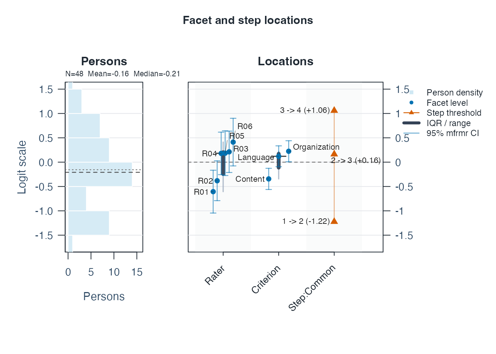
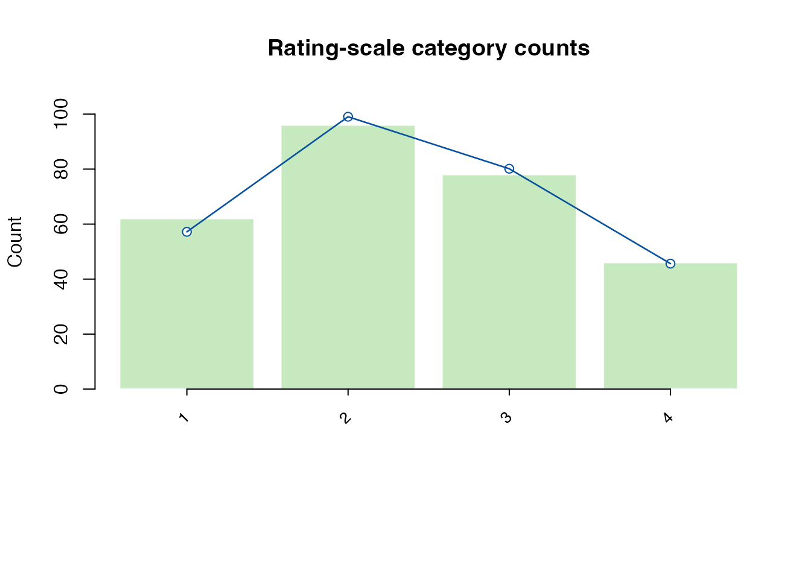
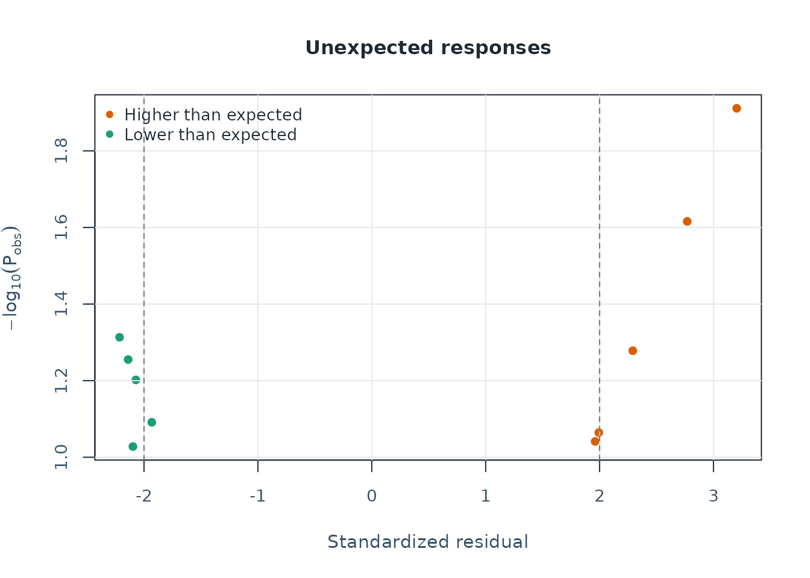
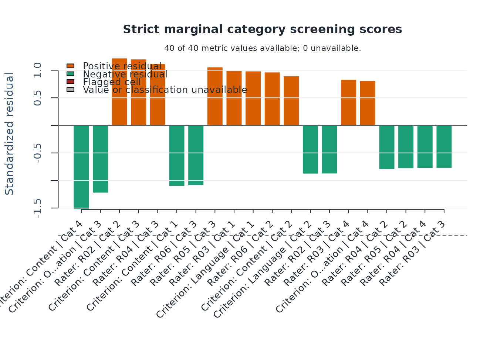

# mfrmr Workflow

## Quick start

This tutorial follows the ordinary fixed-facet
[`fit_mfrm()`](https://ryuya-dot-com.github.io/mfrmr/reference/fit_mfrm.md)
workflow. To choose between fixed facets, shared random raters and
Person-specific testlets, use `mfrmr_output_guide("models")` or
[`help("mfrmr_workflow_methods")`](https://ryuya-dot-com.github.io/mfrmr/reference/mfrmr_workflow_methods.md).
The extended models have dedicated tutorials:
[`vignette("mfrmr-random-raters", package = "mfrmr")`](https://ryuya-dot-com.github.io/mfrmr/articles/mfrmr-random-raters.md)
and
[`vignette("mfrmr-testlets", package = "mfrmr")`](https://ryuya-dot-com.github.io/mfrmr/articles/mfrmr-testlets.md).
Their prediction targets and reporting support differ; the diagnostics
and comprehensive reports below require an ordinary `mfrm_fit` result.

This example estimates person abilities while accounting for rater
severity and criterion difficulty. A *facet* is a source of variation in
scores; here, `Rater` and `Criterion` are facets, and individual raters
and criteria are their *levels*. The data are synthetic, with one row
per rating and scores from 1 to 4.

`head(toy)` shows the first six rows. The quoted column names in
[`fit_mfrm()`](https://ryuya-dot-com.github.io/mfrmr/reference/fit_mfrm.md)
are case-sensitive; `Study` and `Group` are extra labels unused by this
model. `MML` selects marginal maximum likelihood; `RSM` selects a
rating-scale model with shared category thresholds (the transitions
between adjacent scores).

``` r

# Load the package
library(mfrmr)

# Load example ratings and look at the first six rows
toy <- load_mfrmr_data("example_operational")
head(toy)
#>                Study Person Rater    Criterion Score Group
#> 1 OperationalExample   P001   R01     Language     4     A
#> 2 OperationalExample   P001   R01 Organization     2     A
#> 3 OperationalExample   P001   R02      Content     4     A
#> 4 OperationalExample   P001   R02     Language     3     A
#> 5 OperationalExample   P001   R02 Organization     2     A
#> 6 OperationalExample   P002   R01      Content     3     A

# Fit the model
fit <- fit_mfrm(
  data = toy,
  person = "Person",
  facets = c("Rater", "Criterion"),
  score = "Score",
  method = "MML",
  model = "RSM"
)

# Plot the results (Wright map)
plot(fit)
```


``` r


# Save the summary, then display its tables
results <- summary(fit)
results$person_overview # One row summarizing person ability estimates
#> # A tibble: 1 × 11
#>   Persons DistributionN ReviewExcludedExtremeE…¹ EstimateUse   Mean    SD Median
#>     <int>         <int>                    <int> <chr>        <dbl> <dbl>  <dbl>
#> 1      48            48                        0 source_fit… -0.155 0.824 -0.208
#> # ℹ abbreviated name: ¹​ReviewExcludedExtremeEAPs
#> # ℹ 4 more variables: Min <dbl>, Max <dbl>, Span <dbl>, MeanPosteriorSD <dbl>
results$facet_overview  # One row per facet: number of levels, mean, SD, range
#> # A tibble: 2 × 7
#>   Facet     Levels MeanEstimate SDEstimate MinEstimate MaxEstimate  Span
#>   <chr>      <int>        <dbl>      <dbl>       <dbl>       <dbl> <dbl>
#> 1 Criterion      3     0             0.302      -0.344       0.224 0.568
#> 2 Rater          6    -4.64e-18      0.399      -0.606       0.412 1.02

# Check the interpretation status and recommended next step
results$decision
#>                                                           Interpretation
#> 1 Fit-readiness requirements satisfied; formal precision review required
#>   FormalInference FitReadiness                                              Why
#> 1              No        ready Formal precision support has not been evaluated.
#>                                                                                                                                                   NextAction
#> 1 Run `diagnose_mfrm()` and pass its result as `diagnostics =` to evaluate formal precision support; fit readiness alone is not a formal-inference decision.
```

`<-` saves an object without printing it. Here `toy` holds the data,
`fit` holds the model, and `results` holds its summary. `$` selects a
named part: `results$person_overview` displays just that table. Enter
`results` to print the full summary.

The Wright map displays the estimates in logits, the model’s measurement
units, rather than the original 1-to-4 scores. With this example’s
default orientation, higher person estimates mean higher ability; higher
rater estimates mean stricter ratings, and higher criterion estimates
mean greater difficulty.

The overview tables describe distributions: `person_overview` has one
row for all 48 persons, and `facet_overview` has one row for each facet.
`Mean`/`MeanEstimate` is the average, `SD`/`SDEstimate` is the spread,
and `Min`/`Max` or `MinEstimate`/`MaxEstimate` give the endpoints. Rater
and criterion means are constrained to zero here; their SDs and ranges
show differences among levels.

### Inspect individual estimates

``` r

estimates <- as.data.frame(fit)
head(subset(estimates, Facet == "Person")) # First six persons
#>    Facet Level    Estimate Extreme
#> 1 Person  P001  0.28429588    none
#> 2 Person  P002  0.66118004    none
#> 3 Person  P003  0.02177773    none
#> 4 Person  P004  0.22410785    none
#> 5 Person  P005 -0.17496065    none
#> 6 Person  P006  0.67681003    none
subset(estimates, Facet == "Rater")       # All raters
#>    Facet Level   Estimate Extreme
#> 49 Rater   R01 -0.6059776    <NA>
#> 50 Rater   R02 -0.3820356    <NA>
#> 51 Rater   R03  0.2120388    <NA>
#> 52 Rater   R04  0.1799462    <NA>
#> 53 Rater   R05  0.1842365    <NA>
#> 54 Rater   R06  0.4117917    <NA>
subset(estimates, Facet == "Criterion")   # All criteria
#>        Facet        Level   Estimate Extreme
#> 55 Criterion      Content -0.3441471    <NA>
#> 56 Criterion     Language  0.1204520    <NA>
#> 57 Criterion Organization  0.2236950    <NA>
```

`Facet` identifies the type of estimate, `Level` identifies the person,
rater, or criterion, and `Estimate` is its value in logits.

### Check what needs review

Read `results$decision`, especially `Why` and `NextAction`, before
interpreting or reporting estimates. `FormalInference = "No"` in this
first summary can mean that precision has not yet been reviewed; it does
not necessarily mean that fitting failed. The default summary does not
compute diagnostics.

``` r

diagnostics <- diagnose_mfrm(fit)
diagnostic_summary <- summary(diagnostics)
diagnostic_summary$decision
#>               Interpretation FormalInference FitReadiness
#> 1 Ready for formal inference             Yes        ready
#>                                           Why
#> 1 All stored fit-readiness components passed.
#>                                                                                            NextAction
#> 1 Inspect `diagnostic_basis` before comparing legacy residual evidence with strict marginal evidence.
```

For your own data, follow [Use your own CSV](#use-your-own-csv) below.
For reporting, `res <- mfrm_results(fit, diagnostics = diagnostics)`
builds a comprehensive object that reuses the checks above. Pass `res`
to
[`mfrm_report()`](https://ryuya-dot-com.github.io/mfrmr/reference/mfrm_report.md)
or
[`export_mfrm_results()`](https://ryuya-dot-com.github.io/mfrmr/reference/export_mfrm_results.md);
`results` remains the basic summary.

## Use your own CSV

The goal here is to estimate person ability while accounting for rater
severity and criterion difficulty in your own ratings. Start with the
same row layout as the packaged example: **one score from one rater for
one person on one criterion**. For example:

| Person | Rater | Criterion | Score |
|--------|-------|-----------|-------|
| 001    | R1    | Content   | 3     |
| 001    | R1    | Style     | 2     |
| 001    | R2    | Content   | 4     |
| 001    | R2    | Style     | 3     |

The repeated `001` is intentional: all four scores belong to the same
person. Keep IDs consistent across rows. These four rows explain the
layout; use the complete set of ratings for estimation. `Score` contains
the ordered integer categories from the rubric, not totals or averages
across raters. This example uses two non-person facets; choose facets
that represent your design.

### 1. Read and inspect the file

You can practice the full workflow without supplying a file. This block
writes the packaged synthetic ratings to a new temporary CSV:

``` r

library(mfrmr)
csv_path <- tempfile(fileext = ".csv")
write.csv(load_mfrmr_data("example_operational"), csv_path,
          row.names = FALSE, na = "")
```

For your own data, export your rating sheet as **CSV UTF-8**, with
column names in the first row. Skip the practice block above and select
your file instead:

``` r

library(mfrmr)
csv_path <- file.choose()
```

For a reusable script, replace
[`file.choose()`](https://rdrr.io/r/base/file.choose.html) with a quoted
path such as `"data/ratings.csv"`, relative to the folder shown by
[`getwd()`](https://rdrr.io/r/base/getwd.html). Both routes now use the
same import and analysis code:

``` r

ratings <- read.csv(
  csv_path,
  colClasses = "character",
  na.strings = "",
  check.names = FALSE,
  fileEncoding = "UTF-8-BOM"
)
# Treat the documented missing-score marker only in the score column
ratings <- recode_missing_codes(ratings, columns = "Score", codes = "NA")
head(ratings)
#>                Study Person Rater    Criterion Score Group
#> 1 OperationalExample   P001   R01     Language     4     A
#> 2 OperationalExample   P001   R01 Organization     2     A
#> 3 OperationalExample   P001   R02      Content     4     A
#> 4 OperationalExample   P001   R02     Language     3     A
#> 5 OperationalExample   P001   R02 Organization     2     A
#> 6 OperationalExample   P002   R01      Content     3     A
names(ratings)
#> [1] "Study"     "Person"    "Rater"     "Criterion" "Score"     "Group"
table(ratings$Score, useNA = "ifany")
#> 
#>  1  2  3  4 
#> 62 96 78 46
```

Reading columns as text preserves distinct IDs such as `001`, `1`, and
`NA`; `mfrmr` converts numeric score strings such as `"3"` for
estimation. `check.names = FALSE` preserves the headers. Empty cells are
missing in every column; the literal marker `NA` is recoded only in
`Score`. Use the missing-score markers declared for your data. Zero is a
score when the rubric includes zero, and must not be used to fill
unassigned rating cells.

The quoted column names in the next two steps must match
`names(ratings)`, including capitalization and spaces. You do not have
to rename your file’s columns. For headers `Student`, `Judge`, `Task`,
and `Rating`, change the arguments in **both**
[`describe_mfrm_data()`](https://ryuya-dot-com.github.io/mfrmr/reference/describe_mfrm_data.md)
and
[`fit_mfrm()`](https://ryuya-dot-com.github.io/mfrmr/reference/fit_mfrm.md)
as follows:

| Argument | Four-column example       | Your alternative headers |
|----------|---------------------------|--------------------------|
| `person` | `"Person"`                | `"Student"`              |
| `facets` | `c("Rater", "Criterion")` | `c("Judge", "Task")`     |
| `score`  | `"Score"`                 | `"Rating"`               |

Also use `columns = "Rating"` in the recoding call and inspect
`ratings$Rating` instead of `ratings$Score`. Extra columns such as the
practice file’s `Study` and `Group` are unused by this model.

### 2. Review the rows and the rubric

Set the minimum and maximum from the **rubric**, not the observed
minimum and maximum in this sample. The code below describes a 1-to-4
rubric. Keep the same values in the data review and the fit.
`keep_original = TRUE` preserves the intended category structure,
including categories with no observations.

``` r

data_review <- describe_mfrm_data(
  data = ratings,
  person = "Person",
  facets = c("Rater", "Criterion"),
  score = "Score",
  rating_min = 1,
  rating_max = 4,
  keep_original = TRUE
)
data_review$row_retention
#>                             Stage Rows DroppedRows
#> 1          input_selected_columns  282           0
#> 2 after_missing_and_weight_filter  282           0
#>                            DroppedReason
#> 1                                       
#> 2 missing values or non-positive weights
data_review$missing_by_column
#> # A tibble: 4 × 2
#>   Column    Missing
#>   <chr>       <int>
#> 1 Person          0
#> 2 Rater           0
#> 3 Criterion       0
#> 4 Score           0
data_review$score_distribution
#> # A tibble: 4 × 4
#>   Score  RawN WeightedN Percent
#>   <int> <int>     <dbl>   <dbl>
#> 1     1    62        62    22.0
#> 2     2    96        96    34.0
#> 3     3    78        78    27.7
#> 4     4    46        46    16.3
data_review$design_connectivity
#>      Basis     Facet PersonNodes FacetLevelNodes Edges Components
#> 1 observed     Rater          48               6    96          1
#> 2 observed Criterion          48               3   144          1
#>   LargestComponentPersons LargestComponentLevels LargestComponentPercent
#> 1                      48                      6                     100
#> 2                      48                      3                     100
#>   Connected
#> 1      TRUE
#> 2      TRUE
```

Read these four tables in order:

- `row_retention`: compare input and retained `Rows`; inspect any
  `DroppedRows`. A missing score or required ID removes that rating row,
  not automatically the person’s other ratings. The package does not
  fill missing ratings.
- `missing_by_column`: locate missing input values. Non-numeric score
  text can also cause row loss; inspect warnings and
  `data_review$preparation_notes` when the retained count is unexpected.
- `score_distribution`: `RawN` counts the retained ratings in each
  category. A zero count in an internal category, such as 3 on a 1-to-4
  scale, prevents fitting with `keep_original = TRUE`. Review the data
  and rubric before changing categories; increasing optimizer iterations
  cannot supply missing category information.
- `design_connectivity`: `Components = 1` means a facet’s levels are
  connected through shared persons. More than one component needs design
  review before comparing levels across components. Connectivity alone
  does not establish full model identification.

For the practice CSV, all 282 input rows are retained, all four
categories have observations, and each facet has one connected
component. Six planned ratings are absent from the file; column missing
counts cannot detect absent rows. If you have a planned assignment
roster, pass it as `expected_design` to
[`describe_mfrm_data()`](https://ryuya-dot-com.github.io/mfrmr/reference/describe_mfrm_data.md)
to assess these omissions. The applied example later in this vignette
shows how. Without a roster, structural missingness is reported as not
assessed; a complete person-by-rater-by-criterion crossing is not
assumed.

### 3. Fit and read the results

After resolving the data-review findings, fit the same rows, columns,
and rubric. This example uses an RSM with shared category thresholds;
the choice should reflect the scoring design. Diagnostics then supply
evidence for the interpretation decision.

``` r

csv_fit <- fit_mfrm(
  data = ratings,
  person = "Person",
  facets = c("Rater", "Criterion"),
  score = "Score",
  rating_min = 1,
  rating_max = 4,
  keep_original = TRUE,
  method = "MML",
  model = "RSM"
)
csv_diagnostics <- diagnose_mfrm(csv_fit)
csv_results <- summary(csv_fit, diagnostics = csv_diagnostics)
csv_results$decision
#>               Interpretation FormalInference FitReadiness
#> 1 Ready for formal inference             Yes        ready
#>                                           Why
#> 1 All stored fit-readiness components passed.
#>                                                                                                                                                                   NextAction
#> 1 After reviewing convergence, run `review <- summary(fit, profile = "facets", detail = "brief")` for the comprehensive measurement review; FACETS software is not required.
```

Read `Why` and `NextAction` before using the estimates. A
`FormalInference` value of `"No"` means that the stated obstacle to
formal use still needs attention. Diagnostic plots can help investigate
it. Even a supported precision decision does not establish the validity
of the assessment or answer the study’s substantive question.

``` r

plot(csv_fit)
```


``` r

csv_estimates <- as.data.frame(csv_fit)
head(subset(csv_estimates, Facet == "Person"))
#>    Facet Level    Estimate Extreme
#> 1 Person  P001  0.28429588    none
#> 2 Person  P002  0.66118004    none
#> 3 Person  P003  0.02177773    none
#> 4 Person  P004  0.22410785    none
#> 5 Person  P005 -0.17496065    none
#> 6 Person  P006  0.67681003    none
subset(csv_estimates, Facet == "Rater")
#>    Facet Level   Estimate Extreme
#> 49 Rater   R01 -0.6059776    <NA>
#> 50 Rater   R02 -0.3820356    <NA>
#> 51 Rater   R03  0.2120388    <NA>
#> 52 Rater   R04  0.1799462    <NA>
#> 53 Rater   R05  0.1842365    <NA>
#> 54 Rater   R06  0.4117917    <NA>
subset(csv_estimates, Facet == "Criterion")
#>        Facet        Level   Estimate Extreme
#> 55 Criterion      Content -0.3441471    <NA>
#> 56 Criterion     Language  0.1204520    <NA>
#> 57 Criterion Organization  0.2236950    <NA>
```

`Level` identifies the person, rater, or criterion; `Estimate` is the
fitted value in logits. With these defaults, higher person values mean
higher ability, higher rater values mean stricter ratings, and higher
criterion values mean greater difficulty. The rater and criterion
estimates are centered at zero within each facet. In the practice file,
R06 is about +0.41 and R01 about -0.61: R06 is estimated to rate more
strictly after accounting for person ability and criterion difficulty.
This difference alone does not establish statistical significance.

With custom facet names, change the `Facet` filters too, for example
from `"Rater"` to `"Judge"`; person rows retain `Facet == "Person"` even
when the input ID column is named `Student`. To inspect all persons,
remove [`head()`](https://rdrr.io/r/utils/head.html). The overview
tables in `csv_results` summarize distributions; the rows in
`csv_estimates` give individual estimates.

### If a check stops you

| What you see | What to check or change |
|----|----|
| The CSV is not found | Use [`file.choose()`](https://rdrr.io/r/base/file.choose.html) or check the quoted path relative to [`getwd()`](https://rdrr.io/r/base/getwd.html). An `.xlsx` workbook must first be exported as CSV. |
| All fields appear in one column, or the header is garbled | Check the separator and encoding. Use `sep = ";"` for a semicolon-delimited file; re-export as CSV UTF-8 if text is unreadable. |
| `Column(s) not found in data` | Compare `names(ratings)` with the names in `person`, `facets`, and `score`; check spelling, spaces, and case. |
| Non-numeric or fractional scores | Check `table(ratings$Score, useNA = "ifany")`. Map rubric labels explicitly to their ordered integer codes. Do not round totals or averaged ratings to make them fit. |
| Scores outside the supplied range, such as 99 | Check whether the value is an error or a documented missing code. Correct the value or recode the declared missing marker; keep the range tied to the rubric. |
| Fewer retained rows than expected | Inspect `data_review$missing_by_column` and `data_review$preparation_notes`. Correct unintended missing IDs or score values, then rerun the review and fit. |
| Duplicated person-by-facet cells | Inspect `data_review$duplicate_cell_detail`. Correct accidental duplicates. If these are distinct tasks or occasions, include the corresponding facet; do not automatically delete legitimate ratings. |
| A category has no observations, or the design is disconnected | Review category coding and assignments. Do not invent ratings or change optimizer settings to resolve missing information. |

If your data documentation defines `99` and `.` as missing **scores**,
recode only that column before step 2. This preserves an ID such as
`99`:

``` r

ratings <- recode_missing_codes(
  ratings, columns = "Score", codes = c("99", ".")
)
table(ratings$Score, useNA = "ifany")
```

Use only the codes declared for your data, and change `"Score"` if your
score column has another name. Then repeat steps 2 and 3 with the
recoded data.

### If criteria occupy separate columns

For a sheet with one row per person-rater pair and separate criterion
scores, reshape the criterion columns into rating rows:

``` r

wide <- data.frame(
  Person = c("001", "001"),
  Rater = c("R1", "R2"),
  Content = c(3, 4),
  Style = c(2, 3)
)
ratings_long <- tidyr::pivot_longer(
  wide,
  cols = c("Content", "Style"),
  names_to = "Criterion",
  values_to = "Score"
)
ratings_long
#> # A tibble: 4 × 4
#>   Person Rater Criterion Score
#>   <chr>  <chr> <chr>     <dbl>
#> 1 001    R1    Content       3
#> 2 001    R1    Style         2
#> 3 001    R2    Content       4
#> 4 001    R2    Style         3
```

The output is the four-row layout at the start of this section. For your
full sheet, read the CSV into `wide`, select its actual criterion
columns in `cols`, and use `ratings <- ratings_long` before step 2. Keep
the complete dataset; these four demonstration rows are not sufficient
for the intended analysis.

## Continue with diagnostics and reporting

The following sections reuse the model and diagnostics from **Quick
start**. They ask three questions: are the estimates interpretable, what
needs closer inspection, and what information belongs in a report? For
your own analysis, use `csv_fit` and `csv_diagnostics` in these same
helper calls and review your own assignment roster if one exists.

### 1. Check the data and estimation record

``` r

fit_toy <- fit
diag_toy <- diagnostics

# The packaged roster declares which ratings were planned
data("mfrmr_example_operational_design", package = "mfrmr")
data_review_toy <- describe_mfrm_data(
  data = toy,
  person = "Person",
  facets = c("Rater", "Criterion"),
  score = "Score",
  rating_min = 1,
  rating_max = 4,
  keep_original = TRUE,
  expected_design = mfrmr_example_operational_design
)
data_summary_toy <- summary(data_review_toy)
data_summary_toy$structural_missingness
#>     Status ExpectedCells ObservedCells MatchedCells MissingExpectedCells
#> 1 declared           288           282          282                    6
#>   UnexpectedObservedCells CoverageRate ExpectedOnlyPersons UnexpectedPersons
#> 1                       0    0.9791667                   0                 0
data_summary_toy$design_connectivity
#>               Basis     Facet PersonNodes FacetLevelNodes Edges Components
#> 1          observed     Rater          48               6    96          1
#> 2          observed Criterion          48               3   144          1
#> 3 declared_expected     Rater          48               6    96          1
#> 4 declared_expected Criterion          48               3   144          1
#>   LargestComponentPersons LargestComponentLevels LargestComponentPercent
#> 1                      48                      6                     100
#> 2                      48                      3                     100
#> 3                      48                      6                     100
#> 4                      48                      3                     100
#>   Connected
#> 1      TRUE
#> 2      TRUE
#> 3      TRUE
#> 4      TRUE

fit_summary_toy <- summary(fit_toy)
fit_summary_toy$overview[, c("Model", "Method", "N", "Persons", "Converged")]
#> # A tibble: 1 × 5
#>   Model Method     N Persons Converged
#>   <chr> <chr>  <dbl>   <int> <lgl>    
#> 1 RSM   MML      282      48 TRUE
fit_summary_toy$decision
#>                                                           Interpretation
#> 1 Fit-readiness requirements satisfied; formal precision review required
#>   FormalInference FitReadiness                                              Why
#> 1              No        ready Formal precision support has not been evaluated.
#>                                                                                                                                                   NextAction
#> 1 Run `diagnose_mfrm()` and pass its result as `diagnostics =` to evaluate formal precision support; fit readiness alone is not a formal-inference decision.
```

The example has 282 observed ratings from 48 persons, six raters, and
three criteria. All observed rows are retained. Six additional ratings
were planned but are absent; they are visible only because the roster
was supplied. Distinguish omitted planned ratings from input rows
excluded during cleaning. The package does not assume that every rater
scored every person.

Record the estimator, model, score coding, constraints, and numerical
settings. For this RSM, MML uses a standard-normal person distribution;
reported person scores are EAP estimates, and non-person facets are
fixed effects centered within facet. RSM shares category thresholds.
Choose PCM with an explicit `step_facet` when the rubric and question
call for separate thresholds.

The default MML grid is 31 quadrature points. A comparison that could
change the study’s conclusion needs a prespecified denser common-grid
sensitivity check with
[`mml_quadrature_sensitivity()`](https://ryuya-dot-com.github.io/mfrmr/reference/mml_quadrature_sensitivity.md).
A temporary 7-point grid is only a computational screening run. `maxit`
is a computational ceiling, not a convergence criterion; inspect
`ConvergenceStatus` and `Numerical` before increasing it. Keep the same
data, model, method, and planned controls when investigating an
iteration limit. Choose JML for its fixed-person estimand when
appropriate, not as a faster substitute for MML.

### 2. Read precision and model fit before interpreting differences

``` r

diagnostic_summary_toy <- summary(diag_toy)
diagnostic_summary_toy$decision
#>               Interpretation FormalInference FitReadiness
#> 1 Ready for formal inference             Yes        ready
#>                                           Why
#> 1 All stored fit-readiness components passed.
#>                                                                                            NextAction
#> 1 Inspect `diagnostic_basis` before comparing legacy residual evidence with strict marginal evidence.
diagnostic_summary_toy$overall_fit
#> # A tibble: 1 × 6
#>   Infit Outfit InfitZSTD OutfitZSTD DF_Infit DF_Outfit
#>   <dbl>  <dbl>     <dbl>      <dbl>    <dbl>     <dbl>
#> 1 0.866  0.857     -1.28      -1.75     174.       282

precision_toy <- precision_review_report(fit_toy, diagnostics = diag_toy)
precision_toy$profile[, c(
  "PrecisionTier", "SupportsFormalInference", "PersonSEBasis", "NonPersonSEBasis"
)]
#>   PrecisionTier SupportsFormalInference      PersonSEBasis
#> 1   model_based                    TRUE Posterior SD (EAP)
#>             NonPersonSEBasis
#> 1 Observed information (MML)
precision_toy$checks
#>                      Check Status
#> 1           Precision tier   pass
#> 2    Optimizer convergence   pass
#> 3     ModelSE availability   pass
#> 4 Fit-adjusted SE ordering   pass
#> 5     Reliability ordering   pass
#> 6 Facet precision coverage   pass
#> 7         SE source labels   pass
#>                                                                                                                                                                                                    Detail
#> 1 Uncertainty is conditional on the fitted model. Person posterior SDs condition on the fitted calibration; facet standard errors use observed information. Review interval assumptions before reporting.
#> 2                                                                                                              Numerical convergence checks passed; this alone does not establish valid SEs or intervals.
#> 3                                                                                                                                               Finite standard errors were available for 100.0% of rows.
#> 4                                                                                                              Among available pairs, fit-adjusted SEs were at least as large as their unadjusted values.
#> 5                                                                                                     Among available pairs, fit-adjusted reliability values were not larger than the model-based values.
#> 6                                                                                                                    Each facet had sample/population summaries for both model and fit-adjusted SE modes.
#> 7                                                                                                                     Person uncertainty uses posterior SDs; facet uncertainty uses observed information.

# View the fitted locations with their uncertainty
plot(fit_toy, diagnostics = diag_toy, show_ci = TRUE)
```



The fit-only summary reports `FormalInference = "No"` until precision
evidence is supplied. Read the diagnostic decision’s `Why` and
`NextAction` together with the precision checks. A `model_based` label
alone does not override a failed fit-readiness component or justify a
particular substantive claim.

Infit and Outfit describe departures from the fitted response model;
their reference value is 1. A global average near 1 can coexist with
local problems. In this example the MML person uncertainty is posterior
SD, while the non-person SEs use observed information. Report the basis
and interval method when presenting uncertainty; do not call every
interval a posterior quantile interval or treat a point difference as a
significance test.

### 3. Identify what needs closer inspection

**Are the rating categories working as intended?** Examine category use
and the transitions between scores on the declared rubric:

``` r

scale_toy <- rating_scale_table(fit_toy, diagnostics = diag_toy)
scale_toy$category_table[, c("Category", "Count", "AvgPersonMeasure", "Infit", "Outfit")]
#>   Category Count AvgPersonMeasure     Infit    Outfit
#> 1        1    62       -0.9209312 1.5434694 1.3053867
#> 2        2    96       -0.3314206 0.4933638 0.5214360
#> 3        3    78        0.1586824 0.3395566 0.3440066
#> 4        4    46        0.6843099 1.9416014 1.8255900
scale_toy$threshold_table
#>     Step   Estimate StepFacet StepIndex   Spacing Ordered ThresholdMonotonic
#> 1 Step_1 -1.2229852    Common         1        NA      NA               TRUE
#> 2 Step_2  0.1634468    Common         2 1.3864320    TRUE               TRUE
#> 3 Step_3  1.0595384    Common         3 0.8960916    TRUE               TRUE
#>   GapFromPrev LowerCategory UpperCategory WeaklyIdentified ThresholdCaveat
#> 1          NA             1             2            FALSE                
#> 2   1.3864320             2             3            FALSE                
#> 3   0.8960916             3             4            FALSE
plot(scale_toy)
```



The bars show observed category counts; the line shows fitted expected
counts. Look for rarely used categories, changes in average person
measure across categories, and threshold order. Explain the observed
pattern in terms of the rubric. A warning is a reason to investigate,
not an automatic instruction to merge categories.

**Which ratings differ most from model expectations?** This example uses
an explicit exploratory rule and shows up to ten cases:

``` r

unexpected_toy <- unexpected_response_table(
  fit_toy,
  diagnostics = diag_toy,
  abs_z_min = 1.5,
  prob_max = 0.4,
  top_n = 10
)
unexpected_toy$summary
#> # A tibble: 1 × 10
#>   TotalObservations EvaluatedObservations UnavailableObservations UnexpectedN
#>               <int>                 <int>                   <int>       <int>
#> 1               282                   282                       0         141
#> # ℹ 6 more variables: UnexpectedPercent <dbl>, LowProbabilityN <int>,
#> #   LargeResidualN <int>, Rule <chr>, AbsZThreshold <dbl>, ProbThreshold <dbl>
unexpected_toy$table[, c("Person", "Rater", "Criterion", "Observed", "Expected", "StdResidual")]
#>    Person Rater    Criterion Observed Expected StdResidual
#> 1    P016   R02 Organization        4 1.712717    3.204010
#> 2    P012   R03 Organization        4 1.881621    2.769635
#> 3    P048   R06 Organization        4 2.126046    2.291484
#> 4    P021   R04      Content        1 2.867349   -2.214482
#> 5    P025   R04     Language        1 2.815285   -2.139004
#> 6    P003   R01 Organization        1 2.765869   -2.070969
#> 7    P013   R02      Content        2 3.439682   -2.097409
#> 8    P024   R03     Language        4 2.317510    1.993303
#> 9    P024   R03      Content        1 2.656778   -1.931313
#> 10   P018   R02     Language        4 2.340191    1.961204
plot(unexpected_toy)
```



Read the rule in `$summary` with the residuals. The displayed cases are
a selected preview; `top_n` limits the table, while the summary counts
all flagged ratings. Here this broad rule flags 141 of 282 ratings
(50%), although only ten cases are displayed. Report the rule with the
count and percentage. Inspect the original work and scoring context
before changing a rating or excluding a person. A flag does not identify
its cause.

The default diagnostics retain the residual/EAP path and the
latent-integrated marginal screening path. The latter includes category
and pairwise agreement gaps. Keep their bases separate when reporting:

``` r

diagnostic_summary_toy$diagnostic_basis[, c("DiagnosticPath", "Status", "ReportingUse")]
#> # A tibble: 4 × 3
#>   DiagnosticPath                   Status        ReportingUse               
#>   <chr>                            <chr>         <chr>                      
#> 1 legacy_residual_fit              computed      legacy_compatibility_screen
#> 2 strict_marginal_fit              computed      screening_only             
#> 3 strict_pairwise_local_dependence computed      screening_only             
#> 4 posterior_predictive_follow_up   not_available screening_only
plot_marginal_fit(fit_toy, diagnostics = diag_toy)
```



Follow a pairwise warning with
[`plot_marginal_pairwise()`](https://ryuya-dot-com.github.io/mfrmr/reference/plot_marginal_pairwise.md).
Add residual PCA only when residual structure is relevant to the
question, using `diagnose_mfrm(fit_toy, residual_pca = "both")`. Report
the mode and limits of the screen; residual PCA alone does not establish
unidimensionality. See
[`vignette("mfrmr-mml-and-marginal-fit", package = "mfrmr")`](https://ryuya-dot-com.github.io/mfrmr/articles/mfrmr-mml-and-marginal-fit.md)
and
[`vignette("mfrmr-visual-diagnostics", package = "mfrmr")`](https://ryuya-dot-com.github.io/mfrmr/articles/mfrmr-visual-diagnostics.md)
for these follow-ups.

**What should I discuss with a rater?** Start from the coverage and
category checks above, then view severity and its uncertainty alongside
the screening results. Reuse the same fit and diagnostics:

``` r

plot_rater_severity_profile(
  fit_toy, diagnostics = diag_toy, facet = "Rater", show_bands = FALSE
)
```


``` r

rater_review <- facet_quality_dashboard(
  fit_toy, diagnostics = diag_toy, facet = "Rater"
)
knitr::kable(
  rater_review$detail[, c("Level", "N", "Estimate", "SE", "Infit", "Outfit")],
  digits = 3, row.names = FALSE, caption = "Rater estimates and fit"
)
```

| Level |   N | Estimate |    SE | Infit | Outfit |
|:------|----:|---------:|------:|------:|-------:|
| R01   |  47 |   -0.606 | 0.224 | 0.772 |  0.757 |
| R02   |  56 |   -0.382 | 0.209 | 0.954 |  1.015 |
| R03   |  50 |    0.212 | 0.217 | 1.011 |  0.981 |
| R04   |  47 |    0.180 | 0.223 | 0.917 |  0.891 |
| R05   |  44 |    0.184 | 0.234 | 0.648 |  0.640 |
| R06   |  38 |    0.412 | 0.249 | 0.820 |  0.798 |

Rater estimates and fit {.table}

``` r

knitr::kable(
  rater_review$detail[, c("Level", "MissingMetrics", "SeverityFlag", "MisfitFlag")],
  row.names = FALSE, caption = "Availability and screening flags"
)
```

| Level | MissingMetrics | SeverityFlag | MisfitFlag |
|:------|:---------------|:-------------|:-----------|
| R01   |                | FALSE        | FALSE      |
| R02   |                | FALSE        | FALSE      |
| R03   |                | FALSE        | FALSE      |
| R04   |                | FALSE        | FALSE      |
| R05   |                | FALSE        | FALSE      |
| R06   |                | FALSE        | FALSE      |

Availability and screening flags {.table}

``` r

rater_review$settings
#>                                   Setting Value
#> facet                               facet Rater
#> facet_source                 facet_source  user
#> severity_warn               severity_warn     1
#> misfit_warn                   misfit_warn   1.5
#> misfit_lower                 misfit_lower   0.5
#> central_tendency_max central_tendency_max    NA
#> bias_count_warn           bias_count_warn     1
#> bias_abs_t_warn           bias_abs_t_warn     2
#> bias_abs_size_warn     bias_abs_size_warn   0.5
#> bias_p_max                     bias_p_max  0.05
#> bias_source_bundles   bias_source_bundles     0
writeLines(strwrap(rater_review$notes, width = 72))
#> Flags are screening prompts, not evidence of invalid ratings or grounds
#> for automatic exclusion.
#> Severity is relative to the fitted reference; inspect workload,
#> category use and common ratings before comparing levels.
#> FlagCount counts observed flags only. MissingMetrics identifies
#> unavailable diagnostics; zero flags does not mean all checks passed.
#> BiasCount counts flagged cells in supplied bias results only; zero does
#> not establish absence of bias.
#> Stored fit readiness plus numerical, data-support, connectivity, and
#> stability checks passed. Treat this display as diagnostic evidence, not
#> automatic publication approval.
#> Legacy CentralTendencyFlag is disabled by default because origin
#> proximity does not diagnose observed category avoidance or range
#> restriction.
#> No level-level flags were triggered under the current thresholds.
```

A stricter rater is not necessarily inconsistent or incorrect.
Individual interval overlap is not a test of the difference between two
raters. Read `MissingMetrics` before interpreting flags: zero observed
flags is not a complete pass when diagnostics are unavailable. A
`REVIEW ONLY` label retains the fit’s restrictions; the plot does not
override them.

In this synthetic example, none of the six raters has a severity or
misfit flag under the displayed settings. The earlier response-level
screen still selected 141 ratings: the two screens assess different
units and use different rules. Neither result establishes that every
rating is appropriate.

Use the selected unexpected ratings to discuss the rubric and scoring
context, not to automatically exclude a rater. Limited overlap may call
for more shared ratings before comparing raters. A change after training
alone does not establish a training effect. For your own analysis, use
`csv_fit` and `csv_diagnostics`, and replace `"Rater"` with your actual
facet name. Keep the whole dashboard with
[`saveRDS()`](https://rdrr.io/r/base/readRDS.html) to retain its
settings and notes;
`export_mfrm_bundle(..., include = c("dashboard", "html"))` includes
them with the exported tables. See
[`?facet_quality_dashboard`](https://ryuya-dot-com.github.io/mfrmr/reference/facet_quality_dashboard.md)
for that export route.

### 4. Assemble the evidence for a report

``` r

res_toy <- mfrm_results(fit_toy, diagnostics = diag_toy, include = "publication")
report_toy <- mfrm_report(res_toy, style = "apa")
report_toy$first_screen[, c("Area", "Status", "MainIssue", "NextAction")]
#>                Area            Status
#> 1           Overall request_if_needed
#> 2        Bias / DFF request_if_needed
#> 3 Linking / anchors request_if_needed
#> 4  Misfit / pathway request_if_needed
#> 5               Fit                ok
#> 6         Precision                ok
#>                                                                       MainIssue
#> 1 ok=2; review=0; caveat=0; request_if_needed=3; not_computed=0; unavailable=0.
#> 2                                                   Evidence was not requested.
#> 3                                                   Evidence was not requested.
#> 4                                                   Evidence was not requested.
#> 5                                               No report-index review signals.
#> 6                                               No report-index review signals.
#>                                                NextAction
#> 1                                  Start with Bias / DFF.
#> 2      Request this evidence only if the claim is needed.
#> 3      Request this evidence only if the claim is needed.
#> 4      Request this evidence only if the claim is needed.
#> 5 Use the listed template route if this area is reported.
#> 6 Use the listed template route if this area is reported.

checklist_toy <- reporting_checklist(fit_toy, diagnostics = diag_toy)
subset(checklist_toy$checklist, !DraftReady,
       c("Section", "Item", "NextAction"))
#>                        Section                          Item
#> 8               Method Section Hierarchical structure review
#> 10                  Global Fit              PCA of residuals
#> 23 Bias / Interaction Analysis            Facet pairs tested
#> 24 Bias / Interaction Analysis  Screen-positive interactions
#> 27             Visual Displays          Residual PCA visuals
#> 30             Visual Displays       Strict marginal visuals
#> 31             Visual Displays            Bias / DIF visuals
#>                                                                                                                                   NextAction
#> 8  Run `analyze_hierarchical_structure(fit)` once per design and pass the result to `reporting_checklist(..., hierarchical_structure = hs)`.
#> 10                                                                Run residual PCA if you want to comment on unexplained residual structure.
#> 23                                                                   Run bias screening if the manuscript needs interaction-level follow-up.
#> 24                                                                         Run bias screening before discussing interaction-level anomalies.
#> 27                                                     Run residual PCA if you want scree/loadings visuals for residual-structure follow-up.
#> 30             Treat strict marginal plots as exploratory corroboration screens, then corroborate with design review and legacy diagnostics.
#> 31                                                                    Run bias or DIF screening before discussing interaction-level visuals.
```

`DraftReady` describes available drafting material with caveats. An
unrequested bias or linking analysis may be irrelevant to the question;
do not run every helper merely to turn every flag `TRUE`. The report’s
gaps concern the supplied analysis objects. They cannot confirm
recruitment, rater training, ethics, the study rationale, or whether the
prose answers the research question.

For a journal article, the companion
[`vignette("mfrmr-reporting-and-apa", package = "mfrmr")`](https://ryuya-dot-com.github.io/mfrmr/articles/mfrmr-reporting-and-apa.md)
provides a **Manuscript coverage map**: what to report, where the
numerical evidence is, and what the author must supply. It also shows
estimates with uncertainty, reliability and agreement with distinct
interpretations, and a worked question-to-result explanation.

### 5. Display a table and save the analysis

``` r

measurements_toy <- fit_measures_table(fit_toy, diagnostics = diag_toy)
rater_table_toy <- subset(
  measurements_toy$table, Facet == "Rater",
  c("Level", "N", "Measure", "SE", "CI_Lower", "CI_Upper", "Infit", "Outfit")
)
apa_table(rater_table_toy, digits = 3,
          caption = "Rater severity and fit",
          note = "N counts rating rows. Rater effects are centered within facet and measured in logits; higher values indicate stricter ratings. Intervals are 95% normal approximations from MML observed-information SEs. Infit and Outfit have reference value 1.")
#> Rater severity and fit
#>  Level  N Measure    SE CI_Lower CI_Upper Infit Outfit
#>    R05 44   0.184 0.234   -0.275    0.643 0.648  0.640
#>    R01 47  -0.606 0.224   -1.046   -0.166 0.772  0.757
#>    R06 38   0.412 0.249   -0.077    0.901 0.820  0.798
#>    R04 47   0.180 0.223   -0.256    0.616 0.917  0.891
#>    R02 56  -0.382 0.209   -0.791    0.027 0.954  1.015
#>    R03 50   0.212 0.217   -0.212    0.637 1.011  0.981
#> Note. N counts rating rows. Rater effects are centered within facet and measured in logits; higher values indicate stricter ratings. Intervals are 95% normal approximations from MML observed-information SEs. Infit and Outfit have reference value 1.
```

Report the score scale and direction with the table. For person results,
state the EAP/posterior-SD basis; for rater results, explain that
variation in severity is different from inconsistent scoring. Add a
sentence answering the study’s question instead of repeating every cell
of the table.

``` r

# A new temporary directory keeps this synthetic example repeatable
export_dir <- tempfile("mfrmr-workflow-export-")
export_toy <- export_mfrm_results(
  res_toy,
  output_dir = export_dir,
  include = c("default", "report"),
  acknowledge_sensitive = TRUE
)
export_preview <- head(export_toy$written_files[, c("Component", "Format", "Path")])
export_preview$Path <- basename(export_preview$Path)
knitr::kable(export_preview, row.names = FALSE,
             caption = "First six exported files (filenames only)")
```

| Component | Format | Path |
|:---|:---|:---|
| summary_overview | csv | mfrmr_results_summary_overview.csv |
| summary_decision | csv | mfrmr_results_summary_decision.csv |
| summary_status | csv | mfrmr_results_summary_status.csv |
| summary_fit_readiness | csv | mfrmr_results_summary_fit_readiness.csv |
| summary_fit_readiness_components | csv | mfrmr_results_summary_fit_readiness_components.csv |
| summary_fit_readiness_parameters | csv | mfrmr_results_summary_fit_readiness_parameters.csv |

First six exported files (filenames only) {.table}

This archive retains the collected results.
`acknowledge_sensitive = TRUE` is used because the example contains
synthetic data; it does not remove identifiers or local paths from real
analyses. Review the files before sharing them. The table previews six
filenames; `export_toy$written_files` retains the full list, and its
`Path` column locates the generated files. Temporary files are for
practice; choose a study directory for an archive you will keep. With a
precomputed fit as input, this archive’s replay code assumes that `fit`
and `diagnostics` already exist. Keep your original data-to-fit script.
For a fit replay including its input CSV, and for saving a manuscript
table, figure, and their notes, follow Section 5 of
[`vignette("mfrmr-reporting-and-apa", package = "mfrmr")`](https://ryuya-dot-com.github.io/mfrmr/articles/mfrmr-reporting-and-apa.md).

### Further analyses should answer a stated question

| Question | Follow-up |
|----|----|
| Do category thresholds need to differ by criterion? | [`compare_mfrm()`](https://ryuya-dot-com.github.io/mfrmr/reference/compare_mfrm.md) and [`mml_quadrature_sensitivity()`](https://ryuya-dot-com.github.io/mfrmr/reference/mml_quadrature_sensitivity.md); fit candidates to the same observations and review numerical sensitivity. |
| Do specific rater-by-criterion or group contrasts depart from the model? | [`estimate_bias()`](https://ryuya-dot-com.github.io/mfrmr/reference/estimate_bias.md) or [`analyze_dff()`](https://ryuya-dot-com.github.io/mfrmr/reference/analyze_dff.md); specify the contrasts, screening rules, and multiplicity plan. See the reporting vignette and `mfrmr-linking-and-dff`. |
| How often does a declared rater-warning rule detect a specified departure or falsely flag an unaffected rater? | [`mfrm_screening_performance()`](https://ryuya-dot-com.github.io/mfrmr/reference/mfrm_screening_performance.md) with known simulation truth and all planned trials. See `mfrmr-screening-performance` for individual/family rates, unavailable results and Monte Carlo uncertainty. |
| Would the conclusions change under a bounded GPCM? | [`gpcm_capability_matrix()`](https://ryuya-dot-com.github.io/mfrmr/reference/gpcm_capability_matrix.md) and `mfrmr-gpcm-scope`; explain what discrimination reweighting means for the score interpretation. |
| Are forms or waves on a comparable scale? | `mfrmr-linking-and-dff` and `mfrmr-portable-calibration`; common labels alone do not establish linking. |
| How does a proposed rating design perform under stated assumptions? | [`build_mfrm_sim_spec()`](https://ryuya-dot-com.github.io/mfrmr/reference/build_mfrm_sim_spec.md), [`evaluate_mfrm_recovery()`](https://ryuya-dot-com.github.io/mfrmr/reference/evaluate_mfrm_recovery.md), and [`assess_mfrm_recovery()`](https://ryuya-dot-com.github.io/mfrmr/reference/assess_mfrm_recovery.md); report generating conditions, repetitions, failures, and Monte Carlo uncertainty. |
| How should new persons be scored under an existing calibration? | [`predict_mfrm_units()`](https://ryuya-dot-com.github.io/mfrmr/reference/predict_mfrm_units.md) and [`sample_mfrm_plausible_values()`](https://ryuya-dot-com.github.io/mfrmr/reference/sample_mfrm_plausible_values.md); reuse an eligible fitted calibration and report the conditioning assumptions. |

Simulation examples with one or two repetitions test the computational
setup; they do not estimate operating characteristics adequately for a
paper. A simulation’s assumptions and results also do not replace
evidence from the observed assessment. Keep these analyses in the report
only when their role in answering the study question is clear.

## An observed writing-assessment example

The optional `sirt` package supplies `data.ratings1`, observed
German-writing ratings from a 2009 Austrian educational standards
survey. Its 274 rows contain 135 students, seven observed raters and
five rubric criteria scored 0 to 3. The [data
documentation](https://alexanderrobitzsch.r-universe.dev/sirt/doc/manual.html#data.ratings)
describes the source. This dataset is separate from mfrmr’s synthetic
examples.

The practical question is which differences in severity, category use or
consistency merit discussion with a rater. The example below uses a PCM
so criteria can have different category thresholds. It assumes a common
writing scale and conditionally independent ratings; inspecting the
output does not establish those assumptions. Repeated rubric ratings of
one performance may still share influences that this model does not
represent.

Run this optional example after installing `sirt`. It is not run when
building this vignette. Display aliases replace source identifiers in
the example’s tables; aliases do not make a rating archive anonymous.

``` r

library(mfrmr)
data("data.ratings1", package = "sirt")
wide <- data.ratings1
persons <- match(wide$idstud, unique(wide$idstud))
raters <- match(wide$rater, unique(wide$rater))
writing <- do.call(rbind, lapply(paste0("k", 1:5), function(criterion) {
  data.frame(
    Person = sprintf("P%03d", persons), Rater = paste0("R", raters),
    Criterion = criterion, Score = wide[[criterion]]
  )
}))
review <- describe_mfrm_data(
  writing, person = "Person", facets = c("Rater", "Criterion"), score = "Score",
  rating_min = 0, rating_max = 3
)
review$row_retention
review$design_connectivity

writing_fit <- fit_mfrm(
  writing, "Person", c("Rater", "Criterion"), "Score",
  method = "MML", model = "PCM", step_facet = "Criterion",
  rating_min = 0, rating_max = 3, quad_points = 61, maxit = 400
)
writing_diagnostics <- diagnose_mfrm(writing_fit, residual_pca = "none")
feedback <- facet_quality_dashboard(
  writing_fit, diagnostics = writing_diagnostics, facet = "Rater"
)
feedback$detail[, c("Level", "N", "Estimate", "SE", "Infit", "Outfit", "MisfitFlag")]
feedback$settings
plot_rater_severity_profile(
  writing_fit, diagnostics = writing_diagnostics, facet = "Rater", show_bands = FALSE
)
saveRDS(feedback, "writing-feedback.rds")
archive <- export_mfrm_bundle(
  writing_fit, diagnostics = writing_diagnostics, facet = "Rater",
  output_dir = "writing-analysis", data = writing, acknowledge_sensitive = TRUE
)
```

Reshaping gives 1,370 criterion ratings; the 274 original rows are not
the number of students. Each rater has 185 to 205 criterion ratings
here. The example produces a low-Infit flag for R7: unusually
predictable ratings also trigger this screen. This is a prompt to
inspect rubric use and individual ratings, not evidence that R7 is
inaccurate or should be removed. Severity and consistency answer
different questions, and this dataset supplies no known true rater
quality against which to validate either interpretation.

The quadrature setting belongs to this example; use
[`mml_quadrature_sensitivity()`](https://ryuya-dot-com.github.io/mfrmr/reference/mml_quadrature_sensitivity.md)
when numerical sensitivity matters to a comparison. Preserve the
dashboard’s notes, review rating-category use and common-person
coverage, and use the actual scripts or rubric descriptors in feedback
discussions. A different-looking result alone does not establish that a
rater needs training or that training would improve the scores.
