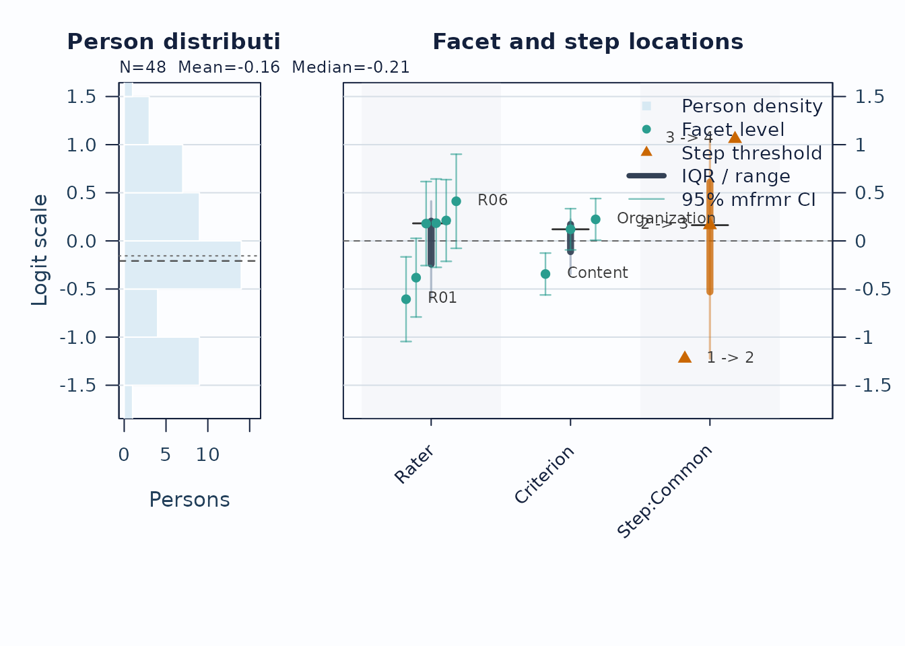
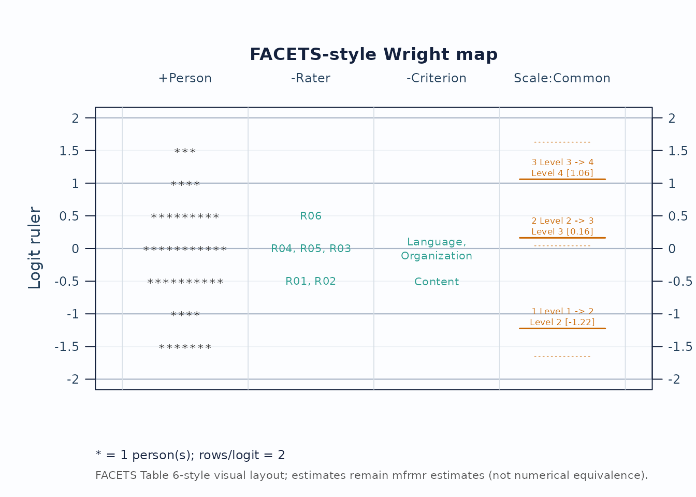
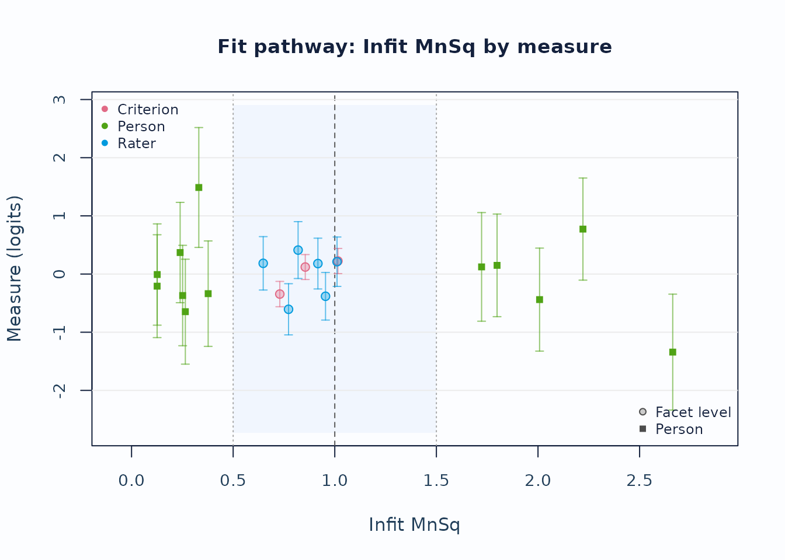
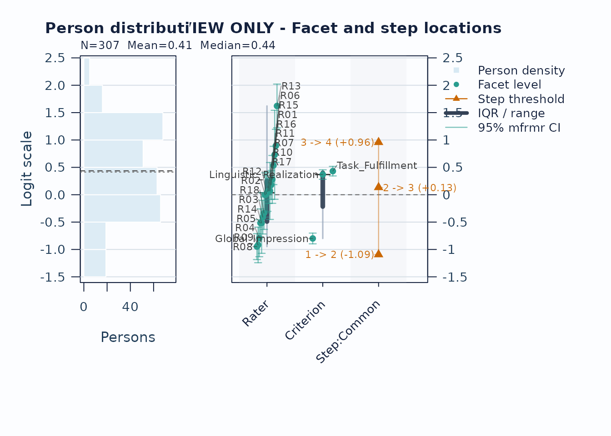
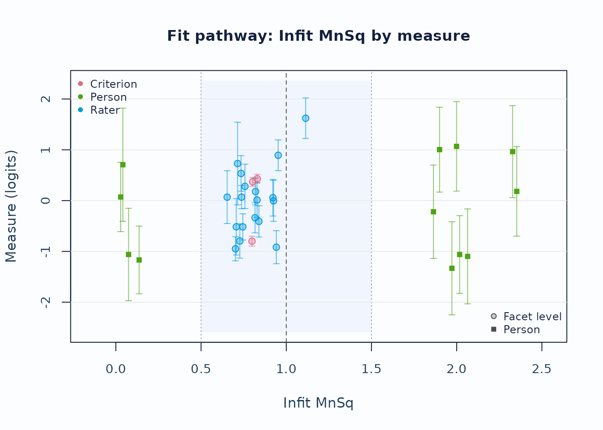
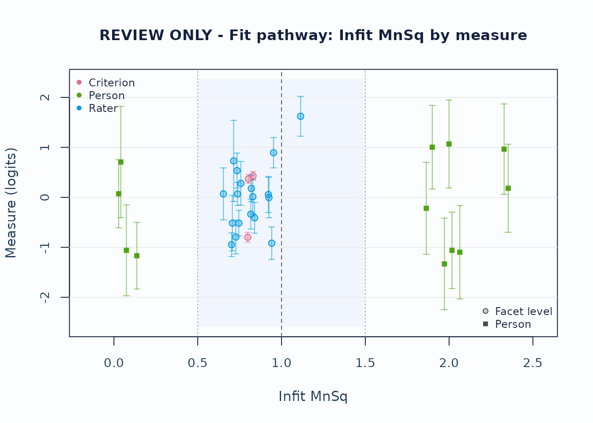
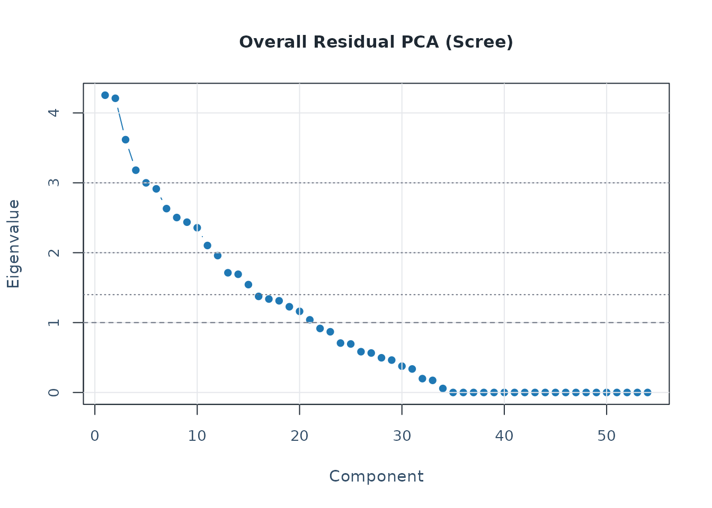
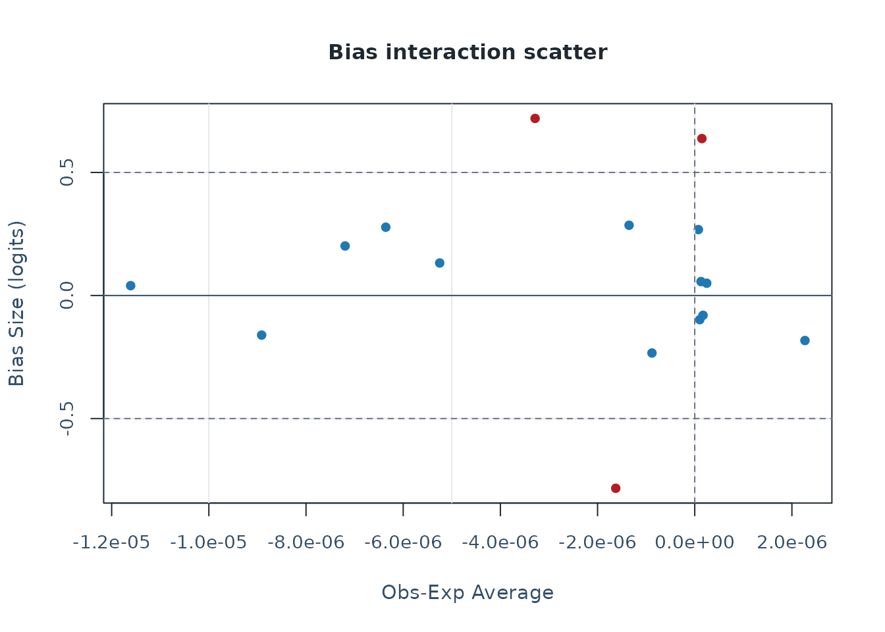

# mfrmr Workflow

This vignette outlines a reproducible workflow for:

- loading packaged simulation data
- fitting an MFRM with flexible facets
- choosing a fast fit summary or an opt-in comprehensive summary
- producing the required Wright map on the fitted shared logit scale
- running diagnostics and residual PCA
- generating APA and visual summary outputs
- moving from fitted models into design simulation and fixed-calibration
  prediction

For a plot-first companion guide, see the separate
`mfrmr-visual-diagnostics` vignette.

For a faster preliminary run without changing the final analysis target:

- test code mechanics on a small deterministic subset or, for an MML
  workflow, a temporary `quad_points = 7` grid; restore the prespecified
  final MML grid (31 points by default) and check quadrature sensitivity
  before reporting
- choose `method = "JML"` only when its person-parameter treatment is
  methodologically appropriate, not merely as a faster substitute for
  MML
- use
  `diagnose_mfrm(..., residual_pca = "none", diagnostic_mode = "both", fit_df_method = "both")`
  when the diagnostics will feed a comprehensive summary
- reuse the same diagnostics object in downstream reports and plots

## MML and Diagnostic Modes

`mfrmr` treats `MML` and `JML` differently on purpose.

- `MML` integrates over the person distribution with Gauss-Hermite
  quadrature.
- `mml_engine = "direct"` (the default) optimizes the quadrature-based
  marginal log-likelihood directly. `mml_engine = "em"` and `"hybrid"`
  provide the documented EM and EM-warm-start routes for supported
  RSM/PCM fits.
- `JML` is useful for JMLE-oriented comparisons and analyses that avoid
  a parametric person distribution. `MML` is the package default and
  supports marginal and fixed-calibration follow-up when its
  response-model and population-distribution assumptions are defensible.

For `RSM` and `PCM`, diagnostics now expose two distinct evidence paths:

- `diagnostic_mode = "legacy"` keeps the residual/EAP-based stack.
- `diagnostic_mode = "marginal_fit"` adds the strict latent-integrated
  screen.
- `diagnostic_mode = "both"` is the safest default when you want to
  inspect both views side by side.

Strict marginal diagnostics are screening-oriented. Use
`summary(diag)$diagnostic_basis` to separate the legacy residual
evidence from the strict marginal evidence rather than pooling them into
one decision.

## Load Data

``` r

library(mfrmr)

list_mfrmr_data(details = TRUE)[, c("Key", "PrimaryUse", "Design", "CountBasis")]
#>                   Key                                          PrimaryUse
#> 1        example_core                             Idealized fast examples
#> 2        example_bias    DFF and bias demonstrations with planted effects
#> 3 example_operational                           Beginner applied workflow
#> 4              study1               Unequal-workload sparse-design review
#> 5              study2                         Larger sparse-design review
#> 6            combined      Identity/linking design review; not direct fit
#> 7      study1_itercal                     Legacy synthetic variant review
#> 8      study2_itercal                     Legacy synthetic variant review
#> 9    combined_itercal Identity/linking sensitivity review; not direct fit
#>                                                                  Design
#> 1                               Complete crossing; no planned omissions
#> 2               Balanced two-rater assignment; planted non-null effects
#> 3                 Connected two-rater assignment; six planned omissions
#> 4                 Two raters per person; highly unequal rater workloads
#> 5                  Two raters per person; incomplete criterion coverage
#> 6 Overlapping IDs; requires explicit anchors/linking for a common scale
#> 7                    Legacy Study 1 variant; rows and scores can differ
#> 8                    Legacy Study 2 variant; rows and scores can differ
#> 9 Overlapping IDs; requires explicit anchors/linking for a common scale
#>                                                  CountBasis
#> 1                                             unique labels
#> 2                                             unique labels
#> 3                                             unique labels
#> 4                                             unique labels
#> 5                                             unique labels
#> 6 raw labels; 513 persons and 30 raters when Study-prefixed
#> 7                                             unique labels
#> 8                                             unique labels
#> 9 raw labels; 513 persons and 30 raters when Study-prefixed

data("ej2021_study1", package = "mfrmr")
head(ej2021_study1)
#>    Study Person Rater              Criterion Score
#> 1 Study1   P001   R08      Global_Impression     4
#> 2 Study1   P001   R08 Linguistic_Realization     3
#> 3 Study1   P001   R08       Task_Fulfillment     3
#> 4 Study1   P001   R10      Global_Impression     4
#> 5 Study1   P001   R10 Linguistic_Realization     3
#> 6 Study1   P001   R10       Task_Fulfillment     2

study1_alt <- load_mfrmr_data("study1")
identical(names(ej2021_study1), names(study1_alt))
#> [1] TRUE
```

## Applied Runnable Example

Start with the packaged `example_operational` dataset. It is
intentionally compact but uses a connected two-rater assignment, unequal
rater workloads, and six planned omissions represented by absent
long-format rows rather than `NA` or sentinel scores. This makes the
main tutorial closer to an applied rating design without using empirical
records. The same object is also available via
`data("mfrmr_example_operational", package = "mfrmr")`. A separate
score-free assignment roster lets the pre-fit review identify those six
omissions without guessing which cells should have existed.
`example_core` remains available as an idealized complete-crossing
example for fast help-page checks.

``` r

data("mfrmr_example_operational", package = "mfrmr")
data("mfrmr_example_operational_design", package = "mfrmr")
toy <- mfrmr_example_operational

data_review_toy <- describe_mfrm_data(
  data = toy,
  person = "Person",
  facets = c("Rater", "Criterion"),
  score = "Score",
  rating_min = 1,
  rating_max = 4,
  expected_design = mfrmr_example_operational_design
)
data_summary_toy <- summary(data_review_toy)
data_summary_toy$structural_missingness
#>     Status ExpectedCells ObservedCells MatchedCells MissingExpectedCells
#> 1 declared           288           282          282                    6
#>   UnexpectedObservedCells CoverageRate ExpectedOnlyPersons UnexpectedPersons
#> 1                       0    0.9791667                   0                 0
data_summary_toy$design_connectivity
#>               Basis     Facet PersonNodes FacetLevelNodes Edges Components
#> 1          observed     Rater          48               6    96          1
#> 2          observed Criterion          48               3   144          1
#> 3 declared_expected     Rater          48               6    96          1
#> 4 declared_expected Criterion          48               3   144          1
#>   LargestComponentPersons LargestComponentLevels LargestComponentPercent
#> 1                      48                      6                     100
#> 2                      48                      3                     100
#> 3                      48                      6                     100
#> 4                      48                      3                     100
#>   Connected
#> 1      TRUE
#> 2      TRUE
#> 3      TRUE
#> 4      TRUE

fit_toy <- fit_mfrm(
  data = toy,
  person = "Person",
  facets = c("Rater", "Criterion"),
  score = "Score",
  method = "MML",
  model = "RSM"
)
diag_toy <- diagnose_mfrm(
  fit_toy,
  residual_pca = "none",
  diagnostic_mode = "both",
  fit_df_method = "both"
)

# Fast fit-only summary: this does not compute diagnostics.
fit_summary_toy <- summary(fit_toy, profile = "fit", detail = "brief")

# Comprehensive review, reusing diagnostics already computed above.
facets_summary_toy <- summary(
  fit_toy,
  profile = "facets",
  detail = "brief",
  diagnostics = diag_toy
)
res_toy <- facets_summary_toy$results

fit_summary_toy$overview
#> # A tibble: 1 × 52
#>   Model Method MethodUsed     N Persons Facets FacetInteractions
#>   <chr> <chr>  <chr>      <int>   <int>  <int>             <int>
#> 1 RSM   MML    MML          282      48      2                 0
#> # ℹ 45 more variables: InteractionParameters <int>, InteractionCells <int>,
#> #   InteractionSparseCells <int>, Categories <dbl>, LogLik <dbl>, AIC <dbl>,
#> #   BIC <dbl>, Converged <lgl>, InferenceReady <lgl>, Iterations <int>,
#> #   IterationsBasis <chr>, MMLEngineRequested <chr>, MMLEngineUsed <chr>,
#> #   MMLEngineDetail <chr>, EMIterations <int>, EMConverged <lgl>,
#> #   EMRelativeChange <dbl>, OptimizerMethod <chr>,
#> #   OptimizerInitialMethod <chr>, OptimizerPolished <lgl>, …
fit_summary_toy$readiness
#>        Domain                                        Status
#> 1   Numerical                                          pass
#> 2        Data                                          pass
#> 3      Design                                   pass_linked
#> 4   Stability                                          pass
#> 5 Diagnostics                                  not_assessed
#> 6   Reporting ready_for_diagnostics_and_reporting_follow_up
#>                                                                                                                              Detail
#> 1                                                                                            Optimizer returned convergence code 0.
#> 2                                                                                No preparation warning or review row was retained.
#> 3 The observed graph satisfies the connectivity requirement; review the remaining design and identification assumptions separately.
#> 4                                                                         No boundary-constant non-person facet level was detected.
#> 5                                                             Diagnostics have not yet been incorporated into this fit-only status.
#> 6                                                             Reporting status is the strictest applicable upstream workflow state.
fit_summary_toy$data_review
#> $status
#>      Domain                Status
#> 1      Data                  pass
#> 2    Design           pass_linked
#> 3 Stability                  pass
#> 4 Reporting ready_for_diagnostics
#> 
#> $overall_connectivity
#> $overall_connectivity$summary
#>   Subset Criterion Person Rater Observations
#> 1      1         3     48     6          282
#> 
#> $overall_connectivity$nodes
#>                      Node   Component Subset     Facet        Level
#> 1             Person:P001 Person:P048      1    Person         P001
#> 2             Person:P002 Person:P048      1    Person         P002
#> 3             Person:P003 Person:P048      1    Person         P003
#> 4             Person:P004 Person:P048      1    Person         P004
#> 5             Person:P005 Person:P048      1    Person         P005
#> 6             Person:P006 Person:P048      1    Person         P006
#> 7             Person:P007 Person:P048      1    Person         P007
#> 8             Person:P008 Person:P048      1    Person         P008
#> 9             Person:P009 Person:P048      1    Person         P009
#> 10            Person:P010 Person:P048      1    Person         P010
#> 11            Person:P011 Person:P048      1    Person         P011
#> 12            Person:P012 Person:P048      1    Person         P012
#> 13            Person:P013 Person:P048      1    Person         P013
#> 14            Person:P014 Person:P048      1    Person         P014
#> 15            Person:P015 Person:P048      1    Person         P015
#> 16            Person:P016 Person:P048      1    Person         P016
#> 17            Person:P017 Person:P048      1    Person         P017
#> 18            Person:P018 Person:P048      1    Person         P018
#> 19            Person:P019 Person:P048      1    Person         P019
#> 20            Person:P020 Person:P048      1    Person         P020
#> 21            Person:P021 Person:P048      1    Person         P021
#> 22            Person:P022 Person:P048      1    Person         P022
#> 23            Person:P023 Person:P048      1    Person         P023
#> 24            Person:P024 Person:P048      1    Person         P024
#> 25            Person:P025 Person:P048      1    Person         P025
#> 26            Person:P026 Person:P048      1    Person         P026
#> 27            Person:P027 Person:P048      1    Person         P027
#> 28            Person:P028 Person:P048      1    Person         P028
#> 29            Person:P029 Person:P048      1    Person         P029
#> 30            Person:P030 Person:P048      1    Person         P030
#> 31            Person:P031 Person:P048      1    Person         P031
#> 32            Person:P032 Person:P048      1    Person         P032
#> 33            Person:P033 Person:P048      1    Person         P033
#> 34            Person:P034 Person:P048      1    Person         P034
#> 35            Person:P035 Person:P048      1    Person         P035
#> 36            Person:P036 Person:P048      1    Person         P036
#> 37            Person:P037 Person:P048      1    Person         P037
#> 38            Person:P038 Person:P048      1    Person         P038
#> 39            Person:P039 Person:P048      1    Person         P039
#> 40            Person:P040 Person:P048      1    Person         P040
#> 41            Person:P041 Person:P048      1    Person         P041
#> 42            Person:P042 Person:P048      1    Person         P042
#> 43            Person:P043 Person:P048      1    Person         P043
#> 44            Person:P044 Person:P048      1    Person         P044
#> 45            Person:P045 Person:P048      1    Person         P045
#> 46            Person:P046 Person:P048      1    Person         P046
#> 47            Person:P047 Person:P048      1    Person         P047
#> 48            Person:P048 Person:P048      1    Person         P048
#> 49              Rater:R01 Person:P048      1     Rater          R01
#> 50              Rater:R02 Person:P048      1     Rater          R02
#> 51              Rater:R03 Person:P048      1     Rater          R03
#> 52              Rater:R04 Person:P048      1     Rater          R04
#> 53              Rater:R05 Person:P048      1     Rater          R05
#> 54              Rater:R06 Person:P048      1     Rater          R06
#> 55     Criterion:Language Person:P048      1 Criterion     Language
#> 56 Criterion:Organization Person:P048      1 Criterion Organization
#> 57      Criterion:Content Person:P048      1 Criterion      Content
#> 
#> $overall_connectivity$components
#> [1] 1
#> 
#> $overall_connectivity$connected
#> [1] TRUE
#> 
#> $overall_connectivity$anchors_present
#> [1] FALSE
#> 
#> 
#> $facet_support
#>       Facet ConstantScore BoundaryConstant        Level Observations WeightedN
#> 1     Rater         FALSE            FALSE          R01           47        47
#> 2     Rater         FALSE            FALSE          R02           56        56
#> 3     Rater         FALSE            FALSE          R03           50        50
#> 4     Rater         FALSE            FALSE          R04           47        47
#> 5     Rater         FALSE            FALSE          R05           44        44
#> 6     Rater         FALSE            FALSE          R06           38        38
#> 7 Criterion         FALSE            FALSE      Content           94        94
#> 8 Criterion         FALSE            FALSE     Language           94        94
#> 9 Criterion         FALSE            FALSE Organization           94        94
#>   DistinctScores MinScore MaxScore
#> 1              4        1        4
#> 2              4        1        4
#> 3              4        1        4
#> 4              4        1        4
#> 5              4        1        4
#> 6              4        1        4
#> 7              4        1        4
#> 8              4        1        4
#> 9              4        1        4
#> 
#> $boundary_levels
#> [1] Facet            ConstantScore    BoundaryConstant Level           
#> [5] Observations     WeightedN        DistinctScores   MinScore        
#> [9] MaxScore        
#> <0 rows> (or 0-length row.names)
#> 
#> $single_level_facets
#> character(0)
#> 
#> $preparation_notes
#> [1] Stage             Condition         Severity          Count            
#> [5] Affected          Message           RecommendedAction
#> <0 rows> (or 0-length row.names)
summary(diag_toy)$overview
#> # A tibble: 1 × 10
#>   Observations Persons Facets Categories Subsets ResidualPCA DiagnosticMode
#>          <int>   <int>  <int>      <int>   <int> <chr>       <chr>         
#> 1          282      48      2          4       1 none        both          
#> # ℹ 3 more variables: Method <chr>, PrecisionTier <chr>, MarginalFit <chr>
facets_summary_toy
#> Many-Facet Measurement Model Summary
#>   Model: RSM | Method: MML | N: 282 | Persons: 48 | Facets: 2 | Categories: 4
#>   MML engine: direct (requested: direct)
#> 
#> Workflow profile: facets
#>   FACETS-style organization; not evidence that FACETS was run and not a claim of numerical equivalence.
#> 
#> Visual workflow (in order)
#>  Priority                   Visual Required Available
#>         1 mfrmr Wright map with SE     TRUE      TRUE
#>         2  FACETS-style Wright map    FALSE      TRUE
#>         3            Infit pathway    FALSE      TRUE
#>                 InterpretationStatus InterpretationReady
#>  ready_for_diagnostic_interpretation                TRUE
#>  ready_for_diagnostic_interpretation                TRUE
#>  ready_for_diagnostic_interpretation                TRUE
#>   Plot commands are stored in `$required_visual$Route`.
#> 
#> Status
#>  - Overall status: Fit completed, but data, design, stability, or diagnostics require review
#>  - Convergence: converged (severity: pass, maximum absolute gradient: 1.58e-05)
#>  - Estimation path: RSM / direct
#>  - Reporting readiness: Review diagnostic findings before reporting
#> 
#> Workflow readiness
#>       Domain                              Status
#>    Numerical                                pass
#>         Data                                pass
#>       Design                         pass_linked
#>    Stability                                pass
#>  Diagnostics                              review
#>    Reporting review_diagnostics_before_reporting
#> 
#> Key warnings
#>  - No population model was requested; MML used an unconditional normal person
#>    distribution.
#>  - Unexpected responses flagged: 60.
#>  - Flagged displacement levels: 1.
#>  - MnSq screening flagged 18 element(s) outside the configured 0.5-1.5 band.
#>  - Person-level fit warnings: 18 row(s); identifiers suppressed. Use
#>    `include_person = TRUE` only under appropriate privacy controls.
#>  - Strict marginal fit flagged 1 group-level summaries.
#> 
#> Next actions
#>  - Create the required native Wright map first; run the first available command
#>    in `$required_visual$Route`.
#>  - Use the FACETS-style ruler only when its familiar layout or rubric labels
#>    help readers; it does not establish numerical equivalence.
#>  - Use the optional Infit pathway after the Wright map; set `include_person =
#>    TRUE` only when selected person points are needed.
#>  - Inspect `$analysis` for triage and `$results$tables` for full structured
#>    tables before preparing the report.
#> 
#> Facet measure overview
#>      Facet Levels MeanEstimate SDEstimate MinEstimate MaxEstimate  Span
#>  Criterion      3            0      0.302      -0.344       0.224 0.568
#>      Rater      6            0      0.399      -0.606       0.412 1.018
#> 
#> Person measure distribution (aggregate; no identifiers)
#>  Persons   Mean    SD Median    Min   Max  Span MeanPosteriorSD
#>       48 -0.155 0.824 -0.208 -1.718 1.515 3.232           0.476
#> 
#> Step parameter summary
#>  Steps    Min  Max  Span Monotonic
#>      3 -1.223 1.06 2.283      TRUE
#> 
#> Overall fit first screen
#>  Infit Outfit InfitZSTD OutfitZSTD InfitZSTD_FACETS OutfitZSTD_FACETS DF_Infit
#>  0.866  0.857    -1.277     -1.752           -1.847            -1.913  173.534
#>  DF_Outfit DF_Infit_FACETS DF_Outfit_FACETS
#>        282         352.601          334.499
#> 
#> Reliability and separation first screen
#>      Facet Levels PrecisionTier Reliability RealReliability Separation Strata
#>  Criterion      3   model_based       0.867           0.866      2.555  3.740
#>     Person     48   model_based       0.664           0.614      1.406  2.207
#>      Rater      6   model_based       0.677           0.677      1.449  2.265
#>  MeanInfit MeanOutfit
#>      0.867      0.857
#>      0.856      0.859
#>      0.854      0.847
#> 
#> Facet chi-square first screen
#>      Facet Levels FixedChiSq FixedDF FixedProb RandomChiSq RandomDF RandomProb
#>  Criterion      3     14.936       2     0.001       1.998        1      0.158
#>     Person     48    126.685      47     0.000      45.187       46      0.506
#>      Rater      6     15.544       5     0.008       4.994        4      0.288
#> 
#> Rating-scale first screen
#>  Categories UsedCategories UnusedScoreCategories WeaklyIdentifiedThresholds
#>           4              4                                                0
#>  MinCategoryCount MeanCategoryInfit MeanCategoryOutfit ThresholdMonotonic
#>                46             1.079              0.999               TRUE
#>  MarginalFitAvailable MarginalFlaggedCategories
#>                  TRUE                         0
#> 
#> Labeled step transitions (first rows)
#>    Step Transition LowerCategory UpperCategory Estimate GapFromPrev
#>  Step_1     1 -> 2             1             2   -1.223          NA
#>  Step_2     2 -> 3             2             3    0.163       1.386
#>  Step_3     3 -> 4             3             4    1.060       0.896
#>  ThresholdMonotonic WeaklyIdentified ThresholdCaveat
#>                TRUE            FALSE                
#>                TRUE            FALSE                
#>                TRUE            FALSE                
#> 
#> Analyses intentionally not run by summary
#>                 Section                Status
#>              Bias / DIF Not run automatically
#>            Residual PCA Not run automatically
#>  Linking / anchor drift Not run automatically
#>                                                                                                       Detail
#>               Bias/DIF requires an explicitly chosen substantive contrast and is not screened automatically.
#>            Residual PCA is not computed by the summary workflow; request it explicitly with diagnose_mfrm().
#>  Anchor drift/linking requires an explicit multi-fit or multi-wave design and is not inferred automatically.
#> 
#> Structured result access
#>  - `$analysis`: compact triage, table index, and plot map.
#>  - `$results$tables`: full structured tables (not printed here).
#>  - Re-run `summary(fit, profile = "facets", detail = "full")` only when more fit-level detail is needed.

# Required first fitted-scale figure.
plot(res_toy, type = "wright", preset = "publication", show_ci = TRUE, top_n = Inf)
```



``` r


# Optional FACETS-style ruler. Replace these examples with the study rubric.
rubric_labels <- c(
  "1" = "Level 1",
  "2" = "Level 2",
  "3" = "Level 3",
  "4" = "Level 4"
)
plot(
  res_toy,
  type = "wright",
  renderer = "facets",
  category_labels = rubric_labels,
  show_ci = FALSE,
  preset = "publication"
)
```



``` r

# Setting show_ci = TRUE on this FACETS-style ruler is available as a
# deliberate hybrid: FACETS ruler grammar plus mfrmr uncertainty intervals.

# Optional follow-up: Infit on x, measure on y; persons are explicit opt-in.
plot(
  res_toy,
  type = "fit_pathway",
  fit_stat = "Infit",
  include_person = TRUE,
  top_n_person = 12,
  person_labels = "none",
  facet_labels = "flagged",
  preset = "publication"
)
```



Optimizer code zero is only one numerical signal.
[`fit_mfrm()`](https://ryuya-dot-com.github.io/mfrmr/reference/fit_mfrm.md)
also checks the terminal gradient; when the initial direct or hybrid
solution stops with a larger gradient and `reltol <= 1e-9`, it runs a
bounded sequence of warm-started polishing stages and retains the best
non-worsening candidate under the recorded selection rule. Inspect
`fit_toy$opt$optimizer_polish$Stages` when `Numerical` is not `pass`.

`maxit` is only a computational ceiling. It must not be increased until
a preferred coefficient, fit statistic, or expected conclusion appears.
For a final analysis, prespecify the estimator and controls and start
from the package default `maxit = 400` unless the analysis protocol
states otherwise. If a run reaches
`ConvergenceStatus = "iteration_limit"`, keep it review-only and repeat
the same data, model, method, anchors, optimizer, tolerance, and
quadrature rule with the next ceiling in a prespecified sequence.
Interpret only a run with `Converged = TRUE`, `InferenceReady = TRUE`,
and `Numerical = pass`. If two separately ready runs differ materially,
investigate numerical stability instead of selecting the preferred
result. Report the requested ceiling, actual evaluations, convergence
reason, and terminal gradient.

`InferenceReady` describes this numerical gate only: Data, Design,
Stability, Diagnostics, and Reporting remain separate rows in
`fit_summary_toy$readiness`. For example, a disconnected design remains
a reporting hold even if its optimizer converges. Conversely,
`ready_for_diagnostics_and_reporting_follow_up` means that fitting
completed and diagnostic review is the next stage; it is neither an
optimization failure nor a claim that the analysis is already
manuscript-ready.

`expected_design` is a declared roster, not an inferred complete
crossing. When no roster is available, the structural-missingness status
is `"not_declared"`; the package does not label unassigned cells as
missing.

The `facets` profile is FACETS-style organization, not evidence that
FACETS was run and not a numerical-equivalence claim. Its brief print is
selective and does not print person identifiers; full tables remain in
`facets_summary_toy$results$tables`. For a report-oriented result set,
use `profile = "reporting"`. To inspect availability without allowing
diagnostic computation, use `compute = "never"`; requested dependent
sections are then recorded as `not_computed`:

``` r

reporting_summary_toy <- summary(
  fit_toy,
  profile = "reporting",
  diagnostics = diag_toy
)

availability_only <- summary(
  fit_toy,
  profile = "facets",
  compute = "never"
)
availability_only$section_status
```

Availability and interpretability are intentionally separate. Review
`res_toy$readiness` and the `InterpretationStatus` columns in
`res_toy$plot_map` before treating an available plot as a final result.
Plots remain available during a numerical, data, design, or stability
review, but they warn and carry `REVIEW ONLY` in the returned subtitle
and drawn title until the readiness issue is resolved.

Bias/DIF, residual PCA, and anchor-drift/linking analyses are
deliberately not auto-run by any summary profile. They require explicit
contrasts, diagnostic settings, or multi-fit designs.

The same fit can then move through the recommended first reporting
workflow:

``` r

report_toy <- mfrm_report(res_toy, style = "qc")

summary(res_toy)$next_actions
#>   Priority               Area
#> 1        1           Overview
#> 3        2             Triage
#> 2        2         Wright map
#> 4        3        Diagnostics
#> 5        4 Visual diagnostics
#> 6        5        Fit pathway
#> 7       11             Tables
#>                                                                      Action
#> 1                                         Read the compact results summary.
#> 3                            Read the first-screen triage before branching.
#> 2                   Create and inspect the required shared-logit scale map.
#> 4                    Review diagnostic key warnings before report drafting.
#> 5                     Open the QC dashboard after reviewing the Wright map.
#> 6 Review Infit against measure, including selected person rows when useful.
#> 7                            Create an appendix-ready summary-table bundle.
#>                                                                                                                                                                     Route
#> 1                                                                                                                                                            summary(res)
#> 3                                                                                                                                                     summary(res)$triage
#> 2                                                                                         plot(res, type = "wright", preset = "publication", show_ci = TRUE, top_n = Inf)
#> 4                                                                                                                                   summary(res$diagnostics)$key_warnings
#> 5                                                                                                                          plot(res, type = "qc", preset = "publication")
#> 6 plot(res, type = "fit_pathway", fit_stat = "Infit", include_person = TRUE, top_n_person = 12, person_labels = "none", facet_labels = "flagged", preset = "publication")
#> 7                                                                                                                                         build_summary_table_bundle(res)
#>                                                                                                                                                 Reason
#> 1                                                           Confirms input mode, model, method, section status, table coverage, and available figures.
#> 3                             Triage orders unavailable, review, information, and OK signals across diagnostics, tables, plots, and reporting outputs.
#> 2 The Wright map is the primary fitted-scale figure: compare person targeting with facet levels and step thresholds before branching into diagnostics.
#> 4                                            Diagnostic warnings identify the highest-priority fit, precision, residual, or category follow-up checks.
#> 5                                                            The QC dashboard gives a focused follow-up view of fit, residual, and category summaries.
#> 6                                          This follow-up separates measure uncertainty from fit displacement while keeping person inclusion explicit.
#> 7                                                                   The bundle exposes table roles, plot readiness, and conservative appendix presets.
summary(report_toy)$overview
#>   Style OverallStatus     FirstAction ReviewAreas NotComputedAreas CaveatAreas
#> 1    qc        review Start with Fit.           1                0           1
#>   OptionalAreas UnavailableAreas OkAreas
#> 1             3                0       0
#>                                             SourceInclude
#> 1 fit, diagnostics, tables, categories, plots, facets_fit

# This is a controlled analysis archive, not a deidentified shareable export.
export_dir <- file.path(tempdir(), "mfrmr-workflow-export")
export_toy <- export_mfrm_results(
  res_toy,
  output_dir = export_dir,
  include = c("default", "report"),
  overwrite = TRUE,
  acknowledge_sensitive = TRUE
)
head(export_toy$written_files)
#>                 Component Format
#> 1        summary_overview    csv
#> 2          summary_status    csv
#> 3 summary_component_index    csv
#> 4     summary_table_index    csv
#> 5        summary_plot_map    csv
#> 6          summary_triage    csv
#>                                                                              Path
#> 1        /tmp/Rtmp53ZhTe/mfrmr-workflow-export/mfrmr_results_summary_overview.csv
#> 2          /tmp/Rtmp53ZhTe/mfrmr-workflow-export/mfrmr_results_summary_status.csv
#> 3 /tmp/Rtmp53ZhTe/mfrmr-workflow-export/mfrmr_results_summary_component_index.csv
#> 4     /tmp/Rtmp53ZhTe/mfrmr-workflow-export/mfrmr_results_summary_table_index.csv
#> 5        /tmp/Rtmp53ZhTe/mfrmr-workflow-export/mfrmr_results_summary_plot_map.csv
#> 6          /tmp/Rtmp53ZhTe/mfrmr-workflow-export/mfrmr_results_summary_triage.csv
#>   Note          DataHandling
#> 1      review_before_sharing
#> 2      review_before_sharing
#> 3      review_before_sharing
#> 4      review_before_sharing
#> 5      review_before_sharing
#> 6      review_before_sharing
```

The acknowledgement suppresses the warning only; it does not redact
person identifiers, person-level results, local paths, or the complete
RDS object. Review every exported file under the study’s data-handling
policy before sharing.

## Diagnostics and Reporting

``` r

t4_toy <- unexpected_response_table(
  fit_toy,
  diagnostics = diag_toy,
  abs_z_min = 1.5,
  prob_max = 0.4,
  top_n = 10
)
t12_toy <- fair_average_table(fit_toy, diagnostics = diag_toy)
t13_toy <- bias_interaction_report(
  estimate_bias(fit_toy, diag_toy,
                facet_a = "Rater", facet_b = "Criterion",
                max_iter = 2),
  top_n = 10
)

class(summary(t4_toy))
#> [1] "summary.mfrm_bundle"
class(summary(t12_toy))
#> [1] "summary.mfrm_bundle"
class(summary(t13_toy))
#> [1] "summary.mfrm_bundle"

names(plot(t4_toy, draw = FALSE))
#> [1] "name" "data"
names(plot(t12_toy, draw = FALSE))
#> [1] "name" "data"
names(plot(t13_toy, draw = FALSE))
#> [1] "name" "data"

chk_toy <- reporting_checklist(fit_toy, diagnostics = diag_toy)
subset(
  chk_toy$checklist,
  Section == "Visual Displays",
  c("Item", "DraftReady", "NextAction")
)
#>                                   Item DraftReady
#> 25                          Wright map       TRUE
#> 26                QC / facet dashboard       TRUE
#> 27                Residual PCA visuals      FALSE
#> 28 Connectivity / design-matrix visual       TRUE
#> 29  Inter-rater / displacement visuals       TRUE
#> 30             Strict marginal visuals      FALSE
#> 31                  Bias / DIF visuals      FALSE
#> 32      Precision / information curves       TRUE
#> 33                Fit/category visuals       TRUE
#>                                                                                                                       NextAction
#> 25                                      Include a Wright map when the manuscript benefits from a shared-scale targeting display.
#> 26                     Use the dashboard as a first-pass triage view, then move to the specific follow-up plot behind each flag.
#> 27                                         Run residual PCA if you want scree/loadings visuals for residual-structure follow-up.
#> 28                                                       Use the design-matrix view to support linkage and comparability claims.
#> 29                                       Use displacement and inter-rater views to localize QC issues after dashboard screening.
#> 30 Treat strict marginal plots as exploratory corroboration screens, then corroborate with design review and legacy diagnostics.
#> 31                                                        Run bias or DIF screening before discussing interaction-level visuals.
#> 32                                Use information curves to describe precision across theta when that is the reporting question.
#> 33                                        Use category curves and fit visuals as local descriptive follow-up after QC screening.
```

## Fit and Diagnose with Full Data

For a larger sparse synthetic illustration, use the packaged Study 1
dataset:

``` r

fit <- fit_mfrm(
  data = ej2021_study1,
  person = "Person",
  facets = c("Rater", "Criterion"),
  score = "Score",
  method = "MML",
  model = "RSM",
  quad_points = 7
)

diag <- diagnose_mfrm(
  fit,
  residual_pca = "none",
  diagnostic_mode = "both",
  fit_df_method = "both"
)

summary(fit, profile = "fit", detail = "brief")
#> Many-Facet Measurement Model Summary
#>   Model: RSM | Method: MML | N: 1842 | Persons: 307 | Facets: 2 | Categories: 4
#>   MML engine: direct (requested: direct)
#> 
#> Visual workflow (in order)
#>  Priority                   Visual Required Available
#>         1 mfrmr Wright map with SE     TRUE      TRUE
#>         2  FACETS-style Wright map    FALSE      TRUE
#>         3            Infit pathway    FALSE     FALSE
#>                 InterpretationStatus InterpretationReady
#>  ready_for_diagnostic_interpretation                TRUE
#>  ready_for_diagnostic_interpretation                TRUE
#>                        not_available               FALSE
#>   Plot commands are stored in `$required_visual$Route`.
#> 
#> Status
#>  - Overall status: Fit completed; review diagnostics before reporting
#>  - Convergence: converged (severity: pass, maximum absolute gradient: 7.44e-05)
#>  - Estimation path: RSM / direct
#>  - Reporting readiness: Fit completed; diagnostics and reporting review can proceed
#> 
#> Workflow readiness
#>       Domain                                        Status
#>    Numerical                                          pass
#>         Data                                          pass
#>       Design                                   pass_linked
#>    Stability                                          pass
#>  Diagnostics                                  not_assessed
#>    Reporting ready_for_diagnostics_and_reporting_follow_up
#> 
#> Key warnings
#>  - No population model was requested; MML used an unconditional normal person
#>    distribution.
#> 
#> Next actions
#>  - After reviewing convergence, run `review <- summary(fit, profile = "facets",
#>    detail = "brief")` for the comprehensive FACETS-organized result surface.
#>  - Then draw the complete native Wright map with `plot(fit, type = "wright",
#>    show_ci = TRUE, top_n = Inf, preset = "publication")`.
#>  - Reuse `review$results$diagnostics`; call `diagnose_mfrm()` again only for
#>    residual PCA or other custom settings.
#>  - Use `reporting_checklist(fit, diagnostics = review$results$diagnostics)` for
#>    reporting readiness.
#> 
#> Facet measure overview
#>      Facet Levels MeanEstimate SDEstimate MinEstimate MaxEstimate  Span
#>  Criterion      3            0      0.693      -0.799       0.431 1.230
#>      Rater     18            0      0.667      -0.948       1.622 2.569
#> 
#> Person measure distribution (aggregate; no identifiers)
#>  Persons  Mean    SD Median    Min   Max  Span MeanPosteriorSD
#>      307 0.414 0.812  0.436 -1.451 2.385 3.835           0.482
#> 
#> Step parameter summary
#>  Steps    Min   Max  Span Monotonic
#>      3 -1.093 0.958 2.051      TRUE
#> 
#> Analyses intentionally not run by summary
#>                 Section                Status
#>              Bias / DIF Not run automatically
#>            Residual PCA Not run automatically
#>  Linking / anchor drift Not run automatically
#>                                                                                                       Detail
#>               Bias/DIF requires an explicitly chosen substantive contrast and is not screened automatically.
#>            Residual PCA is not computed by the summary workflow; request it explicitly with diagnose_mfrm().
#>  Anchor drift/linking requires an explicit multi-fit or multi-wave design and is not inferred automatically.
#> 
#> Section availability requiring attention
#>      Section        Status
#>  diagnostics not_requested
#>                                                                                                Detail
#>  The fit profile does not compute diagnostics. Use profile = 'facets' or 'reporting' to request them.
#> 
#> Structured result access
#>  - Use `summary(fit, profile = "facets")` for the computed FACETS-organized review.
#>  - Use `summary(fit, detail = "full")` for legacy fit-level detail.
summary(diag)
#> Many-Facet Measurement Diagnostics Summary
#>   Observations: 1842 | Persons: 307 | Facets: 2 | Categories: 4 | Subsets: 1
#>   Residual PCA mode: none
#>   Method: MML | Precision tier: Model-based precision
#>   Diagnostic mode: Legacy and strict marginal
#>   Strict marginal fit: Available
#> 
#> Status
#>  - Overall status: Follow-up needed
#>  - Diagnostic path: Legacy and strict marginal
#>  - Strict marginal fit: Available
#>  - Precision tier: Model-based precision
#>  - Primary screen: Read strict marginal fit first; use legacy residuals for
#>    continuity and follow-up.
#> 
#> Key warnings
#>  - Unexpected responses flagged: 100.
#>  - Flagged displacement levels: 40.
#>  - MnSq screening flagged 130 element(s) outside the configured 0.5-1.5 band.
#>  - Person-level fit warnings: 130 row(s); identifiers suppressed. Use
#>    `include_person = TRUE` only under appropriate privacy controls.
#>  - Strict marginal fit flagged 4 group-level summaries.
#> 
#> Next actions
#>  - Inspect `diagnostic_basis` before comparing legacy residual evidence with
#>    strict marginal evidence.
#>  - Review `top_marginal_cells` and `rating_scale_table(..., diagnostics =
#>    diag)` for first-order strict marginal follow-up.
#>  - Review `top_marginal_pairs` for pairwise local-dependence follow-up.
#>  - Use `unexpected_response_table()` / `plot_unexpected()` and
#>    `displacement_table()` / `plot_displacement()` for case-level follow-up.
#> 
#> Overall fit
#>  Infit Outfit InfitZSTD OutfitZSTD DF_Infit DF_Outfit DF_Infit_FACETS
#>  0.811  0.786    -4.629      -7.01 1058.853      1842        2068.188
#>  DF_Outfit_FACETS DF_Infit_ENGINE DF_Outfit_ENGINE InfitZSTD_ENGINE
#>          1613.625        1058.853             1842           -4.629
#>  OutfitZSTD_ENGINE InfitZSTD_FACETS OutfitZSTD_FACETS
#>              -7.01            -6.48             -6.56
#>                      FitDfMethod FitZSTDTransform FitZSTDCap
#>  engine_primary_facets_available  Wilson-Hilferty          9
#> 
#> Flag counts
#>                                 Metric Count
#>                   Unexpected responses   100
#>            Flagged displacement levels    40
#>                       Interaction rows    20
#>                      Inter-rater pairs   153
#>            Marginal fit flagged groups     4
#>  Marginal pairwise flagged level pairs    90
#> 
#> Facet precision and spread
#>      Facet Levels Separation Strata Reliability RealSeparation RealStrata
#>  Criterion      3     14.918 20.223       0.996         14.918     20.223
#>     Person    307      1.322  2.096       0.636          1.226      1.968
#>      Rater     18      3.121  4.495       0.907          3.110      4.480
#>  RealReliability MeanInfit MeanOutfit
#>            0.996     0.810      0.786
#>            0.600     0.798      0.786
#>            0.906     0.813      0.786
#> 
#> Highest-priority non-person fit rows
#>      Facet                  Level Infit Outfit InfitZSTD OutfitZSTD DF_Infit
#>  Criterion      Global_Impression 0.799  0.744    -2.590     -4.913  292.462
#>      Rater                    R08 0.702  0.661    -2.434     -4.103  110.307
#>  Criterion Linguistic_Realization 0.803  0.798    -2.907     -3.799  382.619
#>  Criterion       Task_Fulfillment 0.830  0.816    -2.481     -3.416  383.772
#>      Rater                    R10 0.738  0.726    -2.187     -2.939  118.696
#>  DF_Outfit InfitZSTD_FACETS OutfitZSTD_FACETS DF_Infit_FACETS DF_Outfit_FACETS
#>        614           -3.621            -3.881         565.702          384.918
#>        228           -3.420            -3.134         213.893          134.449
#>        614           -4.086            -3.969         750.062          669.476
#>        614           -3.491            -3.578         752.499          673.020
#>        192           -3.085            -3.012         231.661          201.432
#>   AbsZ
#>  4.913
#>  4.103
#>  3.799
#>  3.416
#>  2.939
#> 
#> Further detail
#>  - Additional tables remain in the structured summary; use `detail = "full"` to
#>    print them.

# Keep the final figure flow explicit: fit -> Wright map -> follow-up plots.
s <- summary(fit, profile = "facets", diagnostics = diag)
res <- s$results
s
#> Many-Facet Measurement Model Summary
#>   Model: RSM | Method: MML | N: 1842 | Persons: 307 | Facets: 2 | Categories: 4
#>   MML engine: direct (requested: direct)
#> 
#> Workflow profile: facets
#>   FACETS-style organization; not evidence that FACETS was run and not a claim of numerical equivalence.
#> 
#> Visual workflow (in order)
#>  Priority                   Visual Required Available
#>         1 mfrmr Wright map with SE     TRUE      TRUE
#>         2  FACETS-style Wright map    FALSE      TRUE
#>         3            Infit pathway    FALSE      TRUE
#>                 InterpretationStatus InterpretationReady
#>  ready_for_diagnostic_interpretation                TRUE
#>  ready_for_diagnostic_interpretation                TRUE
#>  ready_for_diagnostic_interpretation                TRUE
#>   Plot commands are stored in `$required_visual$Route`.
#> 
#> Status
#>  - Overall status: Fit completed, but data, design, stability, or diagnostics require review
#>  - Convergence: converged (severity: pass, maximum absolute gradient: 7.44e-05)
#>  - Estimation path: RSM / direct
#>  - Reporting readiness: Review diagnostic findings before reporting
#> 
#> Workflow readiness
#>       Domain                              Status
#>    Numerical                                pass
#>         Data                                pass
#>       Design                         pass_linked
#>    Stability                                pass
#>  Diagnostics                              review
#>    Reporting review_diagnostics_before_reporting
#> 
#> Key warnings
#>  - No population model was requested; MML used an unconditional normal person
#>    distribution.
#>  - Unexpected responses flagged: 100.
#>  - Flagged displacement levels: 40.
#>  - MnSq screening flagged 130 element(s) outside the configured 0.5-1.5 band.
#>  - Person-level fit warnings: 130 row(s); identifiers suppressed. Use
#>    `include_person = TRUE` only under appropriate privacy controls.
#>  - Strict marginal fit flagged 4 group-level summaries.
#> 
#> Next actions
#>  - Create the required native Wright map first; run the first available command
#>    in `$required_visual$Route`.
#>  - Use the FACETS-style ruler only when its familiar layout or rubric labels
#>    help readers; it does not establish numerical equivalence.
#>  - Use the optional Infit pathway after the Wright map; set `include_person =
#>    TRUE` only when selected person points are needed.
#>  - Inspect `$analysis` for triage and `$results$tables` for full structured
#>    tables before preparing the report.
#> 
#> Facet measure overview
#>      Facet Levels MeanEstimate SDEstimate MinEstimate MaxEstimate  Span
#>  Criterion      3            0      0.693      -0.799       0.431 1.230
#>      Rater     18            0      0.667      -0.948       1.622 2.569
#> 
#> Person measure distribution (aggregate; no identifiers)
#>  Persons  Mean    SD Median    Min   Max  Span MeanPosteriorSD
#>      307 0.414 0.812  0.436 -1.451 2.385 3.835           0.482
#> 
#> Step parameter summary
#>  Steps    Min   Max  Span Monotonic
#>      3 -1.093 0.958 2.051      TRUE
#> 
#> Overall fit first screen
#>  Infit Outfit InfitZSTD OutfitZSTD InfitZSTD_FACETS OutfitZSTD_FACETS DF_Infit
#>  0.811  0.786    -4.629      -7.01            -6.48             -6.56 1058.853
#>  DF_Outfit DF_Infit_FACETS DF_Outfit_FACETS
#>       1842        2068.188         1613.625
#> 
#> Reliability and separation first screen
#>      Facet Levels PrecisionTier Reliability RealReliability Separation Strata
#>  Criterion      3   model_based       0.996           0.996     14.918 20.223
#>     Person    307   model_based       0.636           0.600      1.322  2.096
#>      Rater     18   model_based       0.907           0.906      3.121  4.495
#>  MeanInfit MeanOutfit
#>      0.810      0.786
#>      0.798      0.786
#>      0.813      0.786
#> 
#> Facet chi-square first screen
#>      Facet Levels FixedChiSq FixedDF FixedProb RandomChiSq RandomDF RandomProb
#>  Criterion      3    413.138       2         0       1.999        1      0.157
#>     Person    307    888.264     306         0     302.434      305      0.531
#>      Rater     18    248.677      17         0      17.049       16      0.382
#> 
#> Rating-scale first screen
#>  Categories UsedCategories UnusedScoreCategories WeaklyIdentifiedThresholds
#>           4              4                                                0
#>  MinCategoryCount MeanCategoryInfit MeanCategoryOutfit ThresholdMonotonic
#>               215             0.948              0.864               TRUE
#>  MarginalFitAvailable MarginalFlaggedCategories
#>                  TRUE                         2
#> 
#> Labeled step transitions (first rows)
#>    Step Transition LowerCategory UpperCategory Estimate GapFromPrev
#>  Step_1     1 -> 2             1             2   -1.093          NA
#>  Step_2     2 -> 3             2             3    0.134       1.227
#>  Step_3     3 -> 4             3             4    0.958       0.824
#>  ThresholdMonotonic WeaklyIdentified ThresholdCaveat
#>                TRUE            FALSE                
#>                TRUE            FALSE                
#>                TRUE            FALSE                
#> 
#> Analyses intentionally not run by summary
#>                 Section                Status
#>              Bias / DIF Not run automatically
#>            Residual PCA Not run automatically
#>  Linking / anchor drift Not run automatically
#>                                                                                                       Detail
#>               Bias/DIF requires an explicitly chosen substantive contrast and is not screened automatically.
#>            Residual PCA is not computed by the summary workflow; request it explicitly with diagnose_mfrm().
#>  Anchor drift/linking requires an explicit multi-fit or multi-wave design and is not inferred automatically.
#> 
#> Structured result access
#>  - `$analysis`: compact triage, table index, and plot map.
#>  - `$results$tables`: full structured tables (not printed here).
#>  - Re-run `summary(fit, profile = "facets", detail = "full")` only when more fit-level detail is needed.
plot(res, type = "wright", preset = "publication", show_ci = TRUE, top_n = Inf)
```



``` r


# Optional closest FACETS-style asterisk ruler (without mfrmr CI overlays).
plot(res, type = "wright", renderer = "facets",
     category_labels = rubric_labels, show_ci = FALSE,
     preset = "publication")
```



``` r


plot(
  res,
  type = "fit_pathway",
  fit_stat = "Infit",
  include_person = TRUE,
  top_n_person = 12,
  person_labels = "none",
  facet_labels = "flagged",
  preset = "publication"
)
```



This full-data figure caps the displayed person layer at 12 and
suppresses routine point labels to keep the first screen legible. The
selected person IDs and every retained facet row remain in
`plot(..., draw = FALSE)$data$table`; use `person_labels = "all"` or
`facet_labels = "all"` for a point-identification figure.

If you need residual-structure evidence for a final report, you can add
residual PCA after the initial diagnostic pass. Treat this as an
exploratory screen, not as a standalone unidimensionality test or as a
DIMTEST/UNIDIM substitute. In MFRM reporting, a cautious claim should
combine global residual fit, element-level fit, residual PCA, and
local-dependence screens, for example: “evidence consistent with
essential unidimensionality under the specified facet structure.”

``` r

diag_pca <- diagnose_mfrm(
  fit,
  residual_pca = "both",
  pca_max_factors = 6
)

summary(diag_pca)
#> Many-Facet Measurement Diagnostics Summary
#>   Observations: 1842 | Persons: 307 | Facets: 2 | Categories: 4 | Subsets: 1
#>   Residual PCA mode: both
#>   Method: MML | Precision tier: Model-based precision
#>   Diagnostic mode: Legacy and strict marginal
#>   Strict marginal fit: Available
#> 
#> Status
#>  - Overall status: Follow-up needed
#>  - Diagnostic path: Legacy and strict marginal
#>  - Strict marginal fit: Available
#>  - Precision tier: Model-based precision
#>  - Primary screen: Read strict marginal fit first; use legacy residuals for
#>    continuity and follow-up.
#> 
#> Key warnings
#>  - Unexpected responses flagged: 100.
#>  - Flagged displacement levels: 40.
#>  - MnSq screening flagged 130 element(s) outside the configured 0.5-1.5 band.
#>  - Person-level fit warnings: 130 row(s); identifiers suppressed. Use
#>    `include_person = TRUE` only under appropriate privacy controls.
#>  - Strict marginal fit flagged 4 group-level summaries.
#> 
#> Next actions
#>  - Inspect `diagnostic_basis` before comparing legacy residual evidence with
#>    strict marginal evidence.
#>  - Review `top_marginal_cells` and `rating_scale_table(..., diagnostics =
#>    diag)` for first-order strict marginal follow-up.
#>  - Review `top_marginal_pairs` for pairwise local-dependence follow-up.
#>  - Use `unexpected_response_table()` / `plot_unexpected()` and
#>    `displacement_table()` / `plot_displacement()` for case-level follow-up.
#> 
#> Overall fit
#>  Infit Outfit InfitZSTD OutfitZSTD DF_Infit DF_Outfit
#>  0.811  0.786    -4.629      -7.01 1058.853      1842
#> 
#> Flag counts
#>                                 Metric Count
#>                   Unexpected responses   100
#>            Flagged displacement levels    40
#>                       Interaction rows    20
#>                      Inter-rater pairs   153
#>            Marginal fit flagged groups     4
#>  Marginal pairwise flagged level pairs    90
#> 
#> Facet precision and spread
#>      Facet Levels Separation Strata Reliability RealSeparation RealStrata
#>  Criterion      3     14.918 20.223       0.996         14.918     20.223
#>     Person    307      1.322  2.096       0.636          1.226      1.968
#>      Rater     18      3.121  4.495       0.907          3.110      4.480
#>  RealReliability MeanInfit MeanOutfit
#>            0.996     0.810      0.786
#>            0.600     0.798      0.786
#>            0.906     0.813      0.786
#> 
#> Highest-priority non-person fit rows
#>      Facet                  Level Infit Outfit InfitZSTD OutfitZSTD DF_Infit
#>  Criterion      Global_Impression 0.799  0.744    -2.590     -4.913  292.462
#>      Rater                    R08 0.702  0.661    -2.434     -4.103  110.307
#>  Criterion Linguistic_Realization 0.803  0.798    -2.907     -3.799  382.619
#>  Criterion       Task_Fulfillment 0.830  0.816    -2.481     -3.416  383.772
#>      Rater                    R10 0.738  0.726    -2.187     -2.939  118.696
#>  DF_Outfit  AbsZ
#>        614 4.913
#>        228 4.103
#>        614 3.799
#>        614 3.416
#>        192 2.939
#> 
#> Further detail
#>  - Additional tables remain in the structured summary; use `detail = "full"` to
#>    print them.
```

## Strict Diagnostics for RSM and PCM

For `RSM` and `PCM`, the package can now keep the legacy residual path
and the strict marginal path side by side:

``` r

fit_rsm_strict <- fit_mfrm(
  data = toy,
  person = "Person",
  facets = c("Rater", "Criterion"),
  score = "Score",
  method = "MML",
  model = "RSM",
  quad_points = 7,
  maxit = 30
)
diag_rsm_strict <- diagnose_mfrm(
  fit_rsm_strict,
  diagnostic_mode = "both",
  residual_pca = "none"
)

fit_pcm_strict <- fit_mfrm(
  data = toy,
  person = "Person",
  facets = c("Rater", "Criterion"),
  score = "Score",
  method = "MML",
  model = "PCM",
  step_facet = "Criterion",
  quad_points = 7,
  maxit = 30
)
diag_pcm_strict <- diagnose_mfrm(
  fit_pcm_strict,
  diagnostic_mode = "both",
  residual_pca = "none"
)

summary(diag_rsm_strict)$diagnostic_basis[, c("DiagnosticPath", "Status", "Basis")]
#> # A tibble: 4 × 3
#>   DiagnosticPath                   Status        Basis                          
#>   <chr>                            <chr>         <chr>                          
#> 1 legacy_residual_fit              computed      plugin_residuals_and_eap_tables
#> 2 strict_marginal_fit              computed      latent_integrated_first_order_…
#> 3 strict_pairwise_local_dependence computed      latent_integrated_second_order…
#> 4 posterior_predictive_follow_up   not_available posterior_predictive_replicati…
summary(diag_pcm_strict)$diagnostic_basis[, c("DiagnosticPath", "Status", "Basis")]
#> # A tibble: 4 × 3
#>   DiagnosticPath                   Status        Basis                          
#>   <chr>                            <chr>         <chr>                          
#> 1 legacy_residual_fit              computed      plugin_residuals_and_eap_tables
#> 2 strict_marginal_fit              computed      latent_integrated_first_order_…
#> 3 strict_pairwise_local_dependence computed      latent_integrated_second_order…
#> 4 posterior_predictive_follow_up   not_available posterior_predictive_replicati…
```

When you want a compact simulation-based screening check for the strict
branch, use
[`evaluate_mfrm_diagnostic_screening()`](https://ryuya-dot-com.github.io/mfrmr/reference/evaluate_mfrm_diagnostic_screening.md)
on a small design:

``` r

screen_rsm <- evaluate_mfrm_diagnostic_screening(
  design = list(person = 18, rater = 3, criterion = 3, assignment = 3),
  reps = 1,
  scenarios = c("well_specified", "local_dependence"),
  model = "RSM",
  maxit = 30,
  quad_points = 7,
  seed = 123
)
screen_pcm <- evaluate_mfrm_diagnostic_screening(
  design = list(person = 18, rater = 3, criterion = 3, assignment = 3),
  reps = 1,
  scenarios = c("well_specified", "step_structure_misspecification"),
  model = "PCM",
  maxit = 30,
  quad_points = 7,
  seed = 123
)

screen_rsm$performance_summary[, c("Scenario", "EvaluationUse", "LegacyAnyFlagRate", "StrictAnyFlagRate")]
#> # A tibble: 2 × 4
#>   Scenario         EvaluationUse     LegacyAnyFlagRate StrictAnyFlagRate
#>   <chr>            <chr>                         <dbl>             <dbl>
#> 1 local_dependence sensitivity_proxy                 0                 1
#> 2 well_specified   type_I_proxy                      1                 1
screen_pcm$performance_summary[, c("Scenario", "EvaluationUse", "LegacySensitivityProxy", "StrictSensitivityProxy", "DeltaStrictMinusLegacyFlagRate")]
#> # A tibble: 2 × 5
#>   Scenario           EvaluationUse LegacySensitivityProxy StrictSensitivityProxy
#>   <chr>              <chr>                          <dbl>                  <dbl>
#> 1 step_structure_mi… sensitivity_…                      1                      1
#> 2 well_specified     type_I_proxy                      NA                     NA
#> # ℹ 1 more variable: DeltaStrictMinusLegacyFlagRate <dbl>
```

The same strict branch is now reflected in the reporting router:

``` r

chk_rsm_strict <- reporting_checklist(fit_rsm_strict, diagnostics = diag_rsm_strict)
subset(
  chk_rsm_strict$checklist,
  Section == "Visual Displays" &
    Item %in% c("QC / facet dashboard", "Strict marginal visuals", "Precision / information curves"),
  c("Item", "Available", "DraftReady", "NextAction")
)
#>                              Item Available DraftReady
#> 26           QC / facet dashboard      TRUE       TRUE
#> 30        Strict marginal visuals      TRUE      FALSE
#> 32 Precision / information curves      TRUE       TRUE
#>                                                                                                                       NextAction
#> 26                     Use the dashboard as a first-pass triage view, then move to the specific follow-up plot behind each flag.
#> 30 Treat strict marginal plots as exploratory corroboration screens, then corroborate with design review and legacy diagnostics.
#> 32                                Use information curves to describe precision across theta when that is the reporting question.
```

## Residual PCA and Reporting

``` r

pca <- analyze_residual_pca(diag_pca, mode = "both")
plot_residual_pca(pca, mode = "overall", plot_type = "scree")
```



``` r

data("mfrmr_example_bias", package = "mfrmr")
bias_df <- mfrmr_example_bias
fit_bias <- fit_mfrm(
  bias_df,
  person = "Person",
  facets = c("Rater", "Criterion"),
  score = "Score",
  method = "MML",
  model = "RSM",
  quad_points = 7
)
diag_bias <- diagnose_mfrm(fit_bias, residual_pca = "none")
bias <- estimate_bias(fit_bias, diag_bias, facet_a = "Rater", facet_b = "Criterion")
fixed <- build_fixed_reports(bias)
apa <- build_apa_outputs(fit_bias, diag_bias, bias_results = bias)

mfrm_threshold_profiles()
#> mfrmr Threshold Profile Summary
#> 
#> Overview
#>  Profiles ThresholdCount PCAReferenceCount DefaultProfile
#>         3             11                 7       standard
#> 
#> Profile thresholds
#>               Threshold strict standard lenient
#>        expected_var_min   0.30    2e-01    0.10
#>             low_cat_min  15.00    1e+01    5.00
#>        min_facet_levels   4.00    3e+00    2.00
#>       misfit_ratio_warn   0.08    1e-01    0.15
#>  missing_fit_ratio_warn   0.15    2e-01    0.30
#>               n_obs_min 200.00    1e+02   60.00
#>            n_person_min  50.00    3e+01   20.00
#>    pca_first_eigen_warn   1.50    2e+00    3.00
#>     pca_first_prop_warn   0.10    1e-01    0.20
#>        zstd2_ratio_warn   0.08    1e-01    0.15
#>        zstd3_ratio_warn   0.03    5e-02    0.08
#> 
#> Threshold ranges across profiles
#>               Threshold   Min Median    Max   Span
#>        expected_var_min  0.10  2e-01   0.30   0.20
#>             low_cat_min  5.00  1e+01  15.00  10.00
#>        min_facet_levels  2.00  3e+00   4.00   2.00
#>       misfit_ratio_warn  0.08  1e-01   0.15   0.07
#>  missing_fit_ratio_warn  0.15  2e-01   0.30   0.15
#>               n_obs_min 60.00  1e+02 200.00 140.00
#>            n_person_min 20.00  3e+01  50.00  30.00
#>    pca_first_eigen_warn  1.50  2e+00   3.00   1.50
#>     pca_first_prop_warn  0.10  1e-01   0.20   0.10
#>        zstd2_ratio_warn  0.08  1e-01   0.15   0.07
#>        zstd3_ratio_warn  0.03  5e-02   0.08   0.05
#> 
#> PCA reference bands
#>        Band              Key Value
#>  eigenvalue critical_minimum  1.40
#>  eigenvalue          caution  1.50
#>  eigenvalue           common  2.00
#>  eigenvalue           strong  3.00
#>  proportion            minor  0.05
#>  proportion          caution  0.10
#>  proportion           strong  0.20
#> 
#> Notes
#>  - Profiles tune warning strictness for build_visual_summaries().Use `thresholds` in build_visual_summaries() to override selected values.
vis <- build_visual_summaries(fit_bias, diag_bias, threshold_profile = "standard")
vis$warning_map$residual_pca_overall
#> [1] "Threshold profile: standard (PC1 EV >= 2.0, variance >= 10%)."                                                                                                          
#> [2] "Heuristic reference bands: EV >= 1.4 (critical minimum), >= 1.5 (caution), >= 2.0 (common), >= 3.0 (strong); variance >= 5% (minor), >= 10% (caution), >= 20% (strong)."
#> [3] "Current exploratory PC1 checks: EV>=1.5:Y, EV>=2.0:Y, EV>=3.0:Y, Var>=10%:Y, Var>=20%:Y."                                                                               
#> [4] "Overall residual PCA PC1 exceeds the current heuristic eigenvalue band (3.22)."                                                                                         
#> [5] "Overall residual PCA PC1 explains 20.1% variance."
```

The same `example_bias` dataset also carries a `Group` variable so
DIF-oriented examples can show a non-null pattern instead of a fully
clean result. It can be loaded either with
`load_mfrmr_data("example_bias")` or
`data("mfrmr_example_bias", package = "mfrmr")`.

## Human-Readable Reporting API

``` r

spec <- specifications_report(fit, title = "Study run")
data_qc <- data_quality_report(
  fit,
  data = ej2021_study1,
  person = "Person",
  facets = c("Rater", "Criterion"),
  score = "Score"
)
iter <- estimation_iteration_report(fit, max_iter = 8)
subset_rep <- subset_connectivity_report(fit, diagnostics = diag)
facet_stats <- facet_statistics_report(fit, diagnostics = diag)
cat_structure <- category_structure_report(fit, diagnostics = diag)
cat_curves <- category_curves_report(fit, theta_points = 101)
bias_rep <- bias_interaction_report(bias, top_n = 20)
plot_bias_interaction(bias_rep, plot = "scatter")
```



## Design Simulation and Prediction

The package also supports a separate simulation/prediction layer. The
key distinction is:

- [`evaluate_mfrm_recovery()`](https://ryuya-dot-com.github.io/mfrmr/reference/evaluate_mfrm_recovery.md)
  checks whether known generating parameters are recovered under a
  stated simulation design. It is the first simulation check to run when
  you are validating a model specification or a planned design.
- [`evaluate_mfrm_design()`](https://ryuya-dot-com.github.io/mfrmr/reference/evaluate_mfrm_design.md)
  and
  [`predict_mfrm_population()`](https://ryuya-dot-com.github.io/mfrmr/reference/predict_mfrm_population.md)
  are design-level helpers that summarize expected operating
  characteristics under an explicit simulation specification.
- [`mfrm_generalizability()`](https://ryuya-dot-com.github.io/mfrmr/reference/mfrm_generalizability.md)
  and
  [`mfrm_d_study()`](https://ryuya-dot-com.github.io/mfrmr/reference/mfrm_d_study.md)
  summarize observed univariate G-study components and analytic D-study
  projections. Read `IdentificationStatus`, `GStatus`, and `PhiStatus`
  before reporting projected coefficients; boundary or singular
  mixed-model fits are design-identification warnings rather than
  high-stakes-ready reliability evidence.
- [`predict_mfrm_units()`](https://ryuya-dot-com.github.io/mfrmr/reference/predict_mfrm_units.md)
  and
  [`sample_mfrm_plausible_values()`](https://ryuya-dot-com.github.io/mfrmr/reference/sample_mfrm_plausible_values.md)
  score future or partially observed persons under a fixed `MML`
  calibration.

``` r

if (requireNamespace("lme4", quietly = TRUE)) {
  gt <- mfrm_generalizability(fit)
  gt$coefficients[, c("G", "Phi", "GStatus", "PhiStatus",
                      "IdentificationStatus")]

  ds <- mfrm_d_study(
    gt,
    data.frame(Rater = c(2, 3, 4), Criterion = 4),
    residual_scaling = "sensitivity"
  )
  ds[, c("n_Rater", "n_Criterion", "ResidualScaling",
         "G", "Phi", "GStatus", "PhiStatus", "IdentificationStatus")]
}
```

``` r

sim_spec <- build_mfrm_sim_spec(
  n_person = 30,
  n_rater = 4,
  n_criterion = 4,
  raters_per_person = 2,
  assignment = "rotating"
)

recovery <- suppressWarnings(
  evaluate_mfrm_recovery(
    sim_spec = sim_spec,
    reps = 2,
    maxit = 30,
    include_diagnostics = TRUE,
    diagnostic_fit_df_method = "both",
    seed = 2
  )
)

summary(recovery)$recovery_summary[, c("ParameterType", "Facet", "RMSE", "Bias")]
#> # A tibble: 4 × 4
#>   ParameterType Facet      RMSE      Bias
#>   <chr>         <chr>     <dbl>     <dbl>
#> 1 facet         Criterion 0.151 -3.47e-18
#> 2 facet         Rater     0.161 -3.47e-18
#> 3 person        Person    0.480  1.27e-17
#> 4 step          Common    0.200 -4.62e-18
plot(recovery, type = "summary", metric = "rmse", draw = FALSE)$data$plot_table
#> # A tibble: 4 × 22
#>   ParameterType Facet     ComparisonScale  Rows  Reps ComparableRate MeanTruth
#>   <chr>         <chr>     <chr>           <int> <int>          <dbl>     <dbl>
#> 1 facet         Criterion logit               8     2              1   -0.176 
#> 2 facet         Rater     logit               8     2              1   -0.0221
#> 3 person        Person    logit              60     2              1    0.0229
#> 4 step          Common    logit               6     2              1    0     
#> # ℹ 15 more variables: MeanEstimate <dbl>, Bias <dbl>, McseBias <dbl>,
#> #   RMSE <dbl>, McseRMSE <dbl>, MAE <dbl>, RawBias <dbl>, RawRMSE <dbl>,
#> #   Correlation <dbl>, MeanSE <dbl>, SEAvailableRate <dbl>, Coverage95 <dbl>,
#> #   RecoveryBasis <chr>, PlotGroup <chr>, Value <dbl>

recovery_review <- assess_mfrm_recovery(
  recovery,
  min_reps = 2,
  min_se_available = NULL,
  max_mcse_rmse_ratio = NULL,
  max_rmse = c(facet = 1, step = 1, default = 1.5),
  max_abs_bias = c(default = 0.75)
)

summary(recovery_review)$checklist[, c("Section", "Item", "Status")]
#> # A tibble: 11 × 3
#>    Section               Item                             Status      
#>    <chr>                 <chr>                            <chr>       
#>  1 Run completion        Replication count                ok          
#>  2 Run completion        Simulation and refit success     ok          
#>  3 Run completion        Reported convergence             concern     
#>  4 Recovery content      Recoverable truth-estimate rows  ok          
#>  5 Generator conditions  Bounded-GPCM slope regime        not_assessed
#>  6 Generator conditions  Generated score-category support ok          
#>  7 Uncertainty           Standard-error availability      not_assessed
#>  8 Uncertainty           Coverage                         review      
#>  9 Monte Carlo precision RMSE Monte Carlo error           not_assessed
#> 10 Practical thresholds  RMSE threshold                   ok          
#> 11 Practical thresholds  Bias threshold                   ok
summary(recovery_review)$reading_order
#> # A tibble: 6 × 4
#>    Step Route                                                 WhatToRead Purpose
#>   <int> <chr>                                                 <chr>      <chr>  
#> 1     1 "summary(recovery_review)"                            Overall r… Decide…
#> 2     2 "recovery_review$condition_reporting_notes, then rec… Generator… Separa…
#> 3     3 "recovery_review$diagnostic_reporting_notes, then re… Reporter-… Check …
#> 4     4 "plot(recovery_review, type = \"status\")"            Checklist… Find t…
#> 5     5 "plot(recovery_review, type = \"metrics\")"           Parameter… Identi…
#> 6     6 "recovery_review$source$recovery"                     Row-level… Diagno…
summary(recovery_review)$condition_reporting_notes
#> # A tibble: 2 × 10
#>   Model GPCMSlopeRegime StressLevel    ConditionArea ReportingAttention
#>   <chr> <chr>           <chr>          <chr>         <chr>             
#> 1 RSM   NA              not_applicable slope_regime  context           
#> 2 RSM   NA              not_applicable score_support context           
#> # ℹ 5 more variables: ConditionFinding <chr>, Evidence <chr>,
#> #   ReportingImplication <chr>, NextAction <chr>, ValidationUse <chr>
summary(recovery_review)$condition_review
#> # A tibble: 1 × 16
#>   Model GPCMSlopeRegime StressLevel    SlopeLevels MaxAbsCenteredLogSlope
#>   <chr> <chr>           <chr>                <int>                  <dbl>
#> 1 RSM   NA              not_applicable          NA                     NA
#> # ℹ 11 more variables: Replications <int>, ScoreSupportReplications <int>,
#> #   MinScoreCount <int>, MinScoreProportion <dbl>, MaxZeroScoreLevels <int>,
#> #   ScoreSupportStatus <chr>, Status <chr>, Interpretation <chr>,
#> #   ScoreSupportInterpretation <chr>, ScoreSupportNextAction <chr>,
#> #   NextAction <chr>
summary(recovery_review)$diagnostic_reporting_notes
#> # A tibble: 4 × 7
#>   Facet     ReportingAttention DiagnosticFinding   Evidence ReportingImplication
#>   <chr>     <chr>              <chr>               <chr>    <chr>               
#> 1 Criterion reporting_review   zero_separation_or… replica… The Rasch/FACETS-st…
#> 2 Person    reporting_review   abs_zstd_flags_pre… replica… At least one replic…
#> 3 Person    reporting_review   df_sensitive_zstd_… replica… Fit-ZSTD flagging c…
#> 4 Rater     context            diagnostic_context… replica… Fit/separation diag…
#> # ℹ 2 more variables: NextAction <chr>, ValidationUse <chr>
summary(recovery_review)$diagnostic_review
#> # A tibble: 3 × 21
#>   Facet     Replications MeanLevels MeanSeparation MeanReliability MeanStrata
#>   <chr>            <int>      <dbl>          <dbl>           <dbl>      <dbl>
#> 1 Criterion            2          4           0              0          0.333
#> 2 Person               2         30           2.02           0.799      3.02 
#> 3 Rater                2          4           1.76           0.751      2.68 
#> # ℹ 15 more variables: MeanRealSeparation <dbl>, MeanRealReliability <dbl>,
#> #   MeanRealStrata <dbl>, MeanInfit <dbl>, MeanOutfit <dbl>,
#> #   MeanMisfitRateAbsZ2 <dbl>, MaxMisfitRateAbsZ2 <dbl>, MeanMaxAbsZSTD <dbl>,
#> #   MeanDfSensitiveFlagRate <dbl>, FitDfMethods <chr>, ValidationUse <chr>,
#> #   DiagnosticAvailability <chr>, Status <chr>, Interpretation <chr>,
#> #   NextAction <chr>

status_plot <- plot(recovery_review, type = "status", draw = FALSE)
status_plot$data$section_status
#>                 Section       Status Checks StatusRank AttentionOrder
#> 1        Run completion      concern      1          4              1
#> 2           Uncertainty       review      1          3              2
#> 3  Generator conditions not_assessed      1          2              3
#> 4 Monte Carlo precision not_assessed      1          2              4
#> 5           Uncertainty not_assessed      1          2              5
#> 6  Generator conditions           ok      1          1              6
#> 7  Practical thresholds           ok      2          1              7
#> 8      Recovery content           ok      1          1              8
#> 9        Run completion           ok      2          1              9
status_plot$data$reading_order
#>   Step
#> 1    1
#> 2    2
#> 3    3
#> 4    4
#> 5    5
#> 6    6
#>                                                                                Route
#> 1                                                           summary(recovery_review)
#> 2   recovery_review$condition_reporting_notes, then recovery_review$condition_review
#> 3 recovery_review$diagnostic_reporting_notes, then recovery_review$diagnostic_review
#> 4                                             plot(recovery_review, type = "status")
#> 5                                            plot(recovery_review, type = "metrics")
#> 6                                                    recovery_review$source$recovery
#>                                                                                                                WhatToRead
#> 1                                                                Overall run status, next actions, and compact checklist.
#> 2                               Generator-condition caveats, then GPCM slope-regime and generated score-support metadata.
#> 3 Reporter-facing fit/separation caveats, then optional operating characteristics retained by include_diagnostics = TRUE.
#> 4                                                                          Checklist domains ordered by attention status.
#> 5                                              Parameter groups behind RMSE, bias, coverage, SE, or Monte Carlo statuses.
#> 6                                      Row-level truth-estimate comparisons for the parameter groups that need follow-up.
#>                                                                                                                          Purpose
#> 1                                                                             Decide whether the assessment is ready to inspect.
#> 2 Separate generator stress conditions and sparse score support from parameter-recovery performance before interpreting metrics.
#> 3                                   Check diagnostic behavior without treating fit or separation as parameter-recovery criteria.
#> 4                                                                    Find the part of the assessment that needs attention first.
#> 5                                                           Identify the specific parameter group and metric driving the status.
#> 6                                               Diagnose the underlying recovery pattern before changing design or fit settings.

metric_plot <- plot(recovery_review, type = "metrics", metric = "rmse", draw = FALSE)
metric_plot$data$plot_table
#>   ParameterType     Facet ComparisonScale                 PlotGroup Metric
#> 1        person    Person           logit   person / Person / logit   rmse
#> 2          step    Common           logit     step / Common / logit   rmse
#> 3         facet     Rater           logit     facet / Rater / logit   rmse
#> 4         facet Criterion           logit facet / Criterion / logit   rmse
#>       Value Limit Status OverallStatus StatusRank AttentionOrder
#> 1 0.4802121     1     ok        review          1              1
#> 2 0.2002376     1     ok        review          1              2
#> 3 0.1608166     1     ok        review          1              3
#> 4 0.1509518     1     ok        review          1              4
metric_plot$data$guidance
#> [1] "This metric plot is sorted by status priority, then by RMSE."                                     
#> [2] "Inspect concern/review rows before ok rows."                                                      
#> [3] "Use the row-level recovery table only after identifying the parameter group that needs follow-up."

recovery_bundle <- build_summary_table_bundle(
  recovery_review,
  appendix_preset = "recommended"
)
recovery_bundle$table_index[, c("Table", "Rows", "Role")]
#>                         Table Rows                                Role
#> 1                    overview    1        recovery_assessment_overview
#> 2               reading_order    6   recovery_assessment_reading_order
#> 3                   checklist   11       recovery_assessment_checklist
#> 4   condition_reporting_notes    2  recovery_condition_reporting_notes
#> 5            condition_review    1           recovery_condition_review
#> 6  diagnostic_reporting_notes    4 recovery_diagnostic_reporting_notes
#> 7           diagnostic_review    3          recovery_diagnostic_review
#> 8               metric_review    4              recovery_metric_review
#> 9          uncertainty_review    4         recovery_uncertainty_review
#> 10               next_actions    6              repair_recommendations
#> 11                 thresholds    9                     review_settings

pred_pop <- predict_mfrm_population(
  sim_spec = sim_spec,
  reps = 2,
  maxit = 30,
  seed = 1
)
#> Warning: Unknown or uninitialised column: `ConvergenceRate`.
#> Warning: Unknown or uninitialised column: `MeanMinCategoryCount`.
#> Warning: Unknown or uninitialised column: `MeanSeparation`.

summary(pred_pop)$forecast[, c("Facet", "MeanSeparation", "McseSeparation")]
#> # A tibble: 3 × 3
#>   Facet     MeanSeparation McseSeparation
#>   <chr>              <dbl>          <dbl>
#> 1 Criterion          1.87           0.085
#> 2 Person             2.04           0.04 
#> 3 Rater              0.759          0.759

keep_people <- unique(toy$Person)[1:18]
toy_mml <- suppressWarnings(
  fit_mfrm(
    toy[toy$Person %in% keep_people, , drop = FALSE],
    person = "Person",
    facets = c("Rater", "Criterion"),
    score = "Score",
    method = "MML",
    quad_points = 5,
    maxit = 30
  )
)

new_units <- data.frame(
  Person = c("NEW01", "NEW01"),
  Rater = unique(toy$Rater)[1],
  Criterion = unique(toy$Criterion)[1:2],
  Score = c(2, 3)
)

pred_units <- predict_mfrm_units(toy_mml, new_units, n_draws = 0)
pv_units <- sample_mfrm_plausible_values(toy_mml, new_units, n_draws = 2, seed = 1)

summary(pred_units)$estimates[, c("Person", "Estimate", "Lower", "Upper")]
#> # A tibble: 1 × 4
#>   Person Estimate Lower Upper
#>   <chr>     <dbl> <dbl> <dbl>
#> 1 NEW01    -0.178 -1.36  1.36
summary(pv_units)$draw_summary[, c("Person", "Draws", "MeanValue")]
#> # A tibble: 1 × 3
#>   Person Draws MeanValue
#>   <chr>  <dbl>     <dbl>
#> 1 NEW01      2         0
```

For a report or appendix handoff, pass the recovery objects through the
same summary-table export route used by the rest of the package:

``` r

export_summary_appendix(
  list(recovery = recovery, recovery_review = recovery_review),
  output_dir = tempdir(),
  prefix = "mfrmr_recovery_appendix",
  preset = "recommended",
  include_html = FALSE,
  overwrite = TRUE
)
```

For an initial exploratory run, `reps = 2` or another very small value
is useful only to check the data-generating setup and refit path. For a
study report, increase `reps`, keep the ADEMP-style metadata in the
exported tables, and set substantive RMSE/Bias thresholds so that
[`assess_mfrm_recovery()`](https://ryuya-dot-com.github.io/mfrmr/reference/assess_mfrm_recovery.md)
can mark those rows as `ok`, `review`, or `concern` rather than
`not_assessed`.
