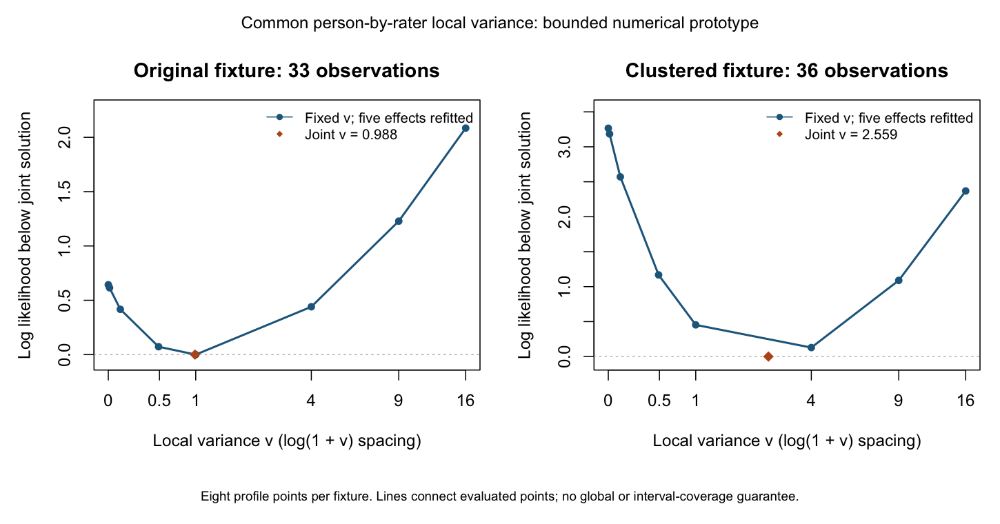

# 人×評定者の局所依存：未知共通分散の推定試作

2026-09-17。以下の問い・範囲・基準を、新しい推定の実行前に記録する。
前提は[固定点照合](local-testlet-tam-reference-0.2.4.md)と
[24条件のストレステスト](local-testlet-stress-0.2.4.md)。

## 問いと設計

同じ答案を同じ評定者が複数基準で採点する依存を、データから推定できる経路を
作る。ここで問うのは、指定した局所効果の分布を維持したまま、固定効果と共通分散を
動かせるか、数値積分の誤差や分散0を最適化の失敗・成功と混同しないかである。
小さな固定応答例での数値検証であり、分散回復・被覆・検出率の実験ではない。

モデル、6人×2評定者×3基準、カテゴリ0/1/2、能力N(0,1)は前回と同じ。
自由座標は(alpha,beta1,beta2,d1,tau1,v)で、beta3=-beta1-beta2、d2=-d1、
tau2=-tau1。gamma_pr=sqrt(v)*z_pr、zは独立N(0,1)を保つ。
TAMの共分散を自由化せず、資格確認済みの独立積分を目的関数とする。

2つの固定応答表を使う。第一は前回の33観測の表。第二は各評定者内で点が似た
次の36観測の表である。列はR1の3基準、R2の3基準の順。

```
0 0 1 | 2 2 1
2 2 1 | 0 0 1
1 1 0 | 2 2 2
0 1 0 | 0 0 1
2 1 2 | 1 2 2
1 2 1 | 1 0 1
```

これは境界と正の分散を探索するための例で、真の分散を指定した乱数生成ではない。
結果を見て応答表を交換しない。期待した解が出なければそのまま記録する。

## 数値手順と判定

- R標準のL-BFGS-Bを使い、構造5座標は[-8,8]、vは[0,16]の有限範囲で探索。
  v=0を小さな正数で代用しない。上限・構造の制限への到達は探索範囲の制約として
  記録し、制約のない有限MLEとは呼ばない。
- 3初期値：(前回の構造, v=.49)、(全構造0, v=0)、
  (alpha=-.3,beta1=.3,beta2=-.2,d1=.2,tau1=.2,v=4)。
- 各評価で正規GH61/121点を比較し、必要時181/241点まで追加。対数尤度・
  モーメントの差1e-7、全自由座標の微分差1e-6を満たさなければ評価不能として
  止める。積分点数の異なる結果を保存し、最適化の収束コードだけで採用しない。
- v>0の微分は既存のlog(v)微分をvで割る。v=0の片側微分は、各人の能力に
  条件づけて `.5 * sum_r{(sum_j residual_pjr)^2 - sum_j Var(Y_pjr)}` を計算し、
  能力の事後分布で平均する。これは正規積分の分散0での右微分である。
  log(v)やSDの微分が境界で0になることを、分散方向の停留の証拠にしない。
- 境界の微分は最適化前に、片側差分2刻み(1e-4,5e-5)のRichardson外挿と1e-5で照合。
- v={0,.01,.1,.49,1,4,9,16}で構造効果を再推定した有限プロフィールを作る。
  直前の解を初期値として使い、探索した点・経路の範囲で比較する。全面的な大域最適性
  の証明や、尤度比検定・区間の校正とは扱わない。
- 全自由座標の投影勾配の最大値1e-5を局所停留の基準とする。v=0では
  対数尤度のv方向微分が正なら境界解を採用しない。構造5座標の通常勾配も確認する。
  初期値間の対数尤度差1e-6、座標差1e-4を別に記録する。
- 選ばれた候補は、細かい積分での再最適化を1回行い、座標差1e-4と尤度差1e-6を
  確認する。さらにTAMの公開関数による固定点評価を前回の格子拡張手順で比較する。
  尤度・モーメント1e-6、全座標微分1e-5。正の分散は中心差分2刻み、ゼロは右差分の
  外挿を使う。数値照合の不成立は記録し、推定成功へ読み替えない。

全欠測、全最低点、全最高点、片方の評定者の全欠測を入力確認に含める。
全欠測は観測なし、全0/2は全体位置に有限MLEがない方向、片方の評定者の欠測は
固定効果の観測設計の階数不足として、最適化前に理由を返す。固定パラメータで
確率を評価できることと、未知パラメータの有限な推定解があることは区別する。

## 結果

事前2例では、各3初期値から同じ正の共通局所分散に到達した。固定分散プロフィール
8点ずつでも、自由推定の点を上回る尤度は見つからなかった。下表は細かい積分での
再推定後の値。元の33観測の表でも正の分散となったことを、そのまま報告する。

| 固定応答例 | 分散v | 対数尤度 | 全座標の投影勾配最大値 | TAMとの対数尤度差 |
| --- | ---: | ---: | ---: | ---: |
| 前回の33観測 | .98832920 | -30.4046955 | 3.09e-7 | 1.74e-11 |
| 評定者内で似た36観測 | 2.55920186 | -35.8147356 | 3.34e-7 | 2.17e-12 |

初期値間の最大座標差はそれぞれ1.04e-6、2.59e-6。細かい積分での再推定による
最大座標差は2.13e-7、2.72e-7、対数尤度差はともに1.64e-13以下だった。
TAMとの事後平均/SD差は最大1.62e-10、全12座標の微分差は最大3.64e-9。
両推定点のTAM照合には±7・41点で足りた。前回のストレス結果を受けた積分拡張の
候補は残しており、この設定を普遍的な既定値とみなさない。

24回の最適化（6初期値、16プロフィール点、2再推定）はすべて収束コード0で、
自由な構造座標の勾配も許容差内。プロフィールのv=16は指定された固定値であって、
自由な分散推定が上限へ到達した結果ではない。プロフィール点での分散方向の勾配は
0である必要がなく、構造効果の勾配と分けて保存した。

数値結果は[全実行](local-testlet-estimation-0.2.4-runs.csv)、
[TAM照合](local-testlet-estimation-0.2.4-tam.csv)、
[微分](local-testlet-estimation-0.2.4-gradients.csv)に保存。
[入力・ゼロ分散微分の6確認](local-testlet-estimation-0.2.4-qualification.csv)も通過した。
初回コードのMD5は`ebafde2f5b7f2ad506e989829d84cb00`。

これは有限範囲内の局所的な数値解の確認であり、全面的な大域最大値、有限MLEの
存在一般、分散回復、標準誤差・区間被覆、識別の十分条件は確認していない。
6人の小例から運用上の精度や推奨評定配置を決めることはできない。
製品コード・公開API・全体パッケージ検査・FairZ本試験への変更は行っていない。

## 初回結果を踏まえた境界の追加確認

事前2例はいずれも正の分散へ到達した。これだけでは分散0を保つ推定経路を
確認できないため、初回結果を変更せず、次の固定例を追加する。R1の3基準を
(0,1,2)の6順列とし、R2も各人で同じ順列を採点する。各ペア内の合計は常に3で、
全列のカテゴリ度数は均衡する。未知の真値から生成したデータとは呼ばない。

追加例も同じ3初期値と細かい積分での再最適化を行い、境界での右微分とTAMでの
尤度・モーメント・全座標微分を確認する。許容差は初回と同じ。追加例で境界に
到達しなければ、その結果を保持する。この診断は事前2例の成績に混ぜない。

### 境界例の結果

3初期値ともv=0へ到達した。構造効果はほぼalpha=beta=d=0、tau1=-.09717449。
分散方向の右微分は-6.478435で、0から分散を増やしても局所的に尤度は改善しない。
投影勾配は6.00e-7以下だった。TAMとの尤度差2.19e-9、平均/SD差1.36e-9、
全6座標の微分差3.24e-7以下で、いずれも許容差内だった。

ただし、細かい積分での再最適化1回はコード52
(`ABNORMAL_TERMINATION_IN_LNSRCH`)となった。元の3初期値はすべてコード0である。
停止時の点は投影勾配1.67e-7で既に事前基準1e-5を満たし、TAM照合も通るが、
最適化器のpgtolは1e-7を要求していた。21回の関数・勾配評価の後、近傍での
ラインサーチが停止した。数値的に確認できる点であることと、収束コード0だった
ことを混同しない。[全4実行](local-testlet-estimation-0.2.4-boundary.csv)と
[9項目の照合](local-testlet-estimation-0.2.4-boundary-checks.csv)を保存した。

試作の停止基準を、積分で確認する勾配精度1e-6と整合するpgtol=1e-6へ変更する。
最終的な投影勾配1e-5、外部照合、初期値・細分化の許容差は変更しない。
変更後は保存済み3例の細分化解と、境界例・前回例の全0初期値からの推定だけを
比較する。元のコード52と全28実行は変更せず、新しい結果を別に記録する。

### 停止基準の修正結果

[5件の対応比較](local-testlet-estimation-0.2.4-stop-bridge.csv)はすべて基準内。
保存済み3点はすべて関数評価1回でコード0となり、座標と尤度の差は厳密に0だった。
境界例の全0初期値からも分散0に到達し、座標差は1.39e-16、尤度差0。
前回例の全0初期値からも元と同じ正の解に到達した。確認対象の範囲では、停止基準の
整合によって不必要なラインサーチを止め、目的関数や確認済みの解を変えずに済んだ。

元のコード52を新しい成功値で上書きしていない。初回の試作コード・全記録は
コミット`02edd35`に保存した。初回28実行の再現にはその版を使う。現在の試作は
停止基準修正後の版であり、対応比較の結果と区別する。TAMで独立に最適化し直した
わけではなく、推定点での尤度・微分・モーメントを外部照合した。

## 記録・再現と次の判断

- [推定試作](local-testlet-estimation-0.2.4.R)、
  [境界例](local-testlet-estimation-boundary-0.2.4.R)、
  [停止基準の対応比較・図の生成](local-testlet-estimation-stop-bridge-0.2.4.R)。
  最後のスクリプトは初回の保存結果を読み、変更が影響する5件だけを実行する。
- 全条件、初期値、各評価の積分点数と誤差、最適化器の返却値、警告、外部照合は
  `validation-results/local-testlet-estimation-20260917/`に保存。計画の`plan.rds`は
  初回推定前に保存した。境界診断と停止基準修正はそれぞれ別記録。
- 初回親コミット`b655d63a761f7ddbe6473f82b62ae4c436cc1ed6`、R 4.6.1、TAM 4.3.25。
  修正後の推定コードMD5 `f32e338e9b7f586225dcdfa6e32e3e67`。
  対応比較コードMD5 `15dee147b35ab6cc96e7fade23752294`。
- 初回24最適化、境界4最適化、停止基準の比較5最適化。独立シミュレーション33反復
  という意味ではない。TAMの固定点呼出しは73回。既存全体パッケージ検査とFairZの
  20,000件は再実行していない。



図の点は実際に評価した8分散値、菱形は自由推定した分散。線は点を結ぶ補助であり、
間のすべての値を探索した結果ではない。両図はそれぞれの最大尤度候補からの差を
描いており、別データ間で適合度を直接比較する図ではない。

これで、宣言した独立な人×評定者効果を保つ、共通局所分散と固定効果の限定的な
推定経路を具体化できた。次は未知分散を含む不確実性の計算法と、人数・評定者数を
増やす際の計算経路を定め、その後に研究Lの回復・被覆を評価する。今回の固定6人・
固定2評定者の試作を一般的な推定器や評定設計の推薦へ直接接続しない。
