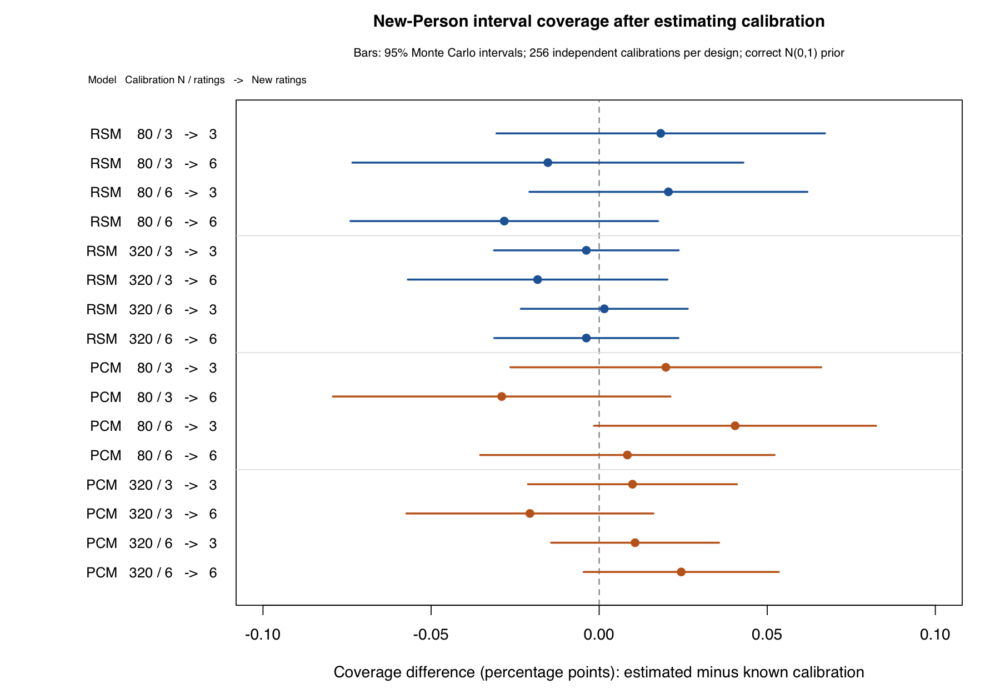

# New-Person intervals after estimated calibration

Date: 2026-09-14. Development version: 0.2.4.9000.

## Question and answer

Researchers usually estimate a calibration from one sample and then score new
Persons. The preceding interval repair checked the posterior CDF at known
calibration. This study asks how much additional error enters when the facet
and step values themselves must be estimated from a finite calibration sample.

After estimating calibration, mean 95% interval coverage ranged from **94.880% to 95.098%**. Estimated-minus-known coverage ranged from **-0.029 to 0.040 percentage points**. **16/16** model/calibration/new-exposure summaries met the prespecified practical coverage criterion. The 95% MC interval for the paired difference included zero in all 16 comparisons; this study did not identify a clear coverage loss attributable to estimating calibration. This is a bounded sampling result, not proof of exact nominal coverage.

The [fixed plan](person-estimated-calibration-0.2.4-plan.md) and
[runner](person-estimated-calibration-0.2.4.R) define eight cells: RSM/PCM,
calibration N=80/320, and 3/6 calibration ratings per Person. Every calibration
is used to score an independent cohort of 512 new Persons at both 3 and 6
ratings. The three-rating assignments are complementary and connected; six
ratings are fully crossed. This separates the amount of calibration data from
the information available about a new Person. It does not represent arbitrary
missingness or a disconnected design.

The unchanged independent generator supplies three Raters, two Criteria,
categories 0--2 and N(0,1) abilities. The true prior is fixed in fitting and
scoring, so estimated-prior error and prior misspecification cannot explain a
difference between methods here. The generating ability saved with each new
Person is the original latent draw, not a new draw or an estimated ability.

## Main results

The fixed-size main run completed **2,048/2,048 calibration datasets**, each with 512 independent new Persons: **1,048,576 distinct new Persons**. The two exposure conditions and two calibration methods reuse these same Persons. There were **2048 available calibrations, 0 errors, 0 warning trials and 0 computable numerical conflicts**. The separate 40 preflight datasets are not included in these counts or coverage estimates.

| Model | Calibration N | Calibration ratings | New ratings | Known coverage | Estimated coverage [95% MC interval] | Difference [95% MC interval], pp |
| --- | ---: | ---: | ---: | ---: | --- | --- |
| RSM | 80 | 3 | 3 | 0.95077 | 0.95095 [0.94978, 0.95212] | 0.018 [-0.031, 0.067] |
| RSM | 80 | 3 | 6 | 0.95021 | 0.95006 [0.94885, 0.95127] | -0.015 [-0.073, 0.043] |
| RSM | 80 | 6 | 3 | 0.95078 | 0.95098 [0.94985, 0.95211] | 0.021 [-0.021, 0.062] |
| RSM | 80 | 6 | 6 | 0.95012 | 0.94984 [0.94862, 0.95105] | -0.028 [-0.074, 0.018] |
| RSM | 320 | 3 | 3 | 0.94884 | 0.94880 [0.94763, 0.94996] | -0.004 [-0.031, 0.024] |
| RSM | 320 | 3 | 6 | 0.94907 | 0.94888 [0.94765, 0.95011] | -0.018 [-0.057, 0.020] |
| RSM | 320 | 6 | 3 | 0.94959 | 0.94961 [0.94838, 0.95084] | 0.002 [-0.023, 0.026] |
| RSM | 320 | 6 | 6 | 0.94904 | 0.94901 [0.94780, 0.95022] | -0.004 [-0.031, 0.024] |
| PCM | 80 | 3 | 3 | 0.94971 | 0.94991 [0.94873, 0.95108] | 0.020 [-0.026, 0.066] |
| PCM | 80 | 3 | 6 | 0.95056 | 0.95027 [0.94901, 0.95154] | -0.029 [-0.079, 0.021] |
| PCM | 80 | 6 | 3 | 0.94996 | 0.95036 [0.94908, 0.95165] | 0.040 [-0.002, 0.082] |
| PCM | 80 | 6 | 6 | 0.94999 | 0.95007 [0.94888, 0.95127] | 0.008 [-0.035, 0.052] |
| PCM | 320 | 3 | 3 | 0.94998 | 0.95008 [0.94889, 0.95127] | 0.010 [-0.021, 0.041] |
| PCM | 320 | 3 | 6 | 0.94908 | 0.94888 [0.94761, 0.95014] | -0.021 [-0.057, 0.016] |
| PCM | 320 | 6 | 3 | 0.94985 | 0.94996 [0.94877, 0.95114] | 0.011 [-0.014, 0.036] |
| PCM | 320 | 6 | 6 | 0.95016 | 0.95040 [0.94915, 0.95165] | 0.024 [-0.005, 0.053] |

For calibration N=80, paired coverage differences ranged from -0.029 to 0.040 percentage points. For calibration N=320, paired coverage differences ranged from -0.021 to 0.024 percentage points. These are shifts relative to the known-calibration method on the same new Persons; the Monte Carlo intervals quantify uncertainty in those shifts. A numerical pass cannot remove a sampling coverage deficit. The lowest estimated-calibration coverage, 94.880%, occurred with known-calibration coverage 94.884% on those same Persons. This illustrates why the paired known-calibration reference is needed to isolate the effect being studied.



The paired known-calibration and estimated-calibration outcomes use the same
Persons. The MC interval for each mean and paired contrast treats an independent
calibration dataset as the sampling unit; the 512 Persons sharing one estimated
calibration are not 512 independent calibration replications. Stratum summaries
use cluster ratio MCSEs. The [aggregation code](person-estimated-calibration-0.2.4-summary.R)
also reports mean width, bias, MSE, RMSE, mean posterior SD, endpoint-response
frequency, and all-attempt available-and-covered rates. RMSE is the square root
of the average MSE, with a delta-method MCSE. It is not an average of replicate
RMSEs. No condition is silently dropped from the whole-study summary.

In true-ability strata below -2 or above 2, estimated-calibration coverage ranged from **65.09% to 77.56%**. The paired known-calibration reference ranged from 64.86% to 77.47% in those strata. These strata are retained and reported descriptively; acceptable overall coverage does not imply 95% coverage at each ability.

The [.93,.97] coverage margin and availability lower bound of .98 are explicit
study choices. Meeting them does not establish exact 95% coverage or simultaneous
coverage across Persons. The intervals still condition on the fitted point
calibration; no calibration-uncertainty correction was implemented in this study.
Coverage averages over repeated calibration samples and new Persons; it does
not certify coverage for one particular saved calibration or fixed true ability.

## Why the computation addresses the question

All 27 assignment/total profiles are scored by the actual public
`predict_mfrm_units()` route. For these unit-slope RSM/PCM models and a fixed
assignment, the log numerator's theta-dependent term is theta times the response
total; the denominator depends on the assignment. Response-specific constants
cancel when normalizing the Person posterior.
This permits exact reuse by assignment and total within the study. It is not
a production cache, an approximation, or a new capability for GPCM or weights.

Independent continuous integration supplies the known-calibration intervals.
The preflight compares it to the package at the generating coordinates and
also checks the estimated-calibration posterior CDF independently. Direct public
scoring of 48 actual new Persons at each exposure in all eight first preflight
replicates verifies the lookup. This guards against a shared bookkeeping error
in the faster study execution.

A separate final audit rebuilt every new Person's assignment and total directly
from the saved six-column response matrix and assignment parity, without the
study's key/lookup/measurement helpers. Coverage, width, bias, MSE, posterior SD
and endpoint frequencies matched exactly in all 2,048 main datasets. Across EAP,
SD and interval endpoints, the maximum difference from known calibration was 0.217 logits, and
calibration coordinates differed from truth by as much as 0.646 logits, so the
small coverage differences do not arise from accidentally reusing true parameters.

Calibration fitting and scoring use fixed Q61. Q121 fitting-objective and full-
gradient checks run at every returned calibration vector. Preflight additionally
checks Q61/Q121 scoring and independent fitting objectives and Person CDFs. These
numerical checks distinguish integration error from finite-calibration error.
They do not extend this sampling result to adaptive fitting or estimated priors.

## Preflight, operational checks and performance

Forty separate preflight datasets (five per cell) completed without fit/scoring
errors, warnings or numerical conflicts. They remain labeled `preflight_only`
and are excluded from the main results. Maximum preflight errors were:

| Check | Maximum absolute difference |
| --- | ---: |
| Fitted objective, Q61 versus Q121 | 2.95e-9 |
| Fitted objective versus independent continuous integration | 1.50e-9 |
| Person moments, Q61 versus Q121 | 6.56e-9 |
| Person moments versus independent continuous integration | 6.56e-9 |
| Fitted-posterior endpoint tail probability | 1.40e-12 |
| Direct scoring versus profile lookup | 1.34e-15 |
| Portable scoring versus its own reviewed source fit | 1.78e-15 |

The independent known-calibration posterior check passed for both RSM and PCM
(maximum endpoint/moment discrepancy 2.47e-11). Runnable aggregation checks
verify calibration-level MCSE, paired covariance and zero-count strata. A
streaming aggregation change avoids retaining whole fits in RAM; all four
preflight CSV outputs were byte-identical before/after. Its original and revised
analysis source are retained. Simulation source and seeds did not change.

Eight preflight source fits also exercised public quadrature refitting,
calibration extraction, validation, freezing, save/load and scoring. Each saved
artifact was rescored on macOS; RSM and PCM examples were also rescored with the
checked Linux package. Values matched their own source-fit prediction to
1.78e-15 on macOS and 4.45e-16 on Linux. Every artifact retained six of its 27
extreme profiles as `scored_review`. These compatibility checks use the stored
scoring order (31); the primary sampling study uses Q61.

Completed-cell resume left all 256 saved results unchanged. A deliberately
different source payload was rejected before any fit. Every attempted fit and
cohort is retained, including any failure. No replacement seeds, repeated
sampling until success, or coverage-dependent extension was used.

Direct six-rating public scoring on one retained RSM calibration took median
2.201 s for 48 Persons, 8.794 s for 192, and 35.324 s for 768 (three timed runs
per size, macOS). Every result matched the profile lookup within 1.56e-15.
A sampling profile attributed 96.4% of sampled CPU time to
`mfrm_mml_logprob_bundle_r()` during CDF inversion. Inclusive stack percentages
overlap; they are not additive and are not wall-clock throughput estimates.
This identifies a concrete future optimization target. No production cache,
changed quadrature order, or less accurate interval approximation was introduced.

## Evidence and limits

This is a correctly specified, moderately sized, connected RSM/PCM design with
a known normal prior and a common calibration scale. It does not validate
prior misspecification, fitted population models, anchors/linking transport,
GPCM, arbitrary sparse designs, or a release decision. Historical structural
parameter coverage and the pending estimated-population parameter study answer
different questions. The current result specifically concerns new-Person
intervals after estimating facet and step parameters.

The design and separation of Monte Carlo uncertainty follow
[Morris, White and Crowther (2019)](https://doi.org/10.1002/sim.8086).
The known-calibration comparison uses the prior-predictive interpretation
described in the [Stan guide](https://mc-stan.org/docs/stan-users-guide/simulation-based-calibration.html),
without an SBC rank-test claim.

The [primary comparison](person-estimated-calibration-0.2.4-results.csv), [run counts](person-estimated-calibration-0.2.4-counts.csv), [full metric/stratum summaries](person-estimated-calibration-0.2.4-summary.csv), [verification ledger](person-estimated-calibration-0.2.4-checks.csv), and [source manifest](person-estimated-calibration-0.2.4-source.csv) accompany this record. Raw inputs, latent draws, all 2,088 primary calibration datasets including preflight, fitted objects and preflight refits, profile scores, portable artifacts, sessions, timing/profile data, checkpoint checks, the checked package archive and evidence hashes are retained under `validation-results/person-estimated-calibration-20260914/`. Some main-run elapsed times were much longer than the dedicated timing measurements; they are retained but are not used as stable throughput estimates.

Package source remained unchanged: all 498 files compared to the previously
checked source archive match. Archive SHA-256:
`2a00ab9bbbec1b65bfb50086dfc9757e51b2d6803b1921f88fba7f7030fcea72`.
The macOS/Linux package checks in the
[preceding record](person-interval-calibration-0.2.4.md) apply to this same archive;
they were not counted as newly rerun checks. No package release or publication
was performed.

Reproduce from the development root with that package on the R library path:

```sh
Rscript inst/validation/person-estimated-calibration-0.2.4.R preflight /tmp/person-cal-preflight
Rscript inst/validation/person-estimated-calibration-0.2.4.R main /tmp/person-cal-main
```

The optional third argument assigns comma-separated cells to one worker. The
`PEC_LIBRARY` environment variable selects the installed package library. Source
the aggregation file to call `pec_summarize(directory)` and the runnable
`pec_self_check(preflight_directory)`. The source gate prevents mixing differing
simulation payloads; execution with a changed package requires a separate record.
