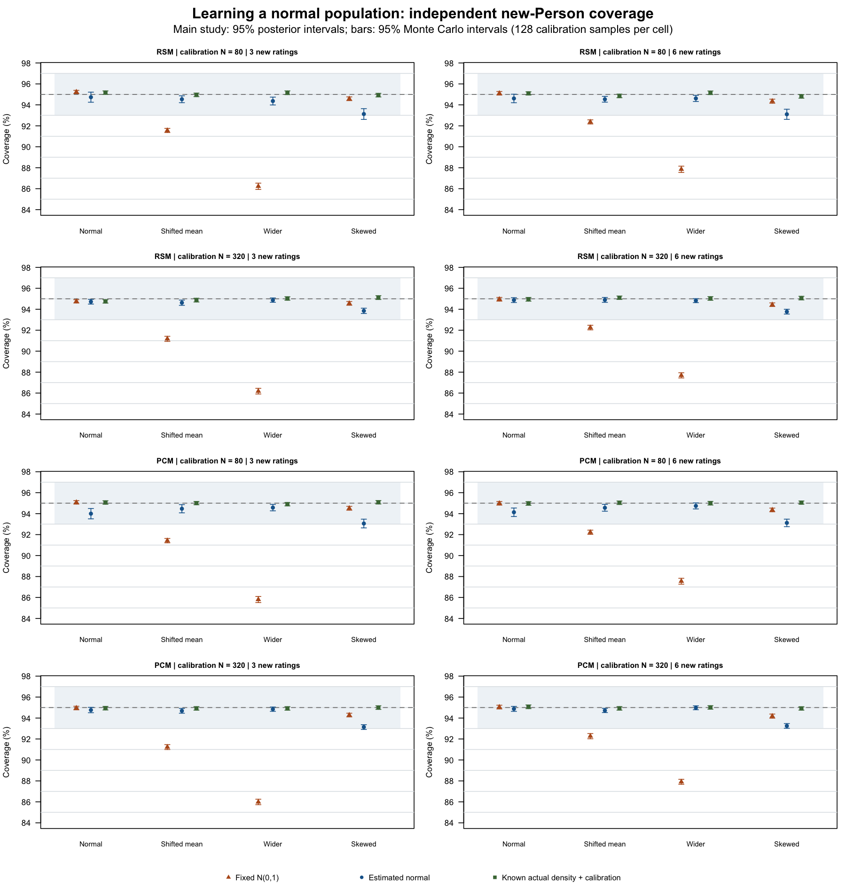

# Learning a normal scoring population — 0.2.4

## Question and answer

A user scoring new people may find that the ordinary N(0,1) assumption does
not describe their population. Does estimating a normal mean and variance
jointly with the measurement calibration improve new-Person scores? Does it
also address a differently shaped population, and what uncertainty remains?

**Learning the normal population improved coverage and error when the actual
normal population was shifted or wider. It did not solve shape mismatch.**
Across the wide-population conditions, 95% interval coverage rose from
85.80–87.91% to 94.36–94.98%. For the standardized skewed population, coverage
instead fell in all eight model/sample-size/rating comparisons. Even when
N(0,1) was correct, estimating it increased RMSE and could reduce coverage,
especially with only 80 calibration Persons.

All 4,096 main fits met the numerical availability criteria. That result does
not establish ordinary scoring eligibility or complete uncertainty accounting:
estimated-population fits remain **review-only**, and the intervals condition
on point estimates of both calibration and population parameters.

## Why this design answers the question

The [plan](person-learned-population-0.2.4-plan.md) crosses RSM/PCM, calibration
N=80/320, and four actual populations: N(0,1), N(.75,1), N(0,1.5^2), and
`(Gamma(2,1)-2)/sqrt(2)`. The last has population mean zero and variance one,
but retains its skewed shape. Samples are not recentered or rescaled.
Each calibration sample has three Raters, two Criteria, categories 0–2, and
all six conditionally independent ratings per Person. Generating facet and
step coordinates are fixed across repetitions and recorded in the plan.

Each sample supplies two public `fit_mfrm()` direct-MML fits: ordinary fixed
N(0,1), and `population_formula=~1` with a one-row-per-Person training table.
Both estimate all facet and step parameters; the latter also estimates the
normal mean and variance. **This compares two complete fitting/scoring
workflows. It does not isolate prior substitution at identical estimated
calibration coordinates.** The two calibration sample sizes probe the cost
of learning these extra parameters.

There are **128 main samples per cell: 2,048 independent calibration samples**.
Each supplies 512 independent new Persons from the same actual population,
for **1,048,576 distinct new-Person draws**. Calibration and scoring IDs are
disjoint. The same new people supply six ratings and balanced complementary
three-rating subsets. This varies rating exposure within a three-Rater,
two-Criterion design; it does not vary the number of Raters. Paired methods
and rating exposures are not additional independent Persons or repetitions.

Public `predict_mfrm_units()` scores all 27 assignment/total profiles with
`scoring_quad_points=241` and explicit `readiness_policy="review"`. The checked
profile lookup is valid for these unit-slope designs. A separately integrated
posterior using the known actual density and generating calibration supplies
an oracle reference. It is not a package feature or an available practical
alternative that knows a user's true population.

The calibration sample is the Monte Carlo unit. Coverage, bias, width and
other means use cluster ratio MCSEs; RMSE is the square root of pooled MSE.
Paired differences retain between-arm covariance, including the delta-method
calculation for RMSE. Reported Monte Carlo intervals use t(127), without
multiplicity adjustment. They quantify simulation precision, not uncertainty
intervals for an individual Person or estimated population parameter.
Empty ability strata remain in the cluster calculation with zero contributions.

## Coverage and its practical consequences

Marginal coverage (%) of 95% posterior intervals. F = fixed N(0,1),
L = estimated normal population; column numbers are new ratings per Person.

| Actual population | Model | Calibration N | F: 3 | L: 3 | F: 6 | L: 6 |
| --- | --- | ---: | ---: | ---: | ---: | ---: |
| N(0,1) | RSM | 80 | 95.230 | 94.733 | 95.107 | 94.612 |
| N(0,1) | PCM | 80 | 95.078 | 93.999 | 94.987 | 94.135 |
| N(0,1) | RSM | 320 | 94.757 | 94.720 | 94.955 | 94.875 |
| N(0,1) | PCM | 320 | 94.955 | 94.765 | 95.045 | 94.875 |
| Mean .75, SD 1 | RSM | 80 | 91.557 | 94.537 | 92.375 | 94.533 |
| Mean .75, SD 1 | PCM | 80 | 91.426 | 94.469 | 92.227 | 94.559 |
| Mean .75, SD 1 | RSM | 320 | 91.176 | 94.624 | 92.255 | 94.894 |
| Mean .75, SD 1 | PCM | 320 | 91.229 | 94.685 | 92.273 | 94.719 |
| Mean 0, SD 1.5 | RSM | 80 | 86.229 | 94.365 | 87.852 | 94.617 |
| Mean 0, SD 1.5 | PCM | 80 | 85.803 | 94.574 | 87.552 | 94.737 |
| Mean 0, SD 1.5 | RSM | 320 | 86.182 | 94.872 | 87.689 | 94.823 |
| Mean 0, SD 1.5 | PCM | 320 | 85.989 | 94.846 | 87.914 | 94.978 |
| Standardized Gamma(2) | RSM | 80 | 94.582 | 93.124 | 94.351 | 93.100 |
| Standardized Gamma(2) | PCM | 80 | 94.513 | 93.056 | 94.354 | 93.117 |
| Standardized Gamma(2) | RSM | 320 | 94.560 | 93.849 | 94.435 | 93.770 |
| Standardized Gamma(2) | PCM | 320 | 94.284 | 93.138 | 94.182 | 93.246 |

The [SVG](person-learned-population-0.2.4-coverage.svg) supports resizing.
Bars are 95% Monte Carlo intervals, the dashed line is nominal 95% coverage,
and the shaded band is the prespecified study-specific [.93,.97] margin.

For shifted normal populations, the learned-minus-fixed coverage difference
was +2.16 to +3.46 percentage points; for wider normal populations it was
+6.76 to +8.86 points. For example, three-rating RSM with calibration N=80
and actual SD 1.5 improved by **8.136 points [7.726, 8.546]**. Its RMSE fell
from **.9318 to .8542 logits**, with a paired change of
**−.0776 [−.0837, −.0716]**. Mean interval width increased from **2.6337 to
3.2774 logits**. Wider intervals and reduced estimation error both contribute
to the practical benefit; higher coverage alone would not describe it fully.

Learning an already correct normal population was not an automatic benefit.
For three-rating PCM at N=80, coverage fell by **1.079 points
[−1.570, −.587]**, and RMSE increased by **.0147 logits [.0110, .0185]**.
Across the correct-normal conditions, RMSE increases were .0094–.0147 logits
at N=80 and .0025–.0036 at N=320. These repeated-sample comparisons include
estimation of the population and the consequent changes in calibration.

For the skewed population, all eight paired coverage differences were
negative, from −1.457 to −.665 percentage points, with their Monte Carlo
intervals below zero. For three-rating PCM at N=320, coverage changed from
**94.284% to 93.138%**, a difference of **−1.146 points [−1.313, −.979]**.
RMSE rose from **.7102 to .7166 logits** and mean width fell from
**2.6229 to 2.4840 logits**. Thus learning a normal location and scale does
not remove this shape mismatch and can worsen the selected outcomes.

**27 of 32** learned-population coverage summaries had their entire Monte
Carlo interval within [.93,.97]. The five marked `review` were the skewed
population with RSM N=80 (both exposures), PCM N=80 (both), and PCM N=320
(three ratings). The three other skewed summaries meet this broad margin
despite their observed deterioration. `supported` in the CSV means only
meeting this prespecified, bounded study criterion; it does not mean exact
95% coverage or approved scoring. Oracle empirical coverage ranged from
94.754–95.168%, consistent with finite Monte Carlo variation around its
nominal integrated coverage. Not every pointwise Monte Carlo interval need
include .95.

The [2,080 marginal rows](person-learned-population-0.2.4-summary.csv) retain
coverage, RMSE, MSE, bias, width, posterior SD, extreme-total rate and paired
contrasts, with denominators and MCSEs. Own-available, paired-available,
oracle-all and joint-available-and-covered/all-attempt summaries are retained;
none of the main fits was discarded or replaced.

## Ability strata and population estimates

The [12,096 stratum rows](person-learned-population-0.2.4-strata.csv) show why
marginal coverage is insufficient. Among theta>2 new Persons in three-rating
RSM, N=80, actual SD 1.5, coverage increased from **45.506% to 84.406%**;
the oracle gave 87.998%. For three-rating PCM, N=320, skewed population,
coverage instead fell from **43.532% to 27.957%**, while the oracle gave
81.590%. In the latter stratum, mean signed error changed from −1.6909 to
−1.8400 logits. These selected examples illustrate materially different tail
behavior, not nominal-95% tests at each ability: even an oracle posterior
interval need not have 95% coverage in every true-ability stratum.
The skewed distribution has no mass below −2; all 504 summary rows for that
structurally empty stratum correctly retain zero Persons and undefined
conditional metrics.

The [population summaries](person-learned-population-0.2.4-population.csv)
retain average fitted means/SDs and their between-sample variation. For wide
RSM populations, the mean fitted SD was 1.4874 at N=80 and 1.5058 at N=320;
its between-sample SD decreased from .2103 to .1088. For shifted RSM
populations, the mean fitted means were .7493 and .7480, with between-sample
SDs .1509 and .0696. Under the skewed population, average fitted normal SDs
were .9113–.9440 across model/sample-size cells, even though the actual
population SD is one. These misspecified-model coordinates need not equal
the generating moments; their difference is not ordinary bias of a
consistent moment estimator. Monte Carlo intervals for the average fitted
coordinates do not establish a population-parameter inference API.

## Numerical qualification and independent checks

The original Q121 preflight included 48 calibration samples and 96 fits,
excluded from main summaries. One of 32 detailed checks failed the fixed
native/reference gradient-agreement limit: PCM, N=320, wide population,
replicate 1, learned arm gave **1.212499e−7 against 1e−7**. The same-vector
Q121/Q241 objective difference was only 8.619736e−9; objective agreement
alone did not catch this derivative discrepancy. Q241 and Q321 gradients
agreed within 1.6e−13 and matched the specified independent derivative.

Before any main samples were generated, fitting/scoring order was increased
to **Q241**, with **Q321** as the higher-order comparison. All thresholds,
sample counts, seeds and availability rules were retained. The same 48
preflight samples were refitted; they are not 48 additional independent
samples. All true abilities and response data were bitwise identical;
maximum parameter/profile changes were 1.274e−7/2.663e−7, and every empirical
preflight coverage value was unchanged. The failed Q121 check remains in the
[numerical record](person-learned-population-0.2.4-checks.csv).

* All 32 fits selected for detailed Q241 preflight checks passed. Maximum independent objective
  discrepancy was 4.55e−13; gradient discrepancy was 1.59e−8, and gradient
  step sensitivity was 1.94e−8. The maximum reference full gradient was
  9.98e−5. Public profile moments agreed with independent integration within
  9.48e−14, endpoint CDF errors were at most 1.89e−12, and direct public
  scoring versus profile lookup differed by at most 2.00e−15.
* All **4,096 main fits** returned, passed native convergence, had a full
  unregularized covariance, finite scoring outputs and zero numerical
  conflicts. There were no captured errors or warnings. Maximum same-vector
  Q241/Q321 objective change was **3.061e−10**; maximum full gradients at
  either order were **9.993e−5**, within the unchanged 1e−4 limit. These
  main checks compare orders; independent integration was performed on the
  prespecified preflight subset, not on every main fit.
* Every cell had 128/128 paired-available samples; its exact 95% availability
  lower bound was .97159. All fixed fits were FitReady/ScoringReady; all
  learned fits retained false readiness flags. Numerical availability does
  not override these flags.
* Q121/Q241/Q321 rules had **zero zero-valued weights**, with minimum weights
  7.899e−97, 1.754e−198 and 1.036e−266. An attempted Q481 check was correctly
  rejected because not all weights were representable as positive finite
  doubles. Its original failure is archived; no clipping or zero replacement
  was introduced.
* The qualified preflight and full main aggregation each passed 130 saved
  replay/metric checks. Independent reconstruction of paired coverage MCSE,
  paired RMSE delta-method covariance, and a stratum ratio retaining empty
  clusters agreed within 3.34e−16. The initial Q121 derived readiness-count
  summary had counted either-arm flags rather than requiring both; this was
  corrected before main execution, preserving the original derived file.
  Raw fits and coverage were unaffected.
* Twenty-four oracle design/population checks recovered probability mass,
  first moments and second moments within 4.45e−16. All seeds, disjoint IDs,
  assigned replications, new-person counts and rating categories were checked.
  The separately generated response totals gave **432 marginal frequency
  comparisons** against independently integrated probabilities; the largest
  discrepancy was **2.828 standard errors**, within the additional five-SE
  generator audit margin. These comparisons overlap and are not 432
  independent hypothesis tests.

## Help, reporting and limits

`fit_mfrm()` help and the portable-calibration vignette now explain that `~1`
learns normal location/scale, requires the training Person table, and retains
the normal-shape assumption. Prediction help and the shared returned note
explicitly state that uncertainty from estimating **either calibration or
population parameters is excluded** from these conditional intervals. The
existing review gate remains in place. A report using this workflow should
identify the fitted population, calibration sample size, scoring population,
rating design, readiness policy, numerical settings and this uncertainty
limitation; it should not call the intervals fully uncertainty-adjusted.

Before/after comparison of 16 public predictions covering 432 profiles and
seeded plausible-value draws found all returned objects bitwise identical
after replacing only the intended explanatory note. The existing prediction
suite passed 165 assertions in 21 blocks without failures, errors, warnings
or skips. All 87 parsed R files match after undoing that one text literal;
compiled sources are identical. Both changed Rd pages passed parsing/checks,
and the rebuilt vignette and final PNG/SVG were checked.

The final documentation package passed `NOT_CRAN=false R CMD check
--no-manual` on macOS (R 4.6.1, arm64, Tahoe 26.6.2): **Status: OK**,
with **673 assertions passing and three intended CRAN skips**. This invokes
the repository's CRAN-check test selection; the separate prediction tests
above cover the changed returned note. The full local test suite was not
rerun for this documentation change. Repository-index access warnings from
the network-restricted check are retained in the complete log; dependency
checks using the installed packages and the final package checks passed.

The study uses the **same actual distribution for calibration and scoring**.
It does not test population drift between training and deployment, a learned
non-normal density, population covariates, parameter-confidence-interval
coverage, weights, anchors/linking, disconnected data, GPCM slopes, residual
dependence or other scoring designs. Current intervals are plug-in intervals;
repeated samples evaluate consequences of omitted estimation uncertainty
without adding that uncertainty to any individual interval. The earlier
planned 80,000-dataset population-parameter interval main study remains
unexecuted and is a separate question.

The previous prior-robustness study held calibration known and used categories
0–3. Its coverage values cannot be compared with these categories-0–2 refitted
results as a controlled estimate of calibration-error effects.

Analysis package SHA256:
`54c9bfa2493f4ded5cf89867a2164b9a998551f21c5b79f0a4bf5978da60e467`.
Documentation package SHA256:
`b14f187a22dd5f811178e20a2681bd04f1b5e71f5ead9be3e849c88ac2a93678`.

The [runner](person-learned-population-0.2.4.R),
[aggregation](person-learned-population-0.2.4-summary.R), frozen plan, complete
counts and source hashes accompany this record. Raw calibration/new-Person
inputs, true abilities/responses, every fit, original and amended preflight,
audits, source snapshots, logs and both package archives are preserved in
`validation-results/person-learned-population-20260914/`, with `COMMANDS.md`
and a verified SHA256 `manifest.csv`. Earlier studies retain their own bundles.
