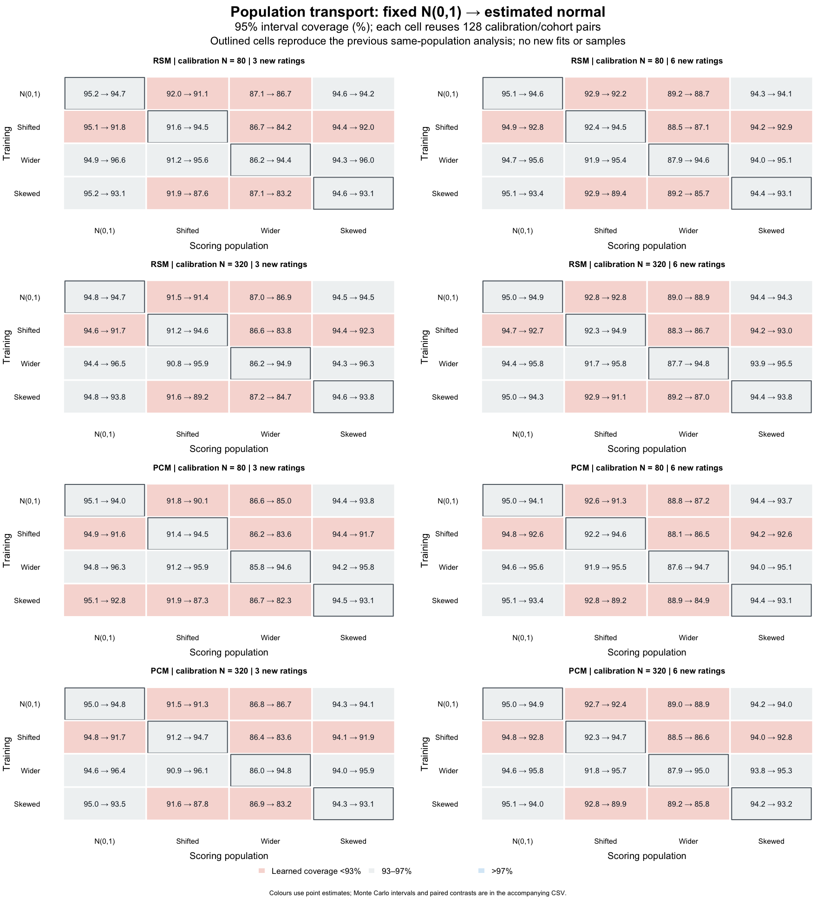

# Scoring after a population change — 0.2.4

## Question and answer

A calibration estimated from last year's cohort may be used to score a new
cohort whose ability distribution has changed. The preceding study showed
benefits of learning a normal mean and variance when training and scoring
populations matched. Does that benefit survive a change between populations,
and does source readiness identify the problem?

**Learning the training population did not reliably protect scores after a
population change.** For RSM with calibration N=320 and three new ratings,
training on a shifted normal population and scoring a standard-normal target
reduced coverage from **94.572% to 91.656%** under the learned workflow.
Training on a wider population and scoring a standard-normal target instead
gave **96.477% coverage**, but increased RMSE and interval width. Thus a
coverage value near 95% does not by itself establish accurate or efficient
scoring after transport.

Increasing calibration N from 80 to 320 did not resolve the selected
population mismatches. The source readiness flags also remained unchanged
across target populations. This supports reporting and examining the
training-to-target assumption; it does not supply an automatic drift
detector or authorize ordinary use of learned-population scores.

## Why this comparison answers the question

This is a **secondary analysis of the previous simulations**, planned after
seeing their same-population results and before calculating the cross-population
combinations. It is not an independent replication. The
[analysis plan](person-population-transport-0.2.4-plan.md) crosses four training
populations with four target populations: N(0,1), N(.75,1), N(0,1.5^2), and
standardized Gamma(2). RSM/PCM and calibration N=80/320 give **64 cells**, each
with 128 saved replicate bundles. New Persons provide three/six ratings in
the same three-Rater, two-Criterion design, with categories 0–2.

The generating measurement parameters remain unchanged. This isolates a
population change on the same measurement scale; it does not introduce Rater
drift, differential item functioning or a new linking problem. For each
model/N/replicate, both source fits score the same saved target cohort. The
target people are independent of the calibration people by the original
disjoint seed construction. No target data are used to refit a population
or choose which scoring method to report.

Both the fixed-N(0,1) and learned-normal fitting workflows originally estimated
facet and step parameters. Their comparison therefore includes the associated
calibration differences, not just substitution of a prior while holding the
estimated calibration identical. The oracle uses the known target density
and generating calibration; it remains an unavailable research reference.

The study reuses **2,048 original calibration samples, 4,096 original fits,
and 1,048,576 original new-Person draws**. Each target cohort is evaluated
under four source populations, producing 4,194,304 source/target Person
evaluations per method/exposure. These are not additional independent people,
fits or random samples. The 128 replicate bundles are independent within a
cell; different cells share samples and must not be pooled as independent
replications. Monte Carlo intervals are pointwise t(127) intervals using the
existing cluster ratio estimator and paired RMSE delta method.

## Coverage, error and interval width

An [SVG](person-population-transport-0.2.4-coverage.svg) is available for resizing.
Each tile reports **fixed → learned** coverage of 95% posterior intervals.
Rows identify the training population and columns the scoring population.
Outlined diagonal tiles reproduce the previous same-population experiment.
Colours describe learned-coverage point estimates, not a significance test
or an eligibility decision. The companion CSV contains Monte Carlo intervals
and paired differences for every tile.

Selected RSM results at calibration N=320 and three new ratings. Each
entry is **fixed N(0,1) → learned normal**; bias, RMSE and width are in logits.

| Training → scoring population | Coverage (%) | RMSE | Signed bias | Mean width |
| --- | ---: | ---: | ---: | ---: |
| N(0,1) → wider | 87.047 → 86.906 | 0.9208 → 0.9215 | -0.0003 → 0.0033 | 2.6693 → 2.6768 |
| Shifted → N(0,1) | 94.572 → 91.656 | 0.6761 → 0.7603 | -0.0017 → 0.3400 | 2.6203 → 2.6528 |
| Wider → N(0,1) | 94.423 → 96.477 | 0.6765 → 0.7550 | -0.0016 → 0.0009 | 2.5998 → 3.2154 |

For shifted training (mean .75, SD 1) and a standard-normal target,
the learned-minus-fixed coverage difference was **−2.916 percentage points
[−3.268, −2.564]**, and the RMSE difference was **+.0842 logits
[.0801, .0882]**. The learned scores had a mean signed error of **+.3400
logits**. At calibration N=80, learned coverage was 91.830%; at N=320 it was
91.656%. The larger calibration sample therefore did not recover target
coverage in this comparison. This is a bounded comparison of these two
sample sizes, not a claim about every possible asymptotic setting.

For wider training (SD 1.5) and a standard-normal target, learned coverage
was **96.477% [96.337, 96.617]**, entirely inside the study's broad [.93,.97]
margin. Nevertheless, the learned-minus-fixed RMSE difference was **+.0785
logits [.0722, .0849]**, and mean width increased by **.6156 logits
[.5957, .6355]**. Passing this coverage margin did not imply lower estimation
error or narrower intervals. Cross-population application does not uniformly
lower coverage: the full matrices retain the improvements as well as losses.

Conversely, learning a standard-normal source did not accommodate a wider
target. Learned coverage remained **86.906% [86.392, 87.421]**; its paired
difference from fixed scoring was −.140 points [−.614, .333]. There was no
meaningful recovery toward 95% in this selected condition.

Among the **96 off-diagonal model/N/exposure summaries**, 36 met the carried-
over whole-Monte-Carlo-interval [.93,.97] criterion, 47 had their whole
interval below .93, and 13 overlapped a criterion boundary. The CSV labels
these as `supported`, `concern` and `review`, respectively. They are
study-specific descriptors, not population-transport approvals. The diagonal
retains the preceding result of 27/32 meeting the broad margin. These counts
describe correlated condition summaries and are not independent success
trials.

Tail results also show directional consequences. In the shifted-training,
standard-normal-target RSM example above, theta<=−2 coverage fell from
**63.347% to 30.894%** (1,476 target Persons), while theta>2 coverage rose
from **63.189% to 87.664%** (1,524 Persons). The corresponding target-oracle
values were 65.786% and 65.289%. The contrasting tails accord with the
positive signed error; they also show why neither a marginal average nor a
95% threshold at every fixed ability is an adequate description.

The [marginal summary](person-population-transport-0.2.4-summary.csv) retains
8,320 rows: coverage, bias, MSE, RMSE, mean posterior SD, width and extreme-total
rates, with paired contrasts and all availability denominators. The
[stratum summary](person-population-transport-0.2.4-strata.csv) retains 48,384
rows, including structurally empty target strata. No nominal-95% claim is made
for each true-ability stratum. The carried-over whole-Monte-Carlo-interval
[.93,.97] rule is descriptive and does not authorize transporting a scoring
prior. Near-nominal coverage alone can conceal bias, inefficiently wide
intervals or poor tail behavior.

## What was checked, and what was reused

All 2,048 required raw samples, the previous metadata/summaries, and the
checked analysis package matched the preceding archive's SHA256 manifest.
There were no new fits, retries, draws or outcome-based sample substitutions.
The new runner uses saved public Q241 profile scores and caches only the
existing assignment/total lookup. This lookup applies to the unit-slope,
fixed-design cases examined here.

Before completing the secondary analysis, all 64 replicate-1 source/target
combinations were qualified. **256 direct public scoring comparisons**,
covering eight actual target Persons and both rating exposures, agreed with
the lookup within **1.78e−15**. All **32 saved-profile comparisons** with the
current checked package were numerically identical for estimates, SDs and bounds.
These are retained replicate-1 samples, not extra independent observations.

Every same-population replicate reproduced its previous metrics exactly.
All **14,176 diagonal aggregate rows** also reproduced the earlier estimates,
MCSEs and bounds within **5.33e−15**. These are reproducibility checks,
not new evidence for the same-population coverage claims. The original
Q241/Q321 fitting checks and convergence/covariance statuses are inherited;
no new independent quadrature audit is claimed here.

All original source fits had numerical availability. Source FitReady and
ScoringReady were true for the fixed fits and false for the learned fits;
all direct scoring checks retained the corresponding source readiness.
Readiness alone does not test whether a source population represents a new
cohort. The learned-population workflow continues to require explicit
`readiness_policy="review"` and cannot be promoted by this secondary analysis.
Inherited fitting times are labelled as such in the
[counts](person-population-transport-0.2.4-counts.csv); new processing times
are recorded separately in the execution logs.

## Help and reporting consequences

The portable-calibration guide now uses a concrete last-year/this-year cohort
example. For an intercept-only population model, scoring a new response batch
retains the fitted mean and variance; it does not estimate a new batch
population. A report should identify the training and target cohorts, explain
why the scoring prior applies, and present sensitivity to that assumption
when uncertain. A larger training sample can estimate the source population
more precisely without resolving a difference from the target population.

Only guide prose was changed in the package. All **317 R, compiled-source
and manual files** were byte-identical to the previously checked package.
The rebuilt guide and the final PNG/SVG were checked. The documentation
package passed `NOT_CRAN=false R CMD check --no-manual` on macOS (R 4.6.1,
arm64, Tahoe 26.6.2): **Status: OK**, with **673 assertions passing and three
intended CRAN skips**. This is the repository's CRAN-check selection, not a
rerun of the complete local suite. Repository-index access warnings from
the network-restricted check are retained in the log; the dependency and
final package checks passed.

Analysis package SHA256:
`b14f187a22dd5f811178e20a2681bd04f1b5e71f5ead9be3e849c88ac2a93678`.
Documentation package SHA256:
`1ad565ec34687a9ca1e6d57dc585547322fad47a9ed1b4c096249bbed9aeded5`.

This study does not establish a population-drift detector, an adaptive
recalibration procedure, a non-normal population estimator, or the safety of
choosing a prior from favorable target results. Intervals remain conditional
on point calibration and population estimates and exclude uncertainty from
estimating them. The separate planned population-parameter interval study is
not executed by this reanalysis. Linking, anchors, disconnected data, GPCM
slopes and response dependence remain outside this design.

The [runner](person-population-transport-0.2.4.R), plan, summaries,
[checks](person-population-transport-0.2.4-checks.csv) and source identities
accompany this record. The derived samples, per-replicate metrics, frozen
source, logs, plot script and checked documentation package are preserved in
`validation-results/person-population-transport-20260914/`, with `COMMANDS.md`
and a verified SHA256 manifest. Original raw inputs remain in the adjacent
`person-learned-population-20260914/` bundle; their exact relative paths and
hashes are retained in the new `evidence/input-manifest.csv`.
