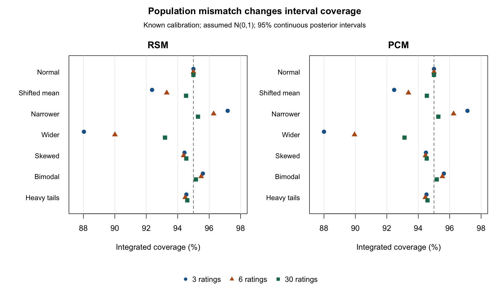

# Person scoring under a mismatched prior — 0.2.4

## Question and answer

A user may apply a saved calibration to a population whose abilities are more
spread out, shifted, or differently shaped than the assumed scoring prior.
Numerically accurate posterior intervals do not establish that this prior
matches the target population. We asked how much this mismatch changes Person
coverage and error while holding the measurement calibration fixed.

**The largest marginal coverage losses in these conditions came from a wider
actual population.** With actual SD 1.5 and an assumed N(0,1) prior, 95% interval
coverage was about **88% with three ratings**, improving to about **93.1–93.2%
with 30 ratings**. Shifting the actual mean to 0.75 reduced three-rating coverage
to about 92.4%. A narrower population produced overcoverage. Shape changes with
the same mean and variance had smaller marginal effects in the selected cases;
this is not a general robustness claim about all non-normal distributions.

## Why this design answers the question

The [frozen plan](person-prior-robustness-0.2.4-plan.md) crosses seven actual
populations with RSM/PCM and 3/6/30 conditionally independent ratings per Person
(42 cells). The known calibration, categories 0–3 and rating positions reuse the
preceding interval study. Only the ability distribution changes. This separates
scoring-prior mismatch from calibration-estimation error and avoids interpreting
a refitted parameter shift as a scoring effect.

For the skewed, bimodal and heavy-tailed conditions, the **population** mean is
zero and variance one; random samples are not recentered or rescaled. The
skewed variable is `(Gamma(2,1)-2)/sqrt(2)`. The bimodal distribution mixes
`N(-sqrt(.84),.4^2)` and `N(sqrt(.84),.4^2)` equally. The heavy-tailed variable
is `t(5)*sqrt(3/5)`. Narrow/wide populations are normal with SD .6/1.5.

In this unit-slope, fixed-design setting, the total score is sufficient.
Independently convolved probabilities at theta=0 give

`P(T=t | theta) = P(T=t | 0) exp(t*theta) / sum_u P(T=u | 0) exp(u*theta)`.

We integrate over the actual density and sum every attainable total. This
avoids sampling error in the primary summaries. Base R adaptive integration
covers the entire support, including the Student-t tails. A separately coded,
response-by-response Monte Carlo experiment checks the total-score method.
The primary summaries are integrated operating characteristics, not Monte Carlo
estimates and not exact-arithmetic results.

Scoring retains the assumed N(0,1) prior. We report fixed Q31 (the public
default), fixed Q121 and adaptive Q61 EAP/SD results separately. Continuous
95% interval endpoints are common to these numerical choices. An independently
integrated posterior using the **known actual density** supplies an oracle
comparison; this is a diagnostic benchmark, not a new package option or a claim
that users know their target ability distribution.

## Results

Integrated marginal coverage (%); column numbers are ratings per Person:

| Actual population | RSM: 3 | RSM: 6 | RSM: 30 | PCM: 3 | PCM: 6 | PCM: 30 |
| --- | ---: | ---: | ---: | ---: | ---: | ---: |
| N(0,1) | 95.000 | 95.000 | 95.000 | 95.000 | 95.000 | 95.000 |
| Mean 0.75, SD 1 | 92.369 | 93.303 | 94.533 | 92.468 | 93.374 | 94.547 |
| Mean 0, SD 0.6 | 97.179 | 96.287 | 95.290 | 97.130 | 96.246 | 95.277 |
| Mean 0, SD 1.5 | 88.033 | 90.005 | 93.192 | 88.001 | 89.946 | 93.124 |
| Standardized Gamma(2) | 94.431 | 94.376 | 94.546 | 94.489 | 94.457 | 94.539 |
| Symmetric normal mixture | 95.601 | 95.494 | 95.156 | 95.629 | 95.535 | 95.174 |
| Standardized t(5) | 94.551 | 94.479 | 94.609 | 94.524 | 94.450 | 94.588 |

The [SVG](person-prior-robustness-0.2.4-coverage.svg) is available for resizing.
The dashed line is nominal 95% coverage; plotted points have numerical, not
Monte Carlo, precision. **Eight of 42** cells exceeded the prespecified
study-specific two-percentage-point deviation from .95. This descriptive margin
is not a certification threshold for the remaining cells.

Using the known actual density, oracle marginal coverage was 95% in all 42
cells (maximum discrepancy 1.97e-11). This isolates the prior assumption as
the source of these coverage differences. It does not establish the feasibility
of learning or transporting that density in practice.

Coverage alone also misses estimation consequences. For three-rating RSM in
the wide-population condition, default-scoring RMSE was **0.8103 logits**, versus
**0.7312** for the oracle. For the standardized skewed population the values
were **0.6339** and **0.5896**, despite overall coverage being close to nominal.
All bias, RMSE, width, mean posterior SD and extreme-total probabilities are
retained in the [168-row summary](person-prior-robustness-0.2.4-summary.csv).
Mean posterior SD and RMSE are distinct quantities; their difference alone is
not an interval-calibration test.

The [1,008 stratum rows](person-prior-robustness-0.2.4-strata.csv) retain population
masses. For example, coverage in theta<-2 or theta>2 strata ranged from
52.8–84.6% in the wide condition and 54.6–82.8% in the heavy-tailed condition.
Even the correctly specified normal control gave 68.9–91.5% in those strata.
Thus these are descriptive conditional comparisons, not failures judged against
95% at each fixed ability. The skewed distribution has no mass below -2;
24 method/design rows for that structurally empty stratum correctly report
undefined conditional metrics rather than inventing zero coverage.

## Numerical error and sampling checks

* All **1,680 actual-density posteriors** completed at both relative integration
  tolerances, 1e-9 and 1e-11. Across all marginal/stratum summaries, coverage
  changed by at most **2.10e-14** and RMSE by **7.11e-13**. The maximum oracle
  posterior endpoint probability error was **6.06e-10**.
* Thirty direct item-convolution checks and seven distribution-moment checks
  passed. Profile masses and first/second moments recover the actual generating
  population; summing stratum contributions reproduces marginal contributions
  within 2.10e-14. The posterior-mean risk identity independently reconstructs
  excess MSE within 7.36e-16.
* The independent Monte Carlo experiment completed **840,000 distinct Persons**
  (20,000 in each of 42 cells). All 84 assumed-prior/oracle coverage comparisons
  were within the prespecified five MCSEs; the largest absolute discrepancy was
  **2.920 MCSEs**. Raw saved abilities and totals exactly reproduce the reported
  empirical coverage. Paired scoring methods are not additional Persons.
* Seven initial three-rating RSM cells were implementation preflight; their
  repetition in the complete deterministic run is not counted as new conditions.
  Every assigned condition was retained; no replacement seeds or outcome-based
  changes were made to the frozen plan or runner.

Increasing quadrature order does not change these continuous intervals under
the fixed calibration/prior. It can improve the **moment approximation**:
the reused independent normal-posterior audit gives worst-case EAP/SD errors
of .07079/.08653 at fixed Q31, .000108/.000226 at fixed Q121, and below 6.3e-14
at adaptive Q61. The largest default-versus-adaptive RMSE difference in the
current population summaries was .00458 logits. Numerical convergence and
matching the target population answer different questions.

## Help changes, scope and evidence

The prediction help now explicitly identifies the ordinary scoring prior and
explains why population mismatch can change coverage despite accurate numerical
integration. The portable-calibration guide adds a concrete wider-population
example and asks users to report the prior and its relevance to the target
population. These are documentation changes; all 87 parsed R source files and
all compiled source remain equivalent to the numerically checked package.

The updated documentation package passed `R CMD check --no-manual` on macOS
(R 4.6.1, arm64, Tahoe 26.6.2): **OK**, with 673 assertions passing and three
intended CRAN skips. The generated prediction help and the portable-calibration
vignette were rebuilt. The final PNG was visually checked; SVG export uses
the already-installed `svglite` writer. Tooling notes and the complete logs are
retained with the reproduction commands.

The study does not evaluate fitting calibration parameters under a wrong prior,
estimating a non-normal density, residual dependence, new slopes, disconnected
or anchored linking designs, or intervals including calibration uncertainty.
Neither the numerical checks nor the oracle comparison promote those cases.

Analysis package SHA256:
`be3119fcf18d62f86145f8c2826794b3dc202c489d16f9da77ed7d77121d6b4f`.
Documentation package SHA256:
`54c9bfa2493f4ded5cf89867a2164b9a998551f21c5b79f0a4bf5978da60e467`.

The [runner](person-prior-robustness-0.2.4.R), frozen plan, complete summaries
and [Monte Carlo checks](person-prior-robustness-0.2.4-monte-carlo.csv) accompany
this record. Full inputs, per-total posteriors, true abilities/totals, both
integration runs, source snapshots, logs and package archives are in
`validation-results/person-prior-robustness-20260914/`, with `COMMANDS.md` and a
SHA256 `manifest.csv`. Previous studies remain in their own evidence bundles.
